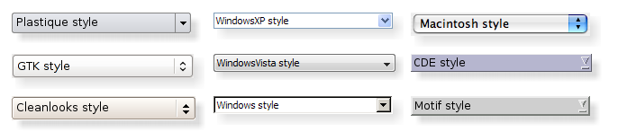

### 16.3.1　QStyle的作用

Qt是一个跨平台的类库，相同的界面组件在不同的操作系统上显示效果是不一样的。QStyle是封装了GUI界面组件外观的抽象类，Qt定义了QStyle类的一些子类，应用于不同的操作系统，如QWindowsStyle和QMacStyle等。这些样式是Qt GUI模块自带的，在不同的平台上编译运行的程序具有缺省的样式，QApplication::style()可以返回应用程序缺省的样式。

Qt内置的界面组件都使用QStyle进行绘制，以保证它们与运行平台的界面效果一致，如图16-8所示是QComboBox在不同操作系统上的九种不同的样式。


<center class="my_markdown"><b class="my_markdown">图16-8　QComboBox的九种不同样式（来自Qt帮助文件）</b></center>

QStyleFactory类管理着Qt的内置样式，QStyleFactory有两个静态函数keys()和create()，其函数原型如下：

```css
QStringList QStyleFactory::keys()
QStyle *QStyleFactory::create(const QString &key)
```

keys()函数返回一个字符串列表，是所在平台支持的QStyle的名称列表；create()函数根据样式名称字符串创建一个QStyle对象。

QApplication有两个静态函数用于操作样式，其函数原型为：

```css
QStyle *QApplication::style()
void QApplication::setStyle(QStyle *style)
```

style()函数返回应用程序当前的样式，任何一个GUI应用程序，在创建时就有一个缺省的样式，通过下面的语句：

```css
QApplication::style()->metaObject()->className()
```

可以获得这个缺省样式的名称。

setStyle()为应用程序设置一个样式，设置样式后，界面元素都具有这个样式所定义的外观。

除了这些Qt内置的样式，用户也可以从QStyle类继承，定义自己的样式，一般是从QStyle的子类QProxyStyle继承。

