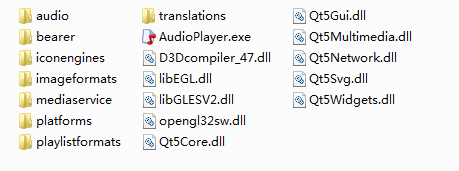

### 16.4.2　Windows平台上的应用程序发布

Qt是跨平台的开发工具，开发的应用程序可以在各种平台上发布，本书只以常用的Windows平台为例介绍Qt应用程序的发布。

#### 1．Windows发布工具

windeployqt.exe是Qt自带的Windows平台发布工具，它可以自动为一个应用程序复制其运行所需的各种库文件、插件和翻译文件，生成可发布的目录。

windeployqt.exe文件在Qt的bin目录下，Qt的每一个编译器版本均有独立的目录，如计算机上的Qt安装有minGW32、MSVC2015 32bit和MSVC2015 62bit 3个编译器版本，Qt安装在D:\Qt目录下，则3个版本的bin目录是：

```css
D:\Qt\Qt5.9.1\5.9.1\mingw53_32\bin
D:\Qt\Qt5.9.1\5.9.1\msvc2015\bin
D:\Qt\Qt5.9.1\5.9.1\msvc2015_64\bin
```

> **注意**
> 应用程序由哪个编译器生成的，就应该用哪个版本的windeployqt生成发布文件。

在Windows的Command窗口使用windeployqt程序，其句法如下：

```css
windeployqt [options] [files]
```

其中options是一些选项设置，可以查看Qt帮助文件查看具体设置，一般使用缺省设置即可，files是需要生成发布文件的应用程序文件名。

要在Command窗口使用windeployqt，最好的方法是将windeployqt版本所在的bin路径添加到系统的PATH环境变量里。

在Windows平台上，windeployqt会将编译器的运行时文件复制到发布目录下，如果是用MSVC编译的，就包含Visual C++的运行库。

#### 2．MinGW编译的应用程序发布实例

将15.2节的音频播放器实例程序samp15_1用MinGW编译器在release模式下编译，生成可执行文件samp15_1.exe。将此可执行文件复制到一个目录下，例如“F:\Setup\minGW”，并将samp15_1.exe更名为AudioPlayer.exe。

将MinGW版本的Qt的bin路径添加到系统的PATH环境变量里，然后在Windows的“开始”菜单的文本框里键入“cmd”，回车后进入Command窗口，在Command窗口里依次键入并执行以下指令：

```css
F:
cd setup\minGW
windeployqt  AudioPlayer.exe
```

执行完成后，windeployqt将AudioPlayer.exe运行时需要的各种库文件都复制到目录“F:\Setup\ minGW”下，如图16-10所示。


<center class="my_markdown"><b class="my_markdown">图16-10　MinGW版本AudioPlayer.exe的发布文件</b></center>

为测试生成的发布目录下的文件是否齐全，将环境变量PATH中的Qt的bin目录去除，然后双击图16-10中的AudioPlayer.exe文件运行程序。这时会出现一个对话框，提示丢失文件“libgcc_s_dw2-1.dll”，发现目录“D:\Qt\Qt5.9.0\5.9\mingw53_32\bin”下有这个文件，将此文件复制到“F:\Setup\minGW”目录下。

再次运行AudioPlayer.exe程序，还会出现丢失文件对话框，将这些文件复制到“F:\Setup\minGW”下，依赖的库文件复制完全后，AudioPlayer.exe才可以正常运行。

所以，windeployqt并不能保证一次将所有依赖文件复制完全，需要测试运行应用程序以检验依赖库的完整性。

> **注意**
> 运行应用程序，测试部署文件完整性时，必须删除系统环境变量里Qt的bin路径，否则系统从Qt的bin路径里总是可以找到依赖的库文件，就达不到测试的目的了。

查看一个可执行文件的依赖文件，也可以使用工具软件Dependency Walker，它能可视化地查看可执行文件的依赖项。可以从其官网下载这个软件的最新版本。

即便在开发应用程序的计算机上测试发布程序没有问题，也应该将发布文件目录复制到一个没有安装Qt的计算机上测试应用程序能否正常运行。

#### 3．MSVC编译的应用程序发布实例

将15.2节的音频播放器实例程序samp15_1用MSVC2015 32bit编译器在release模式下编译，生成可执行文件samp15_1.exe。将此可执行文件复制到一个目录下，如“F:\Setup\msvc32”，并将samp15_1.exe更名为AudioPlayer.exe。

然后就需要使用MSVC2015 32bit版本的Qt的bin目录下的windeployqt程序来为程序AudioPlayer.exe生成发布文件，其使用方法与MinGW版本的类似。生成的发布目录下的文件和目录与图16-10所示内容一样，只不过来源版本不同。

测试时双击AudioPlayer.exe文件，发现它可以直接运行，未提示丢失文件。

同样，也应该将发布目录复制到一个没有安装Qt和MSVC2015的计算机上测试，看其能否正常运行。

#### 4．安装程序制作

复制了应用程序所需的依赖文件，并测试没有问题后就可以制作安装文件了。有很多制作安装文件的软件，用户自行选择并下载一个即可制作自己的安装文件，这里不再详述。


