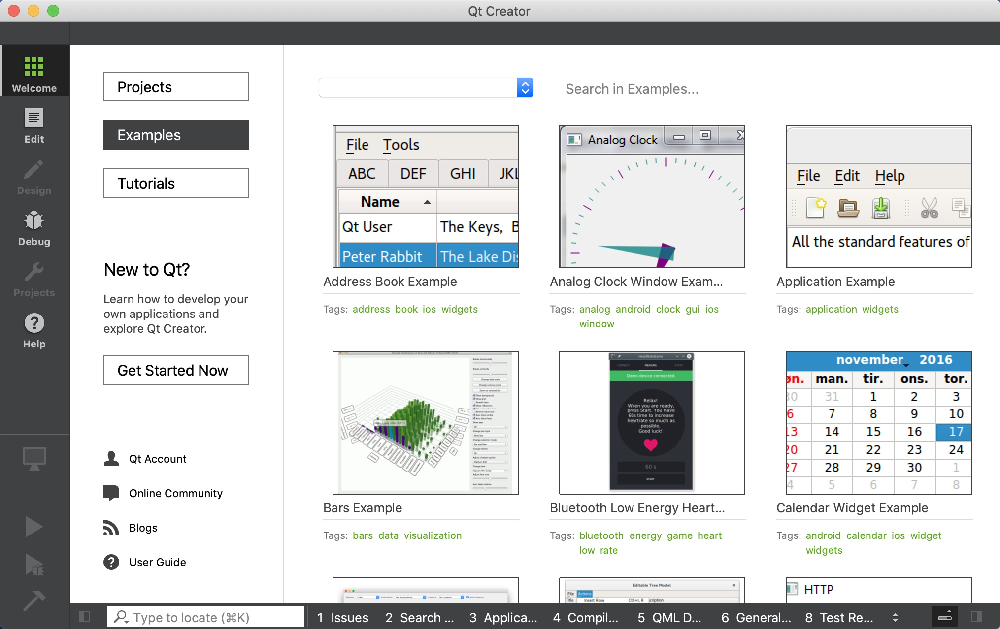
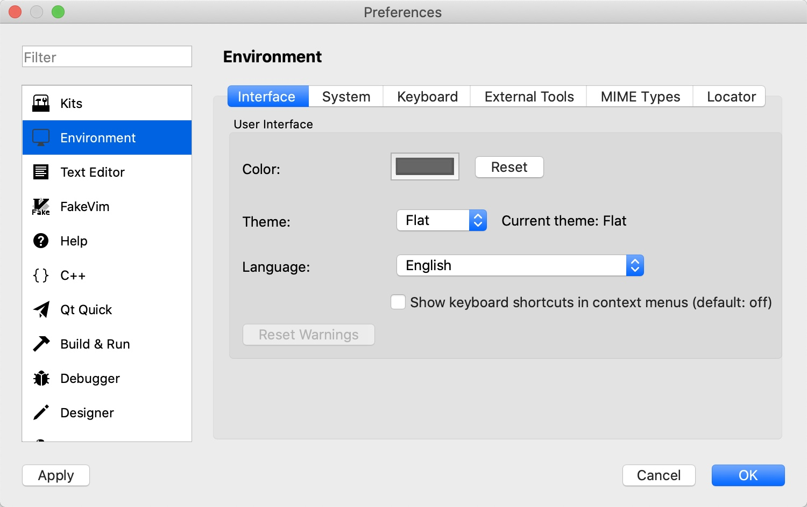
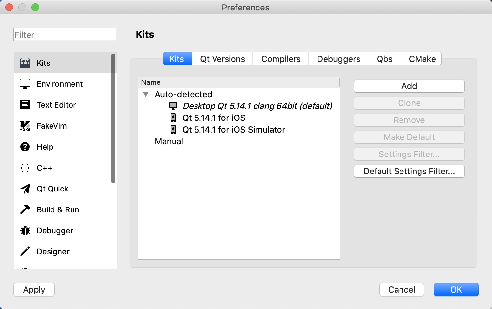

[toc]

### 1. Qt Creator 的界面组成

启动 Qt Creator，出现如下图所示的主窗口。

在左侧主工具栏单击 "Welcome" 按钮后显示实例的界面。这时工作区的左侧有 "Projects" "Examples" "Tutorials" "Get Started Now" 几个按钮，单击后会在主工作区显示相应的内容。

+ 单击 "Projects" 按钮后，工作区显示新建项目按钮和最近打开项目的列表。
+ 单击 "Examples" 按钮后，工作区显示 Qt 自带的大量实例，选择某个实例就可以在 Qt Creator 中打开该项目源程序。
+ 单击 "Tutorials" 按钮后，工作区显示各种视频教程，查看视频教程需要联网并使用浏览器打开。
+ 单击 "Get Started Now" 按钮，工作区显示 "Qt Creator Manual" 帮助主题内容。

### 2. Qt Creator 的设置

常用的设置包括以下几点。

+ Environment 设置：在 Interface 页面可以设置语言和主题，本书全部以英文界面的 Qt Creator 进行讲解，所以语言选择为 English。
+ Text Editor 设置：在此界面可以设置文本编辑器的字体，设置各种类型文字的字体颜色。
+ Kits 设置：它有以下几个页面。
    + Kits 页面显示 Qt Creator 可用的编译工具，在图中可以看到有 3 个编译工具可用。
    + Qt Versions 页面显示安装的 Qt 版本。
    + Compliers 页面显示系统里可用的 C 和 C++ 编译器。
    + Debuggers 页面显示 Qt Creator 自动检测到的调试器。

> 注意：Debuggers 页面没有 Windows 的 CDB 调试器，可以用 MSVC 编译器对 Qt Creator 编写的程序进行编译，但是不能调试，这是因为缺少了 Windows Software Development Kit (SDK)。这个 SDK 不会随 Visual Studio 一同安装，需要从 Microsoft 网站上下载。可以下载 Windows Software Development Kit (SDK) for Windows 8.1，安装后重启计算机即可。