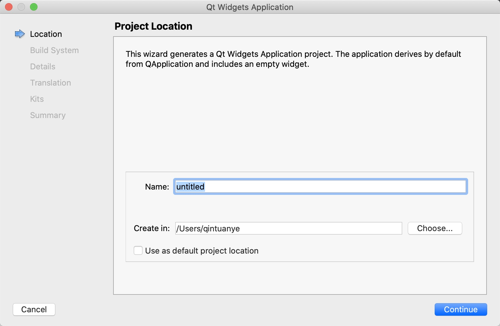
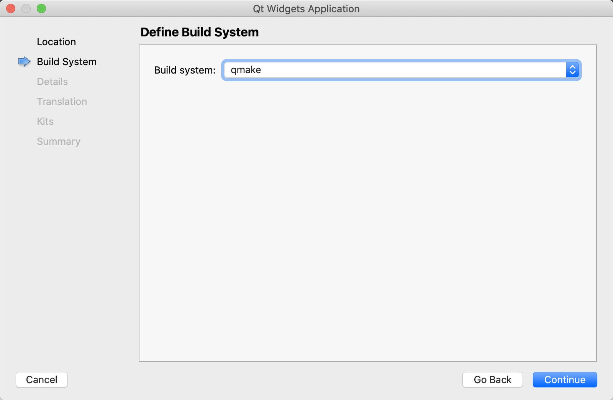
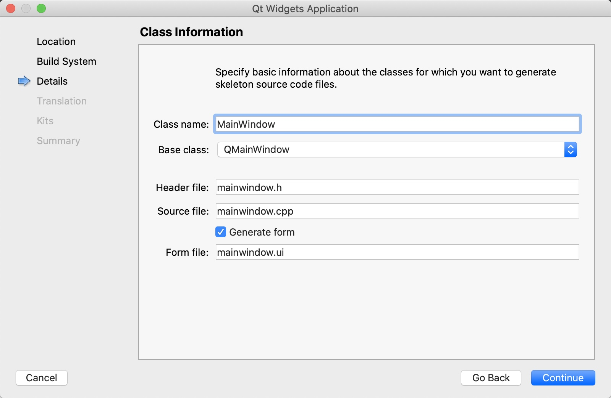
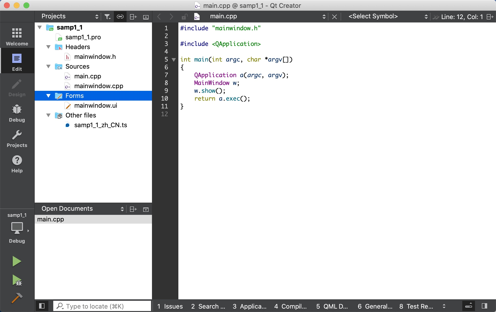
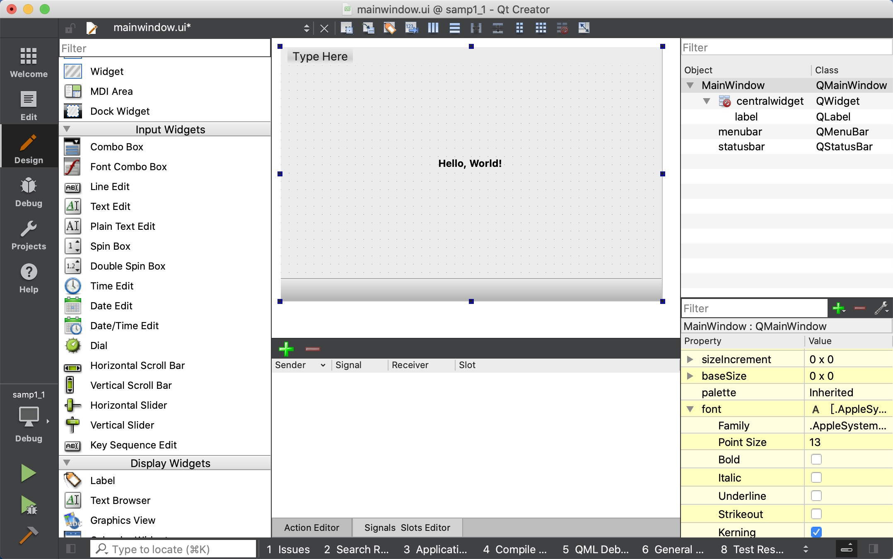
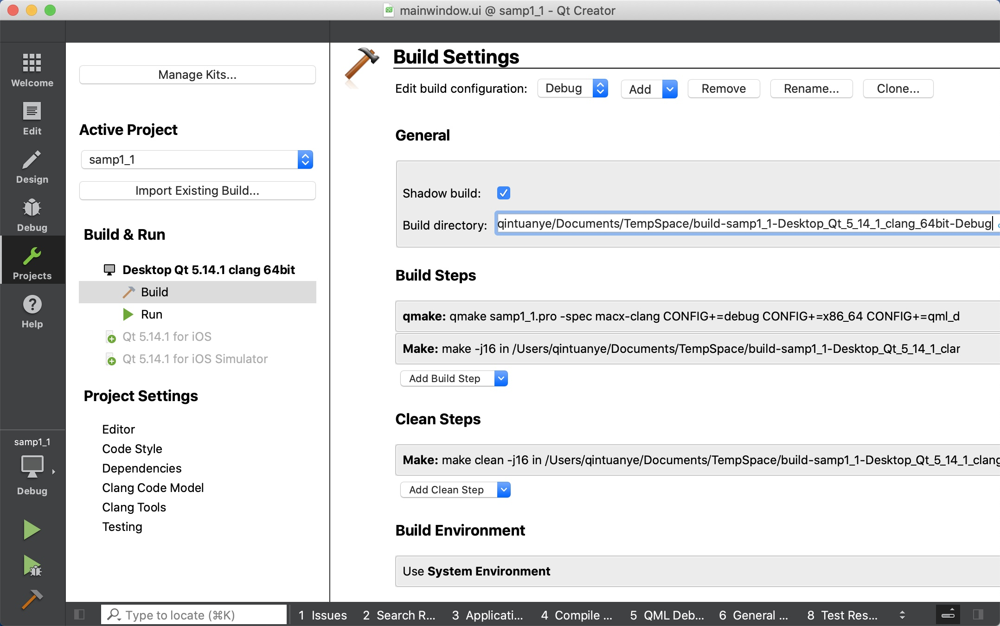

[toc]

### 1. 新建一个项目

单击 Qt Creator 的菜单项 "File" -> "New File or Project"，出现如下图所示的对话框。

图1-5 新建文件或项目对话框

Qt Creator 可以创建多种项目，在最左侧的列表框中单击 "Application"，中间的列表框中列出了可以创建的应用程序的模板，各类应用程序如下。

+ Qt Widgets Application，支持桌面平台的有图形用户界面的应用程序。
+ Qt Console Application，控制台应用程序，无 GUI 界面，一般用于学习 C/C++ 语言，只需要简单的输入输出操作时可创建此类项目。
+ Qt Quick Application，创建可部署的 Qt Quick 2 应用程序。Qt Quick 是 Qt 支持的一套 GUI 开发架构，其界面设计采用 QML 语言，程序架构采用 C++ 语言。利用 Qt Quick 可以设计非常炫的用户界面，一般用于移动设备或嵌入式设备上无边框的应用程序设计。

在图 1-5 显示的对话框中选择项目类型为 Qt Widgets Application 后，单击 "Choose..." 按钮，出行如图 1-6 所示的新建项目向导。

图 1-6 新建项目向导第 1 步：项目名称和存储路径设置

在图 1-6 中，选择一个目录，如 "G:\Qt5Book\Qt5.9Samp\chap01"，再设置项目名称为 samp1_1，这样新建项目后，会在 "G:\Qt5Book\Qt5.9Samp\chap01" 目录下新建一个目录，项目所有文件保存在目录 "G:\Qt5Book\Qt5.9Samp\chap01\samp1_1\\" 下。

在图 1-6 中设置好项目名称和保存路径后，单击 "Next" 按钮，出现如图 1-7 所示的选择编译工具的界面。

图 1-7 新建项目向导第 2 步：选择编译工具

在图 1-7 显示的界面中单击 "Next" 按钮，出现如图 1-8 所示的界面。在此界面中选择需要创建界面的基类。有三种基类可以选择：

+ QMainWindow 是主窗口类，主窗口具有主菜单栏、工具栏和状态栏，类似于一般的应用程序的主窗口；
+ QWidget 是所有具有可视界面类的基类，选择 QWidget 创建的界面对各种界面组件都可以支持；
+ QDialog 是对话框类，可建立一个基于对话框的界面。

在此选择 QMainWindow 作为基类，自动更改的各个文件名不用手动去修改。勾选 "Generate form" 复选框。这个选项如果勾选，就会由 Qt Creator 创建用户界面文件，否则，需要自己编程手工创建界面。然后单击 "Next" 按钮，出现一个页面，总结了需要创建的文件和文件保存目录，单击 "Finish" 按钮就可以完成项目的创建。

### 2. 项目的文件组成和管理

 

在项目名称节点下面，分组管理着项目内的各种源文件，几个文件及分组分别为以下几项：

+ Samp1_1.pro 是项目管理文件，包括一些对项目的设置项。
+ Headers 分组：该节点下是项目内的所有头文件（.h）。
+ Sources 分组：该节点下是项目内的所有 C++ 源文件（.cpp）。main.cpp 是主函数文件，也是应用程序的入口。
+ Forms 分组：该节点下是项目内的所有界面文件（.ui）。

双击文件目录树中的文件 mainwindow.ui，出现如图 1-10 所示的窗体设计界面，这个界面实际上是 Qt Creator 中集成的 Qt Designer。窗口左侧是分组的组件面板，中间是设计的窗口。在组件面板的 Display Widgets 分组里，将一个 Label 组件拖放到设计的窗体上面。双击刚刚放置的 Label 组件，可以编辑其文字内容，将文字内容更改 "Hello, World!"。还可以在窗口右下方的属性编辑器里编辑标签的 Font 属性，Point Size 更改为 12，勾选 Bold。

### 3. 项目的编译、调试与运行

点击主窗口左侧工具栏上的 "Projects" 按钮，出现如图 1-11 所示的项目编译设置界面。

图 1-11 项目编译器选择和设置界面

界面左侧一栏的 "Build & Run" 下面显示了本项目中可用的编译器工具，要使用哪一个编译器用于项目编译，可以通过调整编译器的位置，位于顶部的编译器就是选择的编译器。

主窗口左侧工具栏下方有 4 个按钮，其功能见表 1-1。

<b>表 1-1 编译调试工具栏按钮的作用</b>

| 图标                                        | 作用                                                         | 快捷键   |
| ------------------------------------------- | ------------------------------------------------------------ | -------- |
|  | 弹出菜单选择编译工具和编译模式，如 Debug 或 Release 模式     |          |
|  | 直接运行程序，如果修改后未编译，会先进行编译。即使在 程序中设置了断点，此方式运行的程序也无法调试。 | Ctrl + R |
|  | 项目需要以 Debug 模式编译，点此按钮开始调试运行， 可以在程序中设置断点。若是以 Release 模式编译，点此 按钮也无法进行调试。 | F5       |
|  | 编译当前项目                                                 | Ctrl + B |

在 Qt Creator 中也可以对程序设置断点进行调试，但是必须以 Debug 模式编译，并以 "Start Debugging" （快捷键 F5）方式运行程序。

