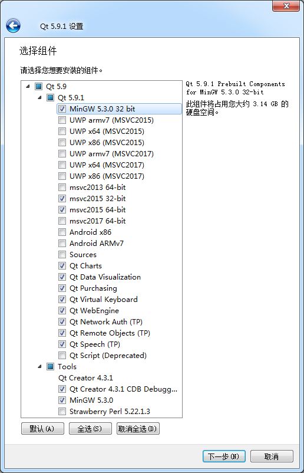
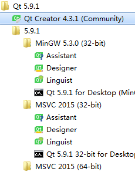

### 1.2.3　Qt的下载与安装

从Qt官网可以下载最新版本的Qt软件。根据开发项目的不同，Qt分为桌面和移动设备应用开发、嵌入式设备开发两大类不同的安装包。

桌面和移动设备应用开发就是开发在PC、服务器、手机、平板电脑等设备上运行的程序，操作系统平台可以是Windows、Linux、macOS、Android等。用于桌面和移动设备应用开发的Qt具有开源许可协议，可以免费下载和使用。

嵌入式设备开发是针对具体的嵌入式设备来开发应用程序，如物联网设备、汽车电子设备、医疗设备等特定的嵌入式设备。用于嵌入式设备开发的Qt可下载30天试用版本。

本书是介绍桌面应用程序开发的，所以下载使用的是桌面和移动设备开发的Qt 5.9.1开源版本。根据Qt官网的提示，注册用户后才可以下载Qt安装程序。

Qt 5.9.1的安装包分为在线安装包和离线安装包，为便于重复安装，最好下载离线安装包。离线安装包根据使用的操作系统平台不同，分为Linux、macOS和Windows 3个版本，本书实例都是用Windows 7平台上的Qt开发的，所以这里下载Windows版本的Qt 5.9.1离线安装包。

Qt 5.9以前版本的离线安装包即使是在Windows平台上，也会根据使用的编译器不同分为很多版本，如MinGW 32-bit版本、MSVC2015 32-bit版本、MSVC2015 64-bit版本等。而Qt 5.9在一个平台上只有一个安装包，编译器的选择放在了安装过程里，所以下载的Windows平台上的Qt 5.9.1安装包只有一个可执行文件。

双击下载后的Qt 5.9.1离线安装包可执行文件，就开始执行安装过程，安装过程与一般的Windows应用程序一样，按照向导进行操作即可。

在安装过程中会出现如图1-1所示的安装选项设置页面，在这个页面里选择需要安装的模块。“Qt 5.9.1”节点下面是Qt的功能模块，包括用于不同编译器和平台的模块，这些模块包括内容如下。

<b class="my_markdown">图1-1　Qt 5.9.1安装选项设置页面</b>

+ MinGW 5.3.0 32 bit编译器模块。MinGW是Minimalist GNU for Windows的缩写，MinGW是Windows平台上使用的GNU工具集导入库的集合。
+ 用于UWP编译的模块。UWP是Windows 10中Universal Windows Platform的简称，有不同编译器类型的UWP。
+ 用于windows平台上的MSVC编译器模块，如msvc2015 32-bit和msvc2015 64-bit等。要安装MSVC编译器的模块，需要计算机上已经安装相应版本的Visual Studio。
+ 用于Android平台的模块，如Android x86和Android ARMv7。
+ Sources是Qt的源程序。
+ Qt Charts是二维图表模块，用于绘制柱状图、饼图、曲线图等常用二维图表。
+ Qt Data Visualization 是三维数据图表模块，用于数据的三维显示，如散点的三维空间分布、三维曲面等。
+ Qt Purchasing、Qt WebEngine、Qt Network Auth(TP)等其他模块，括号里的TP表示技术预览（Technology Preview）。
+ Qt Scritp（Deprecated）是脚本模块，括号里的“Deprecated”表示这是个已经过时的模块。

“Tools”节点下面是一些工具软件，包括内容如下。

+ Qt Creator 4.3.1是用于Qt程序开发的IDE。
+ MinGW 5.3.0是MinGW 编译工具链。
+ Strawberry Perl是一个Perl语言工具。

根据个人的需要设置安装选项，无需选择所有的安装选项。例如，如果不需要进行UWP平台的开发，UWP模块就可以都不选；如果不是为和以前开发的源程序兼容，过时的模块不要选择，如Qt Script就是已过时的模块。

> **注意**
> 如果选择安装MSVC编译器的模块，需要在计算机上安装相应的Microsoft Visual Studio开发工具，使用免费的Community版本的Visual Studio即可。

安装完成后，在Windows“开始”菜单里建立的Qt 5.9.1程序组内容如图1-2所示。程序组中一个主要的程序是Qt Creator 4.3.1(Community)，它是用于开发Qt程序的IDE，是Qt的主要工具软件。

根据选择安装的编译器模块会建立几个子分组，见图1-2中的MinGW 5.3.0 (32-bit)、MSVC 2015（32-bit）和MSVC 2015（64-bit），每个分组下面主要有3个工具软件。

<b class="my_markdown">图1-2　安装后“开始”菜单里的Qt 5.9.1程序组</b>

+ Assistant是一个独立的查看Qt帮助文件的程序，集成在了Qt Creator中。
+ Designer是一个独立的进行窗口、对话框等界面可视化设计的程序。Designer也集成在了Qt Creator中，在Qt Creator中编辑或创建界面文件时，就可以自动打开并进行界面设计。
+ Linguist是一个编辑语言资源文件的程序，在开发多语言界面的应用程序时会用到。

这3个工具软件可独立使用，前两个集成到了Qt Creator里，可在Qt Creator打开。所以Qt的主要工具是Qt Creator，要编写Qt程序，运行Qt Creator即可。

