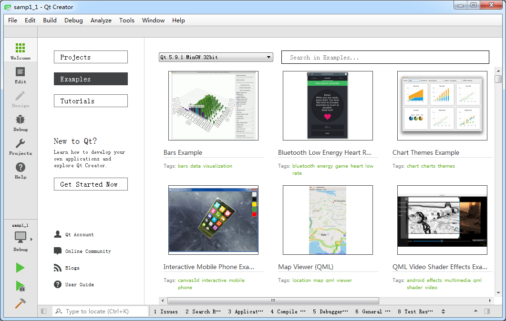

### 1.3.1　Qt Creator的界面组成

启动Qt Creator，出现如图1-3所示的主窗口。

<b class="my_markdown">图1-3　Qt Creator主窗口</b>

Qt Creator的界面很简洁。上方是主菜单栏，左侧是主工具栏，窗口的中间部分是工作区。根据设计内容不同，工作区会显示不同的内容。

图1-3是在左侧主工具栏单击“Welcome”按钮后显示实例的界面。这时工作区的左侧有“Projects”“Examples”“Tutorials”“Get Started Now”几个按钮，单击后会在主工作区显示相应的内容。

+ 单击“Projects”按钮后，工作区显示新建项目按钮和最近打开项目的列表。
+ 单击“Examples”按钮后，工作区显示Qt自带的大量实例，选择某个实例就可以在Qt Creator中打开该项目源程序。
+ 单击“Tutorials”按钮后，工作区显示各种视频教程，查看视频教程需要联网并使用浏览器打开。
+ 单击“Get Started Now”按钮，工作区显示“Qt Creator Manual”帮助主题内容。

主窗口左侧是主工具栏，主工具栏提供了项目文件编辑、窗体设计、程序调试、项目设置等各种功能按钮。

