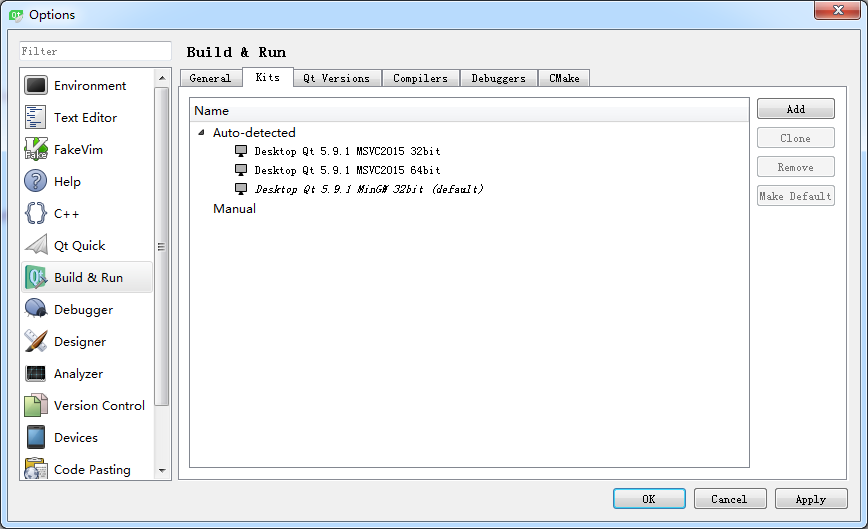

### 1.3.2　Qt Creator的设置

对Qt Creator可以进行一些设置，如刚安装好的Qt Creator界面语言可能是中文，但是很多词汇翻译得并不恰当，可以将Qt Creator的界面语言设置为英文。

单击Qt Creator菜单栏的“Tools”→“Options”菜单项会打开选项设置对话框（如图1-4所示）。对话框的左侧是可设置的内容分组，单击后右侧出现具体的设置界面。常用的设置包括以下几点。

<b class="my_markdown">图1-4　Options的Build & Run设置页面</b>

1．Environment设置：在Interface页面可以设置语言和主题，本书全部以英文界面的Qt Creator进行讲解，所以语言选择为English；为了使界面抓图更清晰，设置主题为Flat Light。更改语言和主题后需要重新启动Qt Creator才会生效。

2．Text Editor设置：在此界面可以设置文本编辑器的字体，设置各种类型文字的字体颜色，如关键字、数字、字符串、注释等字体颜色，也可以选择不同的配色主题。编辑器缺省字体的大小为9，可以修改得大一些。

3．Build & Run设置：图1-4显示的是Build & Run的设置界面，它有以下几个页面。

（1）Kits页面显示Qt Creator可用的编译工具，在图中可以看到有3个编译工具可用。

（2）Qt Versions页面显示安装的Qt版本，有Qt 5.9.1 MinGW 32bit、Qt 5.9.1 MSVC2015 32bit和Qt 5.9.1 MSVC2015 64bit 3个可用的版本。

（3）Compliers页面显示系统里可用的C和C++编译器，由于安装了MinGW和Visual Studio 2015，Qt Creator会自动检测出这些编译器。

（4）Debuggers页面显示Qt Creator自动检测到的调试器，有GNU gdb for MinGW调试器和Windows的CDB调试器。

> **注意**
> 如果只是在计算机上安装了Visual Studio 2015，图1-4显示的界面上MSVC2015的两个编译器的图标会变为带有感叹号的一个黄色图标。Debuggers页面没有Windows的CDB调试器，可以用MSVC编译器对Qt Creator编写的程序进行编译，但是不能调试，这是因为缺少了Windows Software Development Kit (SDK)。这个SDK不会随Visual Studio一同安装，需要从Microsoft网站上下载。可以下载Windows Software Development Kit (SDK) for Windows 8.1，安装后重启计算机即可。

