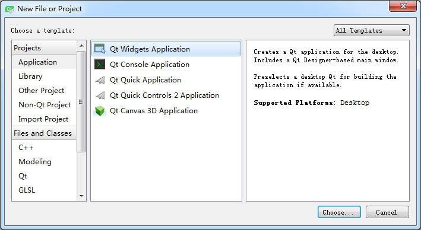
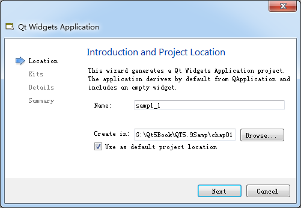
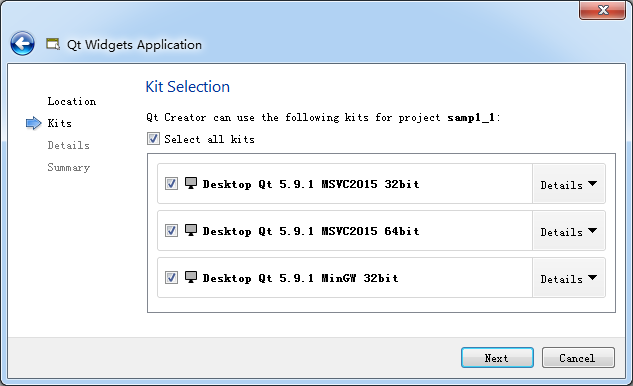
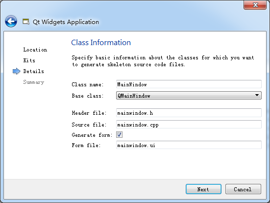

### 1.4.1　新建一个项目

单击Qt Creator的菜单项“File”→“New File or Project”，出现如图1-5所示的对话框。在这个对话框里选择需要创建的项目或文件的模板。

<b class="my_markdown">图1-5　新建文件或项目对话框</b>

Qt Creator可以创建多种项目，在最左侧的列表框中单击“Application”，中间的列表框中列出了可以创建的应用程序的模板，各类应用程序如下。

+ Qt Widgets Application，支持桌面平台的有图形用户界面（Graphic User Interface，GUI）界面的应用程序。GUI的设计完全基于C++语言，采用Qt提供的一套C++类库。
+ Qt Console Application，控制台应用程序，无GUI界面，一般用于学习C/C++语言，只需要简单的输入输出操作时可创建此类项目。
+ Qt Quick Application，创建可部署的Qt Quick 2应用程序。Qt Quick是Qt支持的一套GUI开发架构，其界面设计采用QML语言，程序架构采用C++语言。利用Qt Quick可以设计非常炫的用户界面，一般用于移动设备或嵌入式设备上无边框的应用程序的设计。
+ Qt Quick Controls 2 Application，创建基于Qt Quick Controls 2组件的可部署的Qt Quick 2应用程序。Qt Quick Controls 2组件只有Qt 5.7及以后版本才有。
+ Qt Canvas 3D Application，创建Qt Canvas 3D QML项目，也是基于QML语言的界面设计，支持3D画布。

在图1-5显示的对话框中选择项目类型为Qt Widgets Application后，单击“Choose…”按钮，出现如图1-6所示的新建项目向导。

<b class="my_markdown">图1-6　新建项目向导第1步：项目名称和存储路径设置</b>

在图1-6中，选择一个目录，如“G:\Qt5Book\Qt5.9Samp\chap01”，再设置项目名称为samp1_1，这样新建项目后，会在“G:\Qt5Book\Qt5.9Samp\chap01”目录下新建一个目录，项目所有文件保存在目录“G:\Qt5Book\Qt5.9Samp\chap01\samp1_1\”下。

在图1-6中设置好项目名称和保存路径后，单击“Next”按钮，出现如图1-7所示的选择编译工具的界面，可以将3个编译工具都选中，在编译项目时再选择一个作为当前使用的编译工具，这样可以编译生成不同版本的可执行程序。

在图1-7显示的界面中单击“Next”按钮，出现如图1-8所示的界面。在此界面中选择需要创建界面的基类（base class）。有3种基类可以选择：

<b class="my_markdown">图1-7　新建项目向导第2步：选择编译工具</b>

<b class="my_markdown">图1-8　新建项目向导第3步：选择界面基类</b>

+ QMainWindow是主窗口类，主窗口具有主菜单栏、工具栏和状态栏，类似于一般的应用程序的主窗口；
+ QWidget是所有具有可视界面类的基类，选择QWidget创建的界面对各种界面组件都可以支持；
+ QDialog是对话框类，可建立一个基于对话框的界面。

在此选择QMainWindow作为基类，自动更改的各个文件名不用手动去修改。勾选“Generate form”复选框。这个选项如果勾选，就会由Qt Creator创建用户界面（User Interface，UI）文件，否则，需要自己编程手工创建界面。初始学习，为了了解Qt Creator的设计功能，勾选此选项。然后单击“Next”按钮，出现一个页面，总结了需要创建的文件和文件保存目录，单击“Finish”按钮就可以完成项目的创建。

