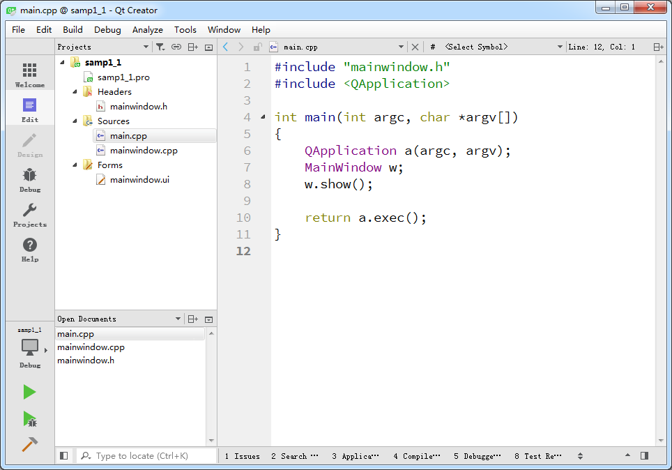
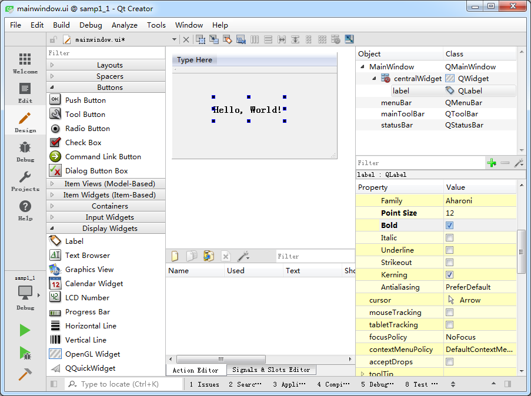

### 1.4.2　项目的文件组成和管理

完成了以上新建项目的步骤后，在Qt Creator的左侧工具栏中单击“Edit”按钮，可显示如图1-9所示的窗口。窗口左侧有上下两个子窗口，上方的目录树显示了项目内文件的组织结构，显示当前项目为samp1_1。项目的名称构成目录树的一个根节点，Qt Creator可以打开多个项目，但是只有一个活动项目（Active Project），活动项目的项目名称节点用粗体字体表示。

<b class="my_markdown">图1-9　项目管理与文件编辑界面</b>

在项目名称节点下面，分组管理着项目内的各种源文件，几个文件及分组分别为以下几项。

+ samp1_1.pro是项目管理文件，包括一些对项目的设置项。
+ Headers分组，该节点下是项目内的所有头文件（.h），图1-9中所示项目有一个头文件mainwindow.h，是主窗口类的头文件。
+ Sources分组：该节点下是项目内的所有C++源文件（.cpp），图1-9中所示项目有两个C++源文件，mainwindow.cpp是主窗口类的实现文件，与mainwindow.h文件对应。main.cpp是主函数文件，也是应用程序的入口。
+ Forms分组：该节点下是项目内的所有界面文件（.ui）。图1-9中所示项目有一个界面文件mainwindow.ui，是主窗口的界面文件。界面文件是文本文件，使用XML语言描述界面的组成。

左侧上下两个子窗口的显示内容可以通过其上方的一个下拉列表框进行选择，可以选择的显示内容包括Projects、Open Documents、Bookmarks、File System、Class View、Outline等。在图1-9中，上方的子窗口显示了项目的文件目录树，下方显示打开的文件列表。可以在下方选择显示Class View，这样下方则显示项目内所有的类的结构，便于程序浏览和快速切换到需要的代码位置。

双击文件目录树中的文件mainwindow.ui，出现如图1-10所示的窗体设计界面，这个界面实际上是Qt Creator中集成的Qt Designer。窗口左侧是分组的组件面板，中间是设计的窗体。在组件面板的Display Widgets分组里，将一个Label组件拖放到设计的窗体上面。双击刚刚放置的Label组件，可以编辑其文字内容，将文字内容更改为“Hello, World!”。还可以在窗口右下方的属性编辑器（Property Editor）里编辑标签的Font属性，Point Size更改为12，勾选Bold。

<b class="my_markdown">图1-10　集成在Qt Creator中UI设计器</b>

