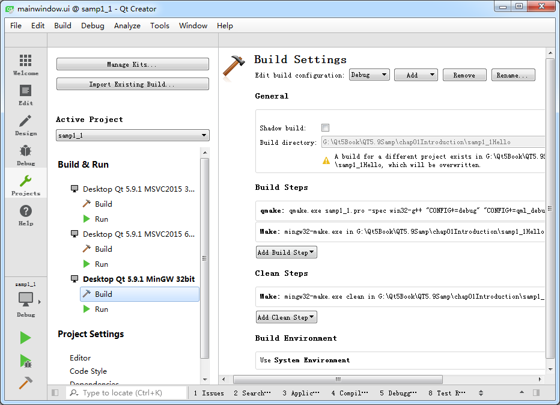
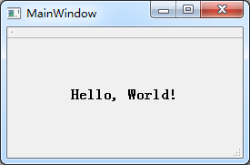
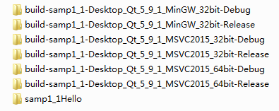

### 1.4.3　项目的编译、调试与运行

单击主窗口左侧工具栏上的“Projects”按钮，出现如图1-11所示的项目编译设置界面。

界面左侧一栏的“Build & Run”下面显示了本项目中可用的编译器工具，要使用哪一个编译器用于项目编译，单击其名称即可，选择的编译器名称会用粗体字表示。这里选择使用MinGW 32bit编译器。

<b class="my_markdown">图1-11　项目编译器选择和设置界面</b>

每个编译器又有Build和Run两个设置界面。在Build设置界面上，有一个“Shadow build”复选框。如果勾选此项，编译后将在项目的同级目录下建立一个编译后的文件目录，目录名称包含编译器信息，这种方式一般用于使用不同编译器创建不同版本的可执行文件。如果不勾选此项，编译后将在项目的目录下建立“Debug”和“Release”子目录用于存放编译后的文件。

在设计完mainwindow.ui文件，并设置好编译工具之后，就可以对项目进行编译、调试或运行。主窗口左侧工具栏下方有4个按钮，其功能见表1-1。

<b class="my_markdown">表1-1　编译调试工具栏按钮的作用</b>

| 图标 | 作用 | 快捷键 |
| :-----  | :-----  | :-----  | :-----  | :-----  |
|  | 弹出菜单选择编译工具和编译模式，如Debug或Release模式 |
|  | 直接运行程序，如果修改后未编译，会先进行编译。即使在程序中设置了断点，此方式运行的程序也无法调试。 | Ctrl+R |
|  | 项目需要以Debug模式编译，点此按钮开始调试运行，可以在程序中设置断点。若是以Release模式编译，点此按钮也无法进行调试。 | F5 |
|  | 编译当前项目 | Ctrl+B |

首先对项目进行编译，没有错误后，再运行程序。程序运行的界面如图1-12所示。这就是一个标准的桌面应用程序，我们采用可视化的方式设计了一个窗口，并在上面显示了字符串“Hello，World！”。

在Qt Creator中也可以对程序设置断点进行调试，但是必须以Debug模式编译，并以“Start Debugging”（快捷键F5）方式运行程序。程序调试的方法与一般IDE工具类似，不再详述。注意，要在Qt Creator里调试MSVC2015编译的程序，必须安装Windows软件开发工具包SDK。

在图1-11的界面中选择其他编译器，并且勾选“Shadow build”，用Debug和Release模式分别编译，将会在项目的同级目录下生成对应的目录，保存编译后的文件。图1-13显示的是实例samp1_1采用3种编译器，分别用Debug和Release模式编译后生成的目录结构。3种编译器，2种编译模式，生成了6个文件夹。

<b class="my_markdown">图1-12　实例程序samp1_1运行时界面</b>

<b class="my_markdown">图1-13　勾选“Shadow build”选项后使用不同编译器和编译模式生成的输出目录</b>

> **提示**
> 除非特别说明，本书后面的实例程序均在Windows 7.0 SP1 64位平台上用Qt Creator 4.3.1开发，采用Qt 5.9.1的MinGW 32bit编译器进行编译。只有在第12章设计Qt Designer的Widget插件时才必须使用MSVC2015 32bit编译器，在第15.5节使用摄像头录像时必须使用Linux平台的Qt。

