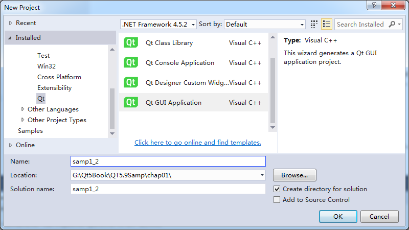
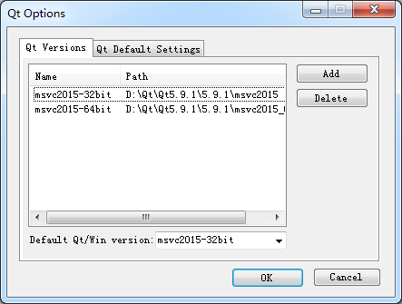
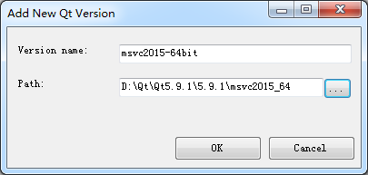
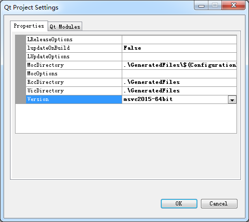

### 1.5　在Visual Studio里使用Qt

在Qt Creator中可以使用MSVC编译工具对Qt项目进行编译。若有人比较习惯于使用Visual Studio，或某些项目必须使用Visual Studio，也可以在Visual Studio里创建和管理Qt程序项目。要在Visual Studio中使用Qt，需要安装一个Visual Studio的Qt插件，这个插件程序由Qt公司提供。

目前最新的Visual Studio Qt插件是“Visual Studio Add-in 2.0.0 for Qt5 MSVC 2015”，可以从Qt官网下载并安装（<https://marketplace.visualstudio.com/items?itemName=TheQtCompany.QtVisualStudioTools2019>）。安装此插件之前，需已经安装好Visual Studio 2015。

这里省略Visual Studio Add-in 2.0.0 for Qt5的安装过程。安装完成后，在Visual Studio的主菜单栏上增加了一个菜单组“Qt VS Tools”，在新建项目向导里增加了可创建Qt项目的项目模板。

在Visual Studio 2015里创建一个Qt GUI应用程序项目。创建项目时选择项目模板的对话框如图1-14所示，选择创建Qt GUI Application项目，根据向导提示完成项目samp1_2的创建。

按照向导缺省设置创建完项目后，Visual Studio管理项目的全部文件，有一个samp1_2.ui的窗体文件，双击此文件，会自动使用Qt Designer打开窗体文件进行界面设计，如同在Qt Creator里设计窗体一样。

在首次使用Visual Studio编译Qt项目之前，必须先进行一些设置，否则会提示没有设置Qt版本，无法编译项目。

<b class="my_markdown">图1-14　在Visual　Studio　2015里创建Qt项目samp1_2</b>

首先要设置Qt版本。单击Visual Studio菜单项“Qt VS Tools”→“Qt Options”，出现如图1-15所示的对话框。Qt Versions页面显示了可以使用的Qt版本（这是已经设置好的界面），在未设置之前，框里是空白的。单击“Add”按钮出现如图1-16所示的添加Qt版本对话框。

<b class="my_markdown">图1-15　Qt Options设置对话框</b>

<b class="my_markdown">图1-16　添加Qt版本对话框</b>

单击“Path”文本框后面的按钮，在出现的目录选择对话框里选择Qt 5.9.1安装目录下的MSVC编译器目录，如“D:\Qt\Qt5.9.1\5.9.1\msvc2015_64”。选择目录后，Version name编辑框里会自动出现版本名称，可以修改此名称为意义更明显的名字，如“msvc2015-64bit”。

然后，再单击Visual Studio菜单项“Qt VS Tools”→“Qt Project Settings”，为项目设置Qt版本，出现如图1-17所示的对话框。在此对话框的Properties分页下的列表框里，在Version下拉列表框中选择某个Qt版本。

<b class="my_markdown">图1-17　Qt项目设置对话框</b>

完成这两项设置后，再进行编译就没有问题了。项目的运行、调试等就都是Visual Studio的操作了，这里不再赘述。

> **提示**
> 在Qt Creator里就可以使用MSVC编译器对项目进行编译，并不是只有在Visual Studio里才可以使用MSVC编译器编译Qt的项目。

