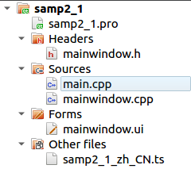
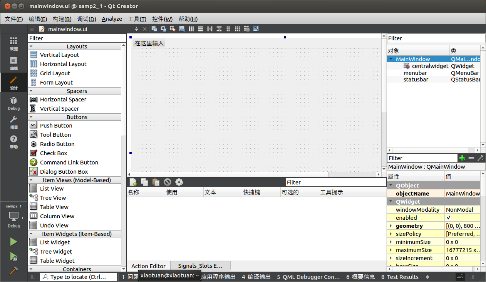

[toc]

### 1. 项目文件组成

在 Qt Creator 中新建一个 Widget Application 项目 samp2_1，在选择窗口基类的页面选择 QWidget 作为窗体基类，并选中 "Generate form" 复选框。创建后的项目文件目录树如图 2-1 所示。



<center>图2-1 项目文件的目录树</center>

这个项目包含以下一些文件。

+ 项目组织文件 samp2_1.pro，存储项目设置的文件。
+ 主程序入口文件 main.cpp，实现 main() 函数的程序文件。
+ 窗体界面文件 widget.ui，一个 XML 格式存储的窗体上的元件及其布局的文件。
+ widget.h 是所设计的窗体类的头文件，widget.cpp 是 widget.h 里定义类的实现文件。

### 2. 项目管理文件

后缀为 ".pro" 的文件是项目的管理文件，文件名就是项目的名称，如本项目中的 samp2_1.pro。下面是 samp2_1.pro 文件的内容。

```properties
QT       += core gui

greaterThan(QT_MAJOR_VERSION, 4): QT += widgets

CONFIG += c++11

# The following define makes your compiler emit warnings if you use
# any Qt feature that has been marked deprecated (the exact warnings
# depend on your compiler). Please consult the documentation of the
# deprecated API in order to know how to port your code away from it.
DEFINES += QT_DEPRECATED_WARNINGS

# You can also make your code fail to compile if it uses deprecated APIs.
# In order to do so, uncomment the following line.
# You can also select to disable deprecated APIs only up to a certain version of Qt.
#DEFINES += QT_DISABLE_DEPRECATED_BEFORE=0x060000    # disables all the APIs deprecated before Qt 6.0.0

SOURCES += \
    main.cpp \
    mainwindow.cpp

HEADERS += \
    mainwindow.h

FORMS += \
    mainwindow.ui

TRANSLATIONS += \
    samp2_1_zh_CN.ts

# Default rules for deployment.
qnx: target.path = /tmp/$${TARGET}/bin
else: unix:!android: target.path = /opt/$${TARGET}/bin
!isEmpty(target.path): INSTALLS += target

```

"Qt    += core gui" 表示项目中加入 core gui 模块。core gui 是 Qt 用于 GUI 设计的类库模块，如果创建的是控制台应用程序，就不需要添加 core gui。

Qt 类库以模块的形式组织各种功能的类，根据项目涉及的功能需求，在项目中添加适当的类库模块支持。例如，如果项目中使用到了涉及数据库操作的类就需要用到 sql 模块，在 pro 文件中需要增加如下一行：

```properties
Qt    += sql
```

samp2_1.pro 中的第2行是：

```properties
greaterThan(QT_MAJOR_VERSION, 4): QT += widgets
```

这是个条件执行语句，表示当 Qt 主板大于 4 时，才加入 widgets 模块。

后面的 SOURCES、 HEADERS、FORMS 记录了项目中包含的源程序文件、头文件和窗体文件（.ui 文件）的名称。

### 3. 界面文件

双击项目文件目录树中的文件 widget.ui，会打开一个集成在 Qt Creator 中的 Qt Designer 对窗体进行可视化设计，如图 2-2 所示。



在图2-2显示的设计窗体上，放置一个 Label 和一个 Push Button 组件，它们的主要属性设置见表2-1。

<center><b>表2-1 界面组件的属性设置</b></center>

| ObjectName | 类名称      | 属性设置                                                     | 备注                   |
| ---------- | ----------- | ------------------------------------------------------------ | ---------------------- |
| LabDemo    | QLabel      | Text="Hello, World"<br />Font.PointSize = 20<br />Font.bold =true | 设置标签显示文字和字体 |
| btnClose   | QPushButton | Text="Close"                                                 | 设置按钮的文字         |

编辑完属性之后，再为 btnClose 按钮增加一个功能，就是单击此按钮时，关闭窗口，退出程序。使用 Signals 和 Slots 编辑器完成这个功能，如图2-4所示。


在信号与槽编辑器的工具栏上单击 "Add" 按钮，在出现的条目中，Sender 选择 btnClose，Signal 选择 clicked()，Receiver 选择窗体 Widget，Slot 选择 close()。这样设置表示当按钮 btnClose 被单击时，就执行 Widget 的 close() 函数，实现关闭窗口的功能。

### 4. 主函数文件

main.cpp 是实现 main() 函数的文件，下面是 main.cpp 文件的内容。

```cpp
#include "mainwindow.h"

#include <QApplication>

int main(int argc, char *argv[])
{
    QApplication a(argc, argv);
    MainWindow w;
    w.show();
    return a.exec();
}
```

QApplication 是 Qt 的标准应用程序类，第 1 行代码定义了一个 QApplication 类的实例 a，就是应用程序对象。

然后定义了一个 Widget 类的变量 w，Widget 是本实例设计的窗口的类名，定义此窗口后再用 w.show() 显示此窗口。

最后一行用 a.exec() 启动应用程序的执行，开始应用程序的消息循环和事件处理。

### 5. 窗体相关的文件

编译后再项目目录下回自动生成一个文件 ui_widget.h，这样对于一个窗体，就有 4 个文件了，各文件的功能说明见表2-2.

<center><b>表2-2 窗体相关的4个文件</b></center>

| 文件            | 功能                                                         |
| --------------- | ------------------------------------------------------------ |
| mainwindow.h    | 定义窗体类的头文件，定义了类 Widget                          |
| mainwindow.cpp  | Widget 类的功能实现源程序文件                                |
| mainwindow.ui   | 窗体界面文件，由 UI 设计器自动生成，存储了窗体上各个组件的属性设置和布局 |
| ui_mainwindow.h | 编译后，根据窗体上的组件及其属性、信号与槽的关联等自动生成的一个类的定义文件，类的名称是 Ui_Widget |

#### 5.1 widget.h 文件

下面是 widget.h 文件的内容：

```cpp
#ifndef MAINWINDOW_H
#define MAINWINDOW_H

#include <QMainWindow>

QT_BEGIN_NAMESPACE
namespace Ui { class MainWindow; }
QT_END_NAMESPACE

class MainWindow : public QMainWindow
{
    Q_OBJECT

public:
    MainWindow(QWidget *parent = nullptr);
    ~MainWindow();

private:
    Ui::MainWindow *ui;
};
#endif // MAINWINDOW_H
```

（1）namespace 声明

代码中有如下的一个 namespace 声明：

```cpp
namespace Ui { class MainWindow; }
```

这是声明了一个名称为 Ui 的命名空间，包含了一个类 Widget。但是这个类 Widget 并不是本文件里定义的类 MainWindow，而是 ui_MainWindow.h 文件里定义的类，用于描述界面组件的。

（2）Widget 类的定义。widget.h 文件的主体部分是一个继承于 QWidget 的类 Widget 的定义，也就是本实例的窗体类。

在 Widget 类中使用了宏 Q_OBJECT，这是使用 Qt 的信号与槽机制的类都必须加入的一个宏。

#### 5.2 widget.cpp文件

下面是 widget.cpp 文件的内容：

```cpp
#include "mainwindow.h"
#include "ui_mainwindow.h"

MainWindow::MainWindow(QWidget *parent)
    : QMainWindow(parent)
    , ui(new Ui::MainWindow)
{
    ui->setupUi(this);
}

MainWindow::~MainWindow()
{
    delete ui;
}
```

#### 5.3 widget.ui 文件

```xml
<?xml version="1.0" encoding="UTF-8"?>
<ui version="4.0">
 <class>Widget</class>
 <widget class="QWidget" name="Widget">
  <property name="geometry">
   <rect>
    <x>0</x>
    <y>0</y>
    <width>336</width>
    <height>216</height>
   </rect>
  </property>
  <property name="windowTitle">
   <string>My First Demo</string>
  </property>
  <widget class="QLabel" name="LabDemo">
   <property name="geometry">
    <rect>
     <x>60</x>
     <y>50</y>
     <width>211</width>
     <height>51</height>
    </rect>
   </property>
   <property name="font">
    <font>
     <pointsize>20</pointsize>
     <weight>75</weight>
     <bold>true</bold>
    </font>
   </property>
   <property name="text">
    <string>Hello, World</string>
   </property>
  </widget>
  <widget class="QPushButton" name="btnClose">
   <property name="geometry">
    <rect>
     <x>200</x>
     <y>140</y>
     <width>81</width>
     <height>31</height>
    </rect>
   </property>
   <property name="text">
    <string>Close</string>
   </property>
  </widget>
 </widget>
 <layoutdefault spacing="6" margin="11"/>
 <resources/>
 <connections>
  <connection>
   <sender>btnClose</sender>
   <signal>clicked()</signal>
   <receiver>Widget</receiver>
   <slot>close()</slot>
   <hints>
    <hint type="sourcelabel">
     <x>240</x>
     <y>195</y>
    </hint>
    <hint type="destinationlabel">
     <x>199</x>
     <y>149</y>
    </hint>
   </hints>
  </connection>
 </connections>
</ui>
```

#### 5.4 ui_widget.h文件

> 注意：
>
> ui_widget.h 是对 widget.ui 文件编译后自动生成的，widget.ui 又是通过 UI 设计器可视化生成的。所以，对 ui_widget.h 手工进行修改没有什么意义，所有涉及界面的修改都应该直接在 UI 设计器里进行。所以，ui_widget.h 也没有必要添加到项目里。

```cpp
/**********************************************************************
** Form generated from reading UI file 'widget.ui'
** Created by: Qt User Interface Compiler version 5.9.0
** WARNING! All changes made in this file will be lost when recompiling UI file!
*********************************************************************/
#ifndef UI_WIDGET_H
#define UI_WIDGET_H

#include <QtCore/QVariant>
#include <QtWidgets/QAction>
#include <QtWidgets/QApplication>
#include <QtWidgets/QButtonGroup>
#include <QtWidgets/QHeaderView>
#include <QtWidgets/QLabel>
#include <QtWidgets/QPushButton>
#include <QtWidgets/QWidget>

Qt_BEGIN_NAMESPACE
class Ui_Widget
{
public:
    QLabel *LabDemo;
    QPushButton *btnClose;

    void setupUi(QWidget *Widget)
    {
        if (Widget->objectName().isEmpty())
            Widget->setObjectName(QStringLiteral("Widget"));
        Widget->resize(280, 168);
        LabDemo = new QLabel(Widget);
        LabDemo->setObjectName(QStringLiteral("LabDemo"));
        LabDemo->setGeometry(QRect(50, 20, 201, 51));
        QFont font;
        font.setPointSize(20);
        font.setBold(true);
        font.setWeight(75);
        LabDemo->setFont(font);
        btnClose = new QPushButton(Widget);
        btnClose->setObjectName(QStringLiteral("btnClose"));
        btnClose->setGeometry(QRect(150, 120, 75, 23));

        retranslateUi(Widget);
        QObject::connect(btnClose, SIGNAL(clicked()), Widget, SLOT(close()));
        QMetaObject::connectSlotsByName(Widget);
    } // setupUi
    void retranslateUi(QWidget *Widget)
    {
        Widget->setWindowTitle(QApplication::translate("Widget", "My First Demo", Q_NULLPTR));
        LabDemo->setText(QApplication::translate("Widget", "Hello, World", Q_NULLPTR));
        btnClose->setText(QApplication::translate("Widget", "Close", Q_NULLPTR));
    } // retranslateUi
};

namespace Ui {
    class Widget: public Ui_Widget {};
} // namespace Ui
Qt_END_NAMESPACE
#endif // UI_WIDGET_H
```

