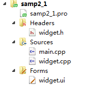

### 2.1.1　项目文件组成

在Qt Creator中新建一个Widget Application项目samp2_1，在选择窗口基类的页面（图1-8）选择QWidget作为窗体基类，并选中“Generate form”复选框。创建后的项目文件目录树如图2-1所示。

<b class="my_markdown">图2-1　项目文件的目录树</b>

这个项目包含以下一些文件。

+ 项目组织文件samp2_1.pro，存储项目设置的文件。
+ 主程序入口文件main.cpp，实现main()函数的程序文件。
+ 窗体界面文件widget.ui，一个XML格式存储的窗体上的元件及其布局的文件。
+ widget.h是所设计的窗体类的头文件，widget.cpp是widget.h里定义类的实现文件。在C++里，任何窗体或界面组件都是用类封装的，一个类一般有一个头文件（.h文件）和一个源程序文件（.cpp文件）。

