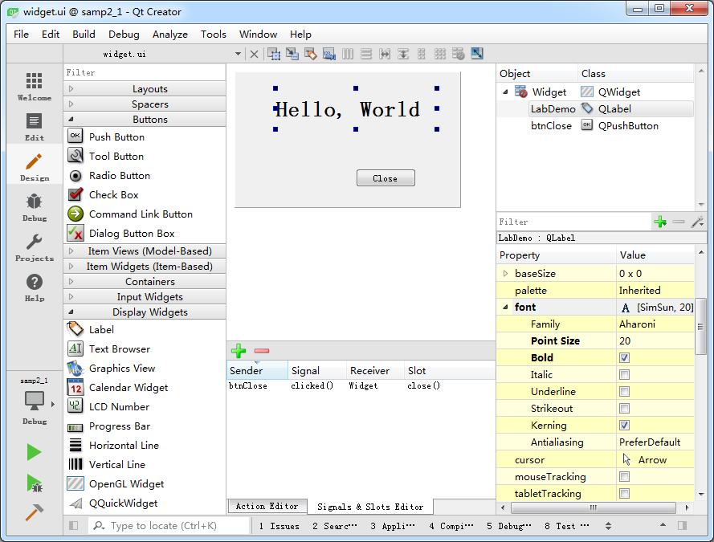
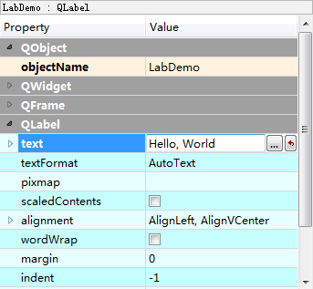
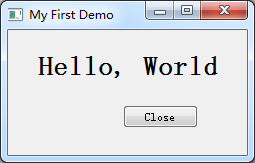

### 2.1.3　界面文件

后缀为“.ui”的文件是可视化设计的窗体的定义文件，如widget.ui。双击项目文件目录树中的文件widget.ui，会打开一个集成在Qt Creator中的Qt Designer对窗体进行可视化设计，如图2-2所示。

> **约定**
> 本书后面将称这个集成在Qt Creator中的Qt Designer为“UI设计器”，以便与独立运行的Qt Designer区别开来。

图2-2中的UI设计器有以下一些功能区域。

+ 组件面板。窗口左侧是界面设计组件面板，分为多个组，如Layouts、Buttons、Display Widgets等，界面设计的常见组件都可以在组件面板里找到。
+ 中间主要区域是待设计的窗体。如果要将某个组件放置到窗体上时，从组件面板上拖放一个组件到窗体上即可。例如，先放一个Label和一个Push Button到窗体上。
+ Signals和Slots 编辑器与Action编辑器是位于待设计窗体下方的两个编辑器。Signals和Slots 编辑器用于可视化地进行信号与槽的关联，Action编辑器用于可视化设计Action。

<b class="my_markdown">图2-2　集成在Qt Creator中的UI设计器</b>

+ 布局和界面设计工具栏。窗口上方的一个工具栏，工具栏上的按钮主要实现布局和界面设计。
+ 对象浏览器（Object Inspector）。窗口右上方是Object Inspector，用树状视图显示窗体上各组件之间的布局包含关系，视图有两列，显示每个组件的对象名称（ObjectName）和类名称。
+ 属性编辑器（Property Editor）。窗口右下方是属性编辑器，是界面设计时最常用到的编辑器。属性编辑器显示某个选中的组件或窗体的各种属性及其取值，可以在属性编辑器里修改这些属性的值。

图2-3显示的是选中窗体上放置的标签组件后属性编辑器的内容。最上方显示的文字“LabDemo: QLabel”表示这个组件是一个QLabel类的组件，objectName是LabDemo。属性编辑器的内容分为两列，Property列是属性的名称，Value列是属性的值。属性又分为多个组，实际上表示了类的继承关系，如在图2-3中，可以看出QLabel的继承关系是QObject→QWidget→QFrame→QLabel。

<b class="my_markdown">图2-3　界面组件的属性编辑器</b>

objectName表示组件的对象名称，界面上的每个组件都需要一个唯一的对象名称，以便被引用。界面上的组件的命名应该遵循一定的法则，具体使用什么样的命名法则根据个人习惯而定，主要目的是便于区分和记忆，也要便于与普通变量相区分。

设置其他属性的值只需在属性编辑器里操作即可，如设置LabDemo的text属性为“Hello, World”，只需像图2-3那样修改text属性的值即可。

> **提示**
> 标准C++语言里并没有property关键字，property是Qt对标准C++的扩展，使得在Qt Designer里就可以可视化设置类的数据。

在图2-2显示的设计窗体上，放置一个Label和一个Push Button组件，它们的主要属性设置见表2-1。

<b class="my_markdown">表2-1　界面组件的属性设置</b>

| ObjectName | 类名称 | 属性设置 | 备注 |
| :-----  | :-----  | :-----  | :-----  | :-----  | :-----  |
| LabDemo | QLabel | Text=”Hello, World” | Font.PointSize=20 | Font.bold=true | 设置标签显示文字和字体 |
| btnClose | QPushButton | Text=”Close” | 设置按钮的文字 |

编辑完属性之后，再为btnClose按钮增加一个功能，就是单击此按钮时，关闭窗口，退出程序。使用Signals和Slots 编辑器完成这个功能，如图2-4所示。

<b class="my_markdown">图2-4　信号与槽编辑器中设计信号与槽的关联</b>

在信号与槽编辑器的工具栏上单击“Add”按钮，在出现的条目中，Sender选择btnClose，Signal选择clicked()，Receiver选择窗体Widget，Slot选择close()。这样设置表示当按钮btnClose被单击时，就执行Widget的close()函数，实现关闭窗口的功能。

然后对项目进行编译和运行，可以出现如图2-5所示的窗口，单击“Close”按钮可以关闭程序。标签的文字内容和字体被修改了，窗口标题也显示为所设置的标题，而我们并没有编写一行程序语句，Qt是怎么实现这些功能的呢？

<b class="my_markdown">图2-5　具有Close按钮的“Hello World”程序</b>

