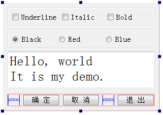

### 2.2.1　实例程序功能

创建一个Widget Application项目samp2_2，在创建窗体时选择基类QDialog，生成的类命名为QWDialog，并选择生成窗体。

如此新建的项目samp2_2有一个界面文件qwdialog.ui，一个头文件qwdialog.h和源程序文件qwdialog.cpp。此外，还有项目文件samp2_2.pro和主程序文件main.cpp。

qwdialog.ui界面文件设计时界面如图2-6所示。程序的主要功能是对中间一个文本框的文字字体样式和颜色进行设置。

<b class="my_markdown">图2-6　实例程序samp2_2设计时界面</b>

在界面设计时，对需要访问的组件修改其objectName，如各个按钮、需要读取输入的编辑框、需要显示结果的标签等，以便在程序里区分。对于不需要程序访问的组件则无需修改其objectName，如用于界面上组件分组的GroupBox、Frame、布局等，让UI设计器自动命名即可。

对图2-6中几个主要组件的命名、属性设置见表2-3。

<b class="my_markdown">表2-3　qwdialog.ui中各个组件的相关设置</b>

| 对象名 | 类名称 | 属性设置 | 备注 |
| :-----  | :-----  | :-----  | :-----  | :-----  | :-----  |
| txtEdit | QPlainTextEdit | Text="Hello, World | It is my demo. " | Font.PointSize=20 | 用于显示文字内容，可编辑 |
| chkBoxUnder | QCheckBox | Text="Underline" | 设置字体为下划线 |
| chkBoxItalic | QCheckBox | Text="Italic" | 设置字体为斜体 |
| chkBoxBold | QCheckBox | Text="Bold" | 设置字体为粗体 |
| rBtnBlack | QRadioButton | Text="Black" | 字体颜色为黑色 |
| rBtnRed | QRadioButton | Text="Red" | 字体颜色为红色 |
| rBtnBlue | QRadioButton | Text="Blue" | 字体颜色为蓝色 |
| btnOK | QPushButton | Text="确 定" | 返回确定，并关闭窗口 |
| btnCancel | QPushButton | Text="取 消" | 返回取消，并关闭窗口 |
| btnClose | QPushButton | Text="退 出" | 退出程序 |
| QWDialog | QWDialog | windowTitle="Dialog by Designer" | 界面窗口的类名称是QWDialog，objectName不要修改 |

对于界面组件的属性设置，需要注意以下几点。

（1）objectName是窗体上创建的组件的实例名称，界面上的每个组件需要有一个唯一的objectName，程序里访问界面组件时都是通过其objectName进行访问，自动生成的槽函数名称里也有objectName。所以，组件的objectName需要在设计程序之前设置好，设置好之后一般不要再改动。若设计程序之后再改动objectName，涉及的代码需要相应的改动。

（2）窗体的objectName就是窗体的类名称，在UI设计器里不要修改窗体的objectName，窗体的实例名称需要在使用窗体的代码里去定义。

