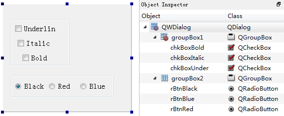
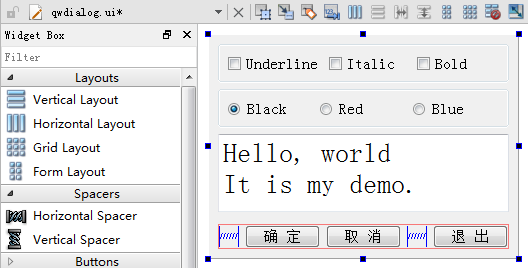
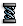
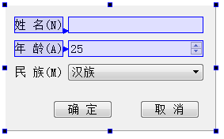
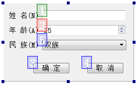

### 2.2.2　界面组件布局

Qt的界面设计使用了布局（Layout）功能。所谓布局，就是界面上组件的排列方式，使用布局可以使组件有规则地分布，并且随着窗体大小变化自动地调整大小和相对位置。布局管理是GUI设计的必备技巧，下面逐步讲解如何实现图2-6所示的界面设计。

#### 1．界面组件的层次关系

为了将界面上的各个组件的分布设计得更加美观，经常使用一些容器类，如QgoupBox、QtabWidget、QFrame等。例如，将3个CheckBox组件放置在一个GroupBox组件里，该GroupBox组件就是这3个CheckBox的容器，移动这个GroupBox就会同时移动其中的3个CheckBox。

图2-7显示的是设计图2-6界面的前期阶段。在窗体上放置了2个GroupBox组件，在groupBox1里放置3个CheckBox组件，在groupBox2里放置3个RadioButton组件。图2-7右侧Object Inspector里显示了界面上各组件之间的层次关系。

<b class="my_markdown">图2-7　界面组件的放置及层次关系</b>

#### 2．布局管理

Qt为界面设计提供了丰富的布局管理功能，在UI设计器中，组件面板里有Layouts和Spacers两个组件面板，在窗体上方的工具栏里有布局管理的按钮（如图2-8所示）。

<b class="my_markdown">图2-8　用于布局可视化设计的组件面板和工具栏</b>

Layouts和Spacers两个组件面板里的布局组件的功能见表2-4。

<b class="my_markdown">表2-4　组件面板上用于布局的组件</b>

| 布局组件 | 功能 |
| :-----  | :-----  | :-----  | :-----  |
| Vertical Layout | 垂直方向布局，组件自动在垂直方向上分布 |
| Horizontal Layout | 水平方向布局，组件自动在水平方向上分布 |
| Grid Layout | 网格状布局，网状布局大小改变时，每个网格的大小都改变 |
| Form Layout | 窗体布局，与网格状布局类似，但是只有最右侧的一列网格会改变大小 |
| Horizontal Spacer | 一个用于水平分隔的空格 |
| Vertical Spacer | 一个用于垂直分隔的空格 |

使用组件面板里的布局组件设计布局时，先拖放一个布局组件到窗体上，如在设计图2-8中3个按钮的布局时，先放一个Horizontal Layout到窗体上，布局组件会以红色边框显示。再往布局组件里拖放3个Push Button和2个Horizontal Spacer，就可以得到图2-8中3个按钮的水平布局效果。

在设计窗体的上方有一个工具栏，用于调整设计器进入不同的状态，以及进行布局设计，工具栏上各按钮的功能见表2-5。

<b class="my_markdown">表2-5　UI设计器工具栏各按钮的功能</b>

| 按钮及快捷键 | 功能 |
| :-----  | :-----  | :-----  | :-----  |
| Edit Widget (F3) | 界面设计进入编辑状态，就是正常的设计状态 |
| Edit Signals/Slots(F4) | 进入信号与槽的可视化设计状态 |
| Edit Buddies | 进入伙伴关系编辑状态，可以设置一个Label与一个组件成为伙伴关系 |
| Edit Tab Order | 进入Tab顺序编辑状态，Tab顺序是在键盘上按Tab键时，输入焦点在界面各组件之间跳动的顺序 |
| Lay Out Horizontally (Ctrl+H) | 将窗体上所选组件水平布局 |
| Lay Out Vertically (Ctrl+L) | 将窗体上所选组件垂直布局 |
| Lay Out Horizontally in Splitter | 将窗体上所选组件用一个分割条进行水平分割布局 |
| Lay Out Vertically in Splitter | 将窗体上所选组件用一个分割条进行垂直分割布局 |
| Lay Out in a Form Layout | 将窗体上所选组件按窗体布局 |
| Lay Out in a Grid | 将窗体上所选组件网格布局 |
| Break Layout | 解除窗体上所选组件的布局，也就是打散现有的布局 |
| Adjust Size(Ctrl+J) | 自动调整所选组件的大小 |

使用工具栏上的布局控制按钮时，只需在窗体上选中需要设计布局的组件，然后点击某个布局按钮即可。在窗体上选择组件时同时按住Ctrl键，可以实现组件多选，选择某个容器类组件，相当于选择了其内部的所有组件。例如，在图2-7的界面中，选中groupBox1，然后单击“Lay Out Horizontally”工具栏按钮，就可以对groupBox1内的3个CheckBox水平布局。

在图2-8的界面上，使groupBox1里的3个CheckBox水平布局，groupBox2里的3个RadioButton水平布局，下方3个按钮水平布局。在窗体上又放置了一个PlainTextEdit组件。现在，改变groupBox1、groupBox2或按钮的水平布局的大小，其内部组件都会自动改变大小。但是当改变窗体大小时，界面上的各组件却并不会自动改变大小。

随后还需为窗体指定一个总的布局。选中窗体（即不要选择任何组件），单击工具栏上的“Lay Out Vertically”按钮，使4个组件垂直分布。这样布局后，当窗体大小改变时，各个组件都会自动改变大小。

在UI设计器里可视化设计布局时，要善于利用水平和垂直空格组件，善于设置组件的最大、最小宽度和高度来实现某些需要的布局效果。

#### 3．伙伴关系与Tab顺序

在UI设计工具栏上单击“Edit Buddies”按钮可以进入伙伴关系编辑状态，如设计一个窗体时，进入伙伴编辑状态之后的界面如图2-9所示。

<b class="my_markdown">图2-9　编辑伙伴关系</b>

伙伴关系（Buddy）是指界面上一个Label和一个组件相关联，如图2-9中的伙伴关系编辑状态，单击一个Label，按住鼠标左键，然后拖向一个组件，就建立了Label和组件之间的伙伴关系。

伙伴关系是为了在程序运行时，在窗体上用快捷键快速将输入焦点切换到某个组件上。例如，在图2-9的界面上，设定“姓名”标签的Text属性为“姓名(&N)”，其中符号“&”用来指定快捷字符，界面上并不显示“&”，这里指定快捷字母为N。那么程序运行时，用户按下Alt+N，输入焦点就会快速切换到“姓名”关联的输入框内。

在UI设计器工具栏上单击“Edit Tab Order”按钮进入Tab顺序编辑状态（如图2-10所示）。Tab顺序是指在程序运行时，按下键盘上的Tab键时输入焦点的移动顺序。一个好的用户界面，在按Tab键时，焦点应该以合理的顺序在界面上移动，而不是随意地移动。

<b class="my_markdown">图2-10　Tab顺序编辑状态</b>

进入Tab顺序编辑状态后，在界面上会显示具有Tab顺序组件的编号，依次按希望的顺序单击组件，就可以重排Tab顺序了。没有输入焦点的组件是没有Tab顺序的，如Label组件。

