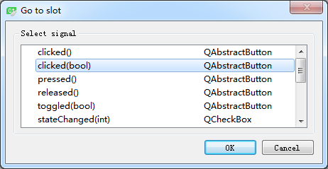
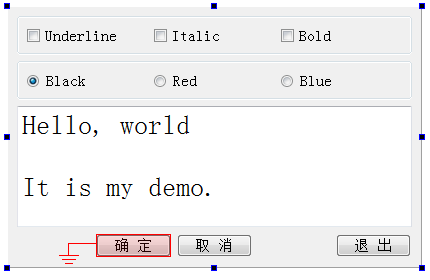
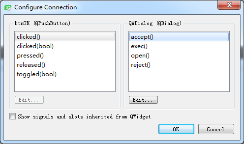

### 2.2.4　可视化生成槽函数原型和框架

下面开始设计程序功能。对于该程序，希望它的功能如下。

+ 单击UnderLine、Italic、Bold 3个CheckBox时，根据其状态，设置PlainTextEdit里的文字的字体样式；
+ Black、Red、Blue 3个RadioButton是互斥选择的，单击某个RadioButton时，设置文字的颜色；
+ 单击“确定”“取消”或“退出”按钮时，关闭窗口，退出程序。

#### 1．字体样式设置

窗体在设计模式下，选中chkBoxUnder组件，单击右键调出其快捷菜单。在快捷菜单中单击菜单项“Go to slot…”，出现如图2-11所示的对话框。


<center class="my_markdown"><b class="my_markdown">图2-11　QCheckBox的Go to slot对话框</b></center>

该对话框列出了QCheckBox类的所有信号，第一个是clicked()，第二个是带一个布尔类型参数的clicked(bool)。

信号clicked(bool)会将CheckBox组件当前的选择状态作为一个参数传递，在响应代码里可以直接利用这个传递的参数。而如果用信号clicked()，则需要在代码里读取CheckBox组件的选中状态。为了简化代码，选择clicked(bool)信号。

选择clicked(bool)，然后单击“OK”按钮，在QWDialog的类定义中，会在private slots部分自动增加一个槽函数声明，函数名是根据发射对象及其信号名称自动命名的。

```css
void on_chkBoxUnder_clicked(bool checked);
```

同时，在qwdialog.cpp文件中自动添加了函数on_chkBoxUnder_clicked(bool)的框架，在此函数中添加如下的代码，实现文本框字体下划线的控制。

```css
void QWDialog::on_chkBoxUnder_clicked(bool checked)
{   
    QFont   font=ui->txtEdit->font();
    font.setUnderline(checked);
    ui->txtEdit->setFont(font);
}
```

以同样的方法为Italic和Bold两个CheckBox设计槽函数，编译后运行，发现已经实现了修改字体的下划线、斜体、粗体属性的功能，说明信号与槽函数已经关联了。

但是，查看QWDialog的构造函数，构造函数只有简单的一条语句。

```css
QWDialog::QWDialog(QWidget *parent) : QDialog(parent), ui(new Ui::QWDialog)
{
    ui->setupUi(this);
}
```

这里没有发现用connect()函数进行几个CheckBox的信号与槽函数关联的操作。这些功能是如何实现的呢？

查看编译生成的ui_qwdialog.h文件。构造函数里调用的setupUi()是在ui_qwdialog.h文件里实现的。查看setupUi()函数的内容，也没有发现用connect()函数进行几个CheckBox的信号与槽关联的操作，只是在setupUI()里发现了如下的一条语句：

```css
QMetaObject::connectSlotsByName(QWDialog);
```

秘密就在于这条语句。connectSlotsByName(QWDialog)函数将搜索QWDialog界面上的所有组件，将信号与槽函数匹配的信号和槽关联起来，它假设槽函数的名称是：

```css
void on_<object name>_<signal name>(<signal parameters>);

```

例如，通过UI设计器的操作，为chkBoxUnder自动生成的槽函数是：

```css
void on_chkBoxUnder_clicked(bool checked);
```

它就正好是chkBoxUnder的信号clicked(bool)的槽函数。那么，connectSlotsByName()就会将此信号和槽函数关联起来，如同执行了下面的这样一条语句：

```css
connect(chkBoxUnder, SIGNAL(clicked (bool)), 
        this, SLOT (on_chkBoxUnder_clicked (bool));
```

这就是用UI设计器可视化设计某个组件的信号响应槽函数，而不用手工去将其关联起来的原因，都是在界面类的构造函数里调用setupUi()自动完成了关联。

#### 2．字体颜色设置

设置字体的3个RadioButton是互斥性选择的，即一次只有一个RadioButton被选中，虽然也可以采用可视化设计的方式设计其clicked()信号的槽函数，但是这样就需要生成3个槽函数。这里可以简化设计，即设计一个槽函数，将3个RadioButton的clicked()信号关联到这一个槽函数。

为此，在QWDialog类的private slots部分增加一个槽函数定义如下：

```css
void setTextFontColor();
```

> **提示**
> 将鼠标光标移动到这个函数的函数名上面，单击右键，在弹出的快捷菜单中选择“Refactor”→“Add Definition in qwdialog.cpp”，就可以在qwdialog.cpp文件中自动为函数setTextFontColor()生成一个函数框架。

在qwdialog.cpp文件中，为setTextFontColor()编写实现代码如下：

```css
void QWDialog::setTextFontColor()
{
   QPalette   plet=ui->txtEdit->palette();
   if (ui->rBtnBlue->isChecked())
      plet.setColor(QPalette::Text,Qt::blue);
   else if (ui->rBtnRed->isChecked())
      plet.setColor(QPalette::Text,Qt::red);
   else if (ui->rBtnBlack->isChecked())
      plet.setColor(QPalette::Text,Qt::black);
   else
      plet.setColor(QPalette::Text,Qt::black);
   ui->txtEdit->setPalette(plet);
}
```

由于这个槽函数是自定义的，所以不会自动与RadioButton的clicked()事件关联，此时编译后运行程序不会实现改变字体颜色的功能。需要在QWDialog的构造函数中手工进行关联，代码如下：

```css
QWDialog::QWDialog(QWidget *parent) :    QDialog(parent),    ui(new Ui::QWDialog)
{
   ui->setupUi(this);
   connect(ui->rBtnBlue,SIGNAL(clicked()),this,SLOT(setTextFontColor()));
   connect(ui->rBtnRed,SIGNAL(clicked()),this,SLOT(setTextFontColor()));
   connect(ui->rBtnBlack,SIGNAL(clicked()),this,SLOT(setTextFontColor()));
}
```

在构造函数中将3个RadioButton的clicked() 信号与同一个槽函数setTextFontColor()相关联。再编译后运行，就可以更改文字的颜色了。

#### 3．三个按钮的功能设计

界面上还有“确定”“取消”“退出”3个按钮，这是在对话框中常见的按钮。“确定”表示确认选择并关闭对话框，“取消”表示取消选择并关闭对话框，“退出”则直接关闭对话框。

QWDialog是从QDialog继承而来的，QDialog提供了accept()、reject()、close()等槽函数来表示这三种状态，只需将按钮的clicked()信号与相应槽函数关联即可。

下面采用可视化的方式，将按钮的clicked()信号与这些槽函数关联起来。在UI设计器里，单击上方工具栏里的“Edit Signals/Slots”按钮，窗体进入信号与槽函数编辑状态，如图2-12所示。将鼠标移动到“确定”按钮上方，再按下鼠标左键，移动到窗体的空白区域释放左键，这时出现如图2-13所示的关联设置对话框。


<center class="my_markdown"><b class="my_markdown">图2-12　窗体进入Signals/Slots编辑状态</b></center>


<center class="my_markdown"><b class="my_markdown">图2-13　信号与槽关联编辑对话框</b></center>

在图2-13中，左侧的列表框里显示了btnOK的信号，选择clicked()，右边的列表框里显示了QWDialog的槽函数，选择accept()，单击“OK”按钮。

同样的方法可以将btnCancel的clicked()信号与QWDialog的reject()槽函数关联，将btnClose的clicked()信号与QWDialog的close()槽函数关联。

> **注意**
> 在图2-13的右侧列表框中没有close()槽函数，需要勾选下方的“Show signals and slots inherited from QWidget”才会出现close()函数。

设置完3个按钮的信号与槽关联之后，在窗体下方的Signals和Slots 编辑器里也显示了这3个关联。实际上，可以直接在Signals和Slots 编辑器进行关联设置。现在编译并运行程序，单击这3个按钮都会关闭程序。

那么，这3个按钮的信号与槽函数的关联是在哪里实现的呢？答案在setupUi()函数里，在setupUi()函数里自动增加了以下3行代码：

```css
QObject::connect(btnOK, SIGNAL(clicked()), QWDialog, SLOT(accept()));
QObject::connect(btnCancel, SIGNAL(clicked()), QWDialog, SLOT(reject()));
QObject::connect(btnClose, SIGNAL(clicked()), QWDialog, SLOT(close()));
```

这个实例程序的功能全部完成了。采用UI设计器设计了窗体界面，采用可视化和程序化的方式设计槽函数，设计信号与槽函数之间的关联。从以上的设计过程可以看到，Qt Creator和UI设计器为设计应用程序提供了强大的可视化设计功能。

