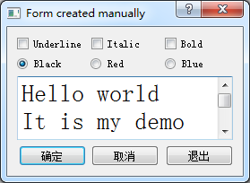

### 2.3.1　实例功能

首先建立一个Widget Appliation项目samp2_3，在创建项目向导中选择基类时，选择基类QDialog，新类的名称命名为QWDlgManual，关键是取消创建窗体，即不勾选“Generate form”复选框。创建后的项目文件目录树下没有qwdlgmanual.ui文件。

该项目通过代码创建一个对话框，实现与samp2_2类似的界面和功能。本例完成后的运行效果如图2-14所示，其界面和功能与samp2_2类似。

<b class="my_markdown">图2-14　实例samp2_3运行效果</b>

