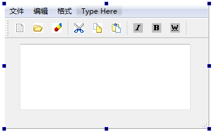
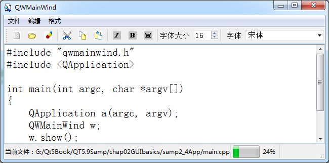

### 2.4.1　设计目的

可视化UI设计无需人工编写代码去处理大量繁琐的界面组件的创建和布局管理工作，可以直观地进行界面设计，大大提高工作效率。但是可视化UI设计也存在一些缺陷，如某些组件无法可视化地添加到界面上，比如在工具栏上无法可视化添加ComboBox组件，而用代码就可以。

采用纯代码方式进行UI设计虽然无所不能，但是设计效率太低，过程非常繁琐，而可视化UI设计简单高效。所以，能用可视化设计的就尽可能用可视化设计解决，无法解决的再用纯代码方式，将两种方法结合，才是高效设计UI的方法。

本节用一个实例讲解如何用混合方式创建UI，即部分界面设计用UI 设计器可视化实现，部分无法在UI设计器里实现的界面设计用代码实现。同时用这个实例讲解如何使用资源文件、如何使用Actions，如何设计主窗口里的菜单、工具栏和状态栏，这些是一般应用程序主窗口都有的功能。

图2-15是在UI设计器里设计完成的窗口。本项目的窗口类是从QMainWindow继承而来的，具有主菜单、工具栏和状态栏。这个例子实现了主菜单、主工具栏和状态栏，中间工作区里是一个TextEdit组件，用于编辑文本。

<b class="my_markdown">图2-15　在UI设计器里完成的窗口界面</b>

我们希望在工具栏上添加一个SpinBox组件，用于设置字体大小，还想在工具栏上添加一个FontComboBox组件，用于选择字体名称。但是在UI设计器里，将这些组件拖放到工具栏上时，会显示不能添加到工具栏上。同样，在窗体下方的状态栏上也不能直接添加Label和ProgressBar组件。这就是UI可视化设计的局限，无法实现某些界面效果。

但是通过编写代码，可以实现期望的界面效果。图2-16就是程序运行时的窗口，可见在工具栏上添加了设置字体大小的SpinBox组件和选择字体名称的FontComboBox组件，在状态栏上添加了显示当前文件名称的标签，还添加了一个ProgressBar。通过设计相应的槽函数并与界面组件的相关信号进行关联，实现了期望的程序功能。

<b class="my_markdown">图2-16　程序运行时的窗口界面</b>

这就是混合方式界面设计的效果，先将所有在UI设计器里可设计的静态UI元素都用可视化的方式实现，不能在UI设计器里可视化设计的再用代码实现。

