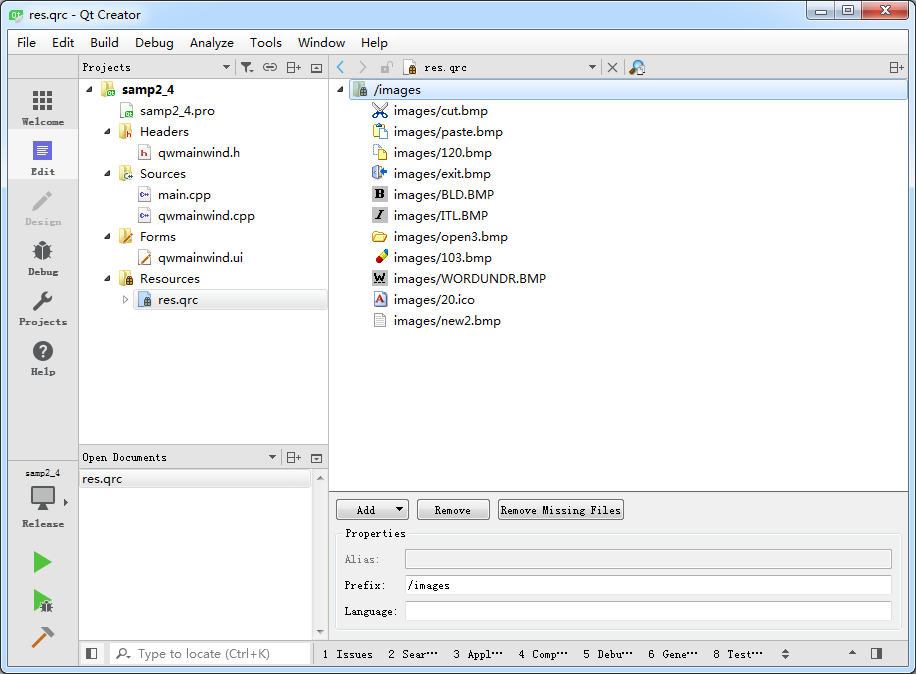

### 2.4.2　创建项目并添加资源文件

创建一个Widget Application项目，在向导的创建窗口类时，选择基类QMainWindow，新建类的名称设置为QWMainWind，并选择生成窗体。

本项目主窗口有菜单和工具栏，需要使用到图标。在Qt项目中，图标可以存储在资源文件里，为此先创建一个资源文件。在Qt Creator里单击“File”→“New File or Project…”菜单项，在新建文件与项目对话框里选择“Qt Resource File”，然后按照向导的指引设置资源文件的文件名，并添加到当前项目里。

本项目创建的资源文件名为res.qrc。在项目文件目录树里，会自动创建一个与Headers、Sources和Forms并列的Resources文件组，在Resources组里有res.qrc节点。在资源文件名节点上右击，在弹出的快捷菜单中选择“Open in Editor”打开资源文件编辑器（如图2-17所示）。

<b class="my_markdown">图2-17　资源文件编辑器</b>

资源文件最主要的一个功能就是存储图标和图片文件，以便在程序里使用。在资源文件里首先建一个前缀（Prefix），例如images，方法是在图2-17显示的窗口右下方的功能区单击“Add”按钮下的“Add Prefix”，设置一个前缀名，前缀就类似于是资源的分组。然后再单击“Add”按钮下的“Add Files”选择图标文件即可。如果所选的图标文件不在本项目的子目录里，会提示复制文件到项目下的子目录。所以，最好将图标等原始文件放在项目的子目录下。

