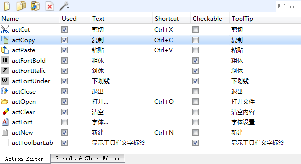
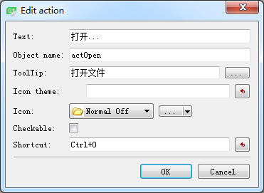

### 2.4.3　设计Action

QAction是一个非常有用的类，在界面设计时创建Action，并编写其trigger()信号的槽函数。使用设计的Action可以创建菜单项、工具栏按钮，还可以设置为QToolButton按钮的关联Action。点击这些由Action创建的菜单项、按钮就是执行Action的槽函数。

在项目文件目录树里双击qwmainwind.ui，进入UI设计器，在窗体的下方有一个Action Editor的面板，图2-18是本项目设计好之后的Action列表。根据图标和文字就可以知道每个Action的功能。

<b class="my_markdown">图2-18　Action编辑器</b>

在Action编辑器的上方有一个工具栏，可以新建、复制、粘贴、删除Action，还可以设置Action列表的显示方式。若要编辑某个Action，在列表里双击该Action即可。单击工具栏上的“New”按钮可以新建一个Action。新建或编辑Action的对话框如图2-19所示。

<b class="my_markdown">图2-19　新建或编辑一个Action</b>

在此对话框里有以下的一些设置。

+ Text：Action的显示文字，该文字会作为菜单标题或工具栏按钮标题显示。若该标题后面有省略号，如“打开…”，则在工具栏按钮上显示时会自动忽略省略号，只显示“打开”。
+ Object name：该Action的objectName。应该遵循自己的命名法则，如以“act”开头表示这是一个Action。图2-19中显示的是打开文件的Action，命名为actOpen。如果一个界面上Action比较多，还可以分组命名，如actFileOpen、actFileNew和actFileSave表示“文件”组，而actEditCut、actEditCopy、actEditPaste等表示“编辑”组。
+ ToolTip：这个文字内容是当鼠标在一个菜单项或工具栏按钮上短暂停留时出现的提示文字。
+ Icon：设置Action的图标，单击其右侧的按钮可以从资源文件里选择图标，或者直接选择图片文件作为图标。
+ Checkable：设置Action是否可以被复选，如果选中此选项，那么该Action就类似于QCheckbox可以改变其复选状态。
+ Shortcut：设置快捷键，将输入光标移动到Shortcut旁边的编辑框里，然后按下想要设置的快捷键即可，如“Ctrl+O”。

做好这些设置后，单击“OK”按钮就可以新建或修改Action了。所有用于菜单和工具栏设计的功能都需要用Action来实现。

