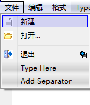
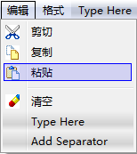
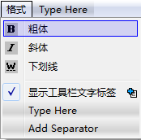

### 2.4.4　设计菜单和工具栏

建立Action之后，就可以在主窗体上设计菜单和工具栏了。本项目的窗体类QWMainWind是从QMainWindow继承的，具有菜单栏、工具栏和状态栏。

双击项目文件目录树里的qwmainwind.ui，在UI设计器里打开此窗口。在窗口最上方显示“Type Here”的地方是菜单栏，菜单栏下方是工具栏，窗口最下方是状态栏。

在菜单栏显示“Type Here”的地方双击，出现一个编辑框，在编辑框里输入所要设计菜单的分组名称，如“文件”，然后回车，这样就创建了一个“文件”菜单分组，同样可以创建“编辑”“格式”分组。

创建主菜单的分组后，从Action编辑器的列表里将一个Action拖放到菜单某个分组下，就可以创建一个菜单项，如同在界面上放置一个组件一样。如果需要在菜单里增加一个分隔条，双击“Add Seperator”就可以创建一个分隔条，然后拖动到需要的位置即可。如果需要删除某个菜单项或分隔条，单击右键，选择“Remove”菜单项。菜单设计的结果如图2-20所示。




<center class="my_markdown"><b class="my_markdown">图2-20　完成后的菜单栏各分组下的菜单项</b></center>

设计工具栏的方式也很相似。将一个Action拖放到窗口的工具栏上，就会新建一个工具栏按钮。同样可以在工具栏上添加分隔条，可以移除工具栏按钮。主窗口上初始的只有一个工具栏，如果需要设计多个工具栏，在主窗口上单击右键，单击“Add Tool Bar”即可新建一个工具栏。

工具栏上按钮的显示方式有多种，只需设置工具栏的toolButtonStyle属性，这是Qt::ToolButtonStyle枚举类型，缺省的是Qt::ToolButtonIconOnly，即只显示按钮的图标。还可以设置为：

+ Qt::ToolButtonTextBesideIcon——文字显示在按钮旁边；
+ Qt::ToolButtonTextOnly——只显示文字；
+ Qt::ToolButtonTextUnderIcon——文字显示在按钮下方。

同时在窗体上放置一个QTextEdit组件，其objectname设置为txtEdit。如此就完成了菜单栏、工具栏的可视化设计。

可视化设计的界面的底层实现是由ui_qwmainwind.h文件实现的。打开ui_qwmainwind.h文件，能看到如下代码（已删除部分设置布局的代码）。

```css
class Ui_QWMainWind
{
public:
   QAction *actCut;
   QAction *actCopy;
   QAction *actPaste;
   QAction *actFontBold;
   QAction *actFontItalic;
   QAction *actFontUnder;
   QAction *actClose;
   QAction *actOpen;
   QAction *actClear;
   QAction *actFont;
   QAction *actNew;
   QAction *actToolbarLab;
   QWidget *centralWidget;
   QtextEdit *txtEdit;
   QSpinBox *spinBox;
   QFontComboBox *fontComboBox;
   QMenuBar *menuBar;
   QMenu *menu;
   QMenu *menu_2;
   QMenu *menu_3;
   QtoolBar *mainToolBar;
   QStatusBar *statusBar;
   void setupUi(QMainWindow *QWMainWind)
   {
      if (QWMainWind->objectName().isEmpty())
         QWMainWind->setObjectName(QStringLiteral("QWMainWind"));
      QWMainWind->resize(586, 363);
      QFont font;
      font.setPointSize(11);
      QWMainWind->setFont(font);
      actCut = new QAction(QWMainWind);
      actCut->setObjectName(QStringLiteral("actCut"));
      QIcon icon;
      icon.addFile(QStringLiteral(":/images/images/cut.bmp"), QSize(), QIcon::Normal, QIcon::Off);
      actCut->setIcon(icon);
      actCopy = new QAction(QWMainWind);
      actCopy->setObjectName(QStringLiteral("actCopy"));
      QIcon icon1;
      icon1.addFile(QStringLiteral(":/images/images/120.bmp"), QSize(), QIcon::Normal, QIcon::Off);
      actCopy->setIcon(icon1);
//  创建其他action，省略...
      centralWidget = new QWidget(QWMainWind);
      centralWidget->setObjectName(QStringLiteral("centralWidget"));
      txtEdit = new QtextEdit(centralWidget);
      txtEdit->setObjectName(QStringLiteral("txtEdit"));
      txtEdit->setGeometry(QRect(20, 20, 231, 221));
      QFont font1;
      font1.setPointSize(16);
      txtEdit->setFont(font1);
      QWMainWind->setCentralWidget(centralWidget);
//主窗体创建菜单栏、工具栏和状态栏
      menuBar = new QMenuBar(QWMainWind);
      menuBar->setObjectName(QStringLiteral("menuBar"));
      menuBar->setGeometry(QRect(0, 0, 586, 23));
      menu = new QMenu(menuBar);
      menu->setObjectName(QStringLiteral("menu"));
      menu_2 = new QMenu(menuBar);
      menu_2->setObjectName(QStringLiteral("menu_2"));
      menu_3 = new QMenu(menuBar);
      menu_3->setObjectName(QStringLiteral("menu_3"));
      QWMainWind->setMenuBar(menuBar);
      mainToolBar = new QtoolBar(QWMainWind);
      mainToolBar->setObjectName(QStringLiteral("mainToolBar"));
      mainToolBar->setToolButtonStyle(Qt::ToolButtonTextUnderIcon);
      QWMainWind->addToolBar(Qt::TopToolBarArea, mainToolBar);
      statusBar = new QStatusBar(QWMainWind);
      statusBar->setObjectName(QStringLiteral("statusBar"));
      QWMainWind->setStatusBar(statusBar);
//主菜单添加菜单项
      menuBar->addAction(menu->menuAction());
      menuBar->addAction(menu_2->menuAction());
      menuBar->addAction(menu_3->menuAction());
      menu->addAction(actNew);
      menu->addAction(actOpen);
      menu->addSeparator();
      menu->addAction(actClose);
      menu_2->addAction(actCut);
      menu_2->addAction(actCopy);
      menu_2->addAction(actPaste);
      menu_2->addSeparator();
      menu_2->addAction(actClear);
      menu_3->addAction(actFontBold);
      menu_3->addAction(actFontItalic);
      menu_3->addAction(actFontUnder);
      menu_3->addSeparator();
      menu_3->addAction(actToolbarLab);
//主工具栏添加按钮
      mainToolBar->addAction(actNew);
      mainToolBar->addAction(actOpen);
      mainToolBar->addAction(actClear);
      mainToolBar->addSeparator();
      mainToolBar->addAction(actCut);
      mainToolBar->addAction(actCopy);
      mainToolBar->addAction(actPaste);
      mainToolBar->addSeparator();
      mainToolBar->addAction(actFontItalic);
      mainToolBar->addAction(actFontBold);
      mainToolBar->addAction(actFontUnder);
      mainToolBar->addSeparator();
      retranslateUi(QWMainWind);
      QMetaObject::connectSlotsByName(QWMainWind);
   } // setupUi
};
```

ui_qwmainwind.h中定义了类Ui_QWMainWind。在public部分定义了界面所有Action和各种组件的指针变量，在setupUi()函数里依次创建所有的Action和界面组件，然后将Action添加到主菜单和工具栏上。

ui_qwmainwind.h的代码很长，上面的清单已省略了若干行。查看ui_qwmainwind.h里的代码有助于了解Action、菜单、工具栏的代码实现原理。若按照实例samp2_3的方法完全通过手工的方式来设计这样一个窗口无疑是一件繁琐的工作。好在采用UI设计器设计界面时，不需要动手去编写这些代码。界面设计的代码实现交给Qt去做就好了，它比手工编写代码效率高。

