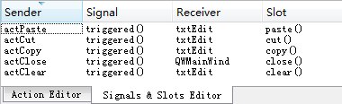

### 2.4.6　Action的功能实现

Action是一种不可见的界面元素，主要用于菜单项、工具栏按钮的设计。Action的主要信号是trigger()，为一个Action的trigger()信号编写槽函数之后，菜单和工具栏上由此Action创建的菜单项和工具栏按钮就都关联此槽函数。

#### 1．编辑功能Action的实现

用于编辑的Action有剪切、复制、粘贴和清除的功能，以便对txtEdit组件进行相应的操作。而QTextEdit类就有相应的槽函数，无需再编写实现代码，只需将Action的trigger()信号与txtEdit的相应槽函数进行关联即可。在Signals和Slots编辑器里设置信号与槽的关联，设计好后的几个Action的关联如图2-21所示。


<center class="my_markdown"><b class="my_markdown">图2-21　在信号与槽编辑器里设置关联</b></center>

#### 2．其他Action的功能实现

Action的主要信号是trigger()和trigger(bool)，在单击菜单项或工具栏按钮时发射。

用于设置粗体、斜体和下划线的3个Action具有Checkable属性，选择trigger(bool)信号设计槽函数更合适，该信号会将Action的复选状态作为一个参数传递，在响应代码里可以直接使用。其他Action可选择trigger()信号生成槽函数。在Action的“Go to slot”对话框，选择信号为Action创建槽函数。

下面是用于设置字体粗体的actFontBold槽函数代码，使用了trigger(bool)信号。

```css
void QWMainWind::on_actFontBold_triggered(bool checked)
{
   QtextCharFormat fmt; 
   fmt=ui->txtEdit->currentCharFormat();
   if (checked)
     fmt.setFontWeight(QFont::Bold);
   else
     fmt.setFontWeight(QFont::Normal);
   ui->txtEdit->mergeCurrentCharFormat(fmt);
}
```

其他Action的槽函数代码略。本实例只是为介绍混合法UI设计，以及应用程序开发的基本流程和方法，程序功能的具体实现不是本例的重点。例如，“打开文件”的代码实现涉及对话框调用、文件读取、数据流等操作，这些会在后续章节里介绍。

#### 3．Action的enabled和checked属性的更新

为了使界面和程序功能显得更加智能一点，应该根据当前的状态自动更新相关Action的checked和enabled属性，这是软件设计中常见的功能。

在本程序中，“剪切”“复制”“粘贴”的enabled属性应该随文本框内文字选择的状态变化而变化，“粗体”“斜体”“下划线”的checked属性应该随着当前文字的字体状态而自动更新。这可以针对QTextEdit的一些信号编写槽函数来实现。

在主窗体上选择文本编辑框txtEdit，在快捷菜单里调出“Go to slot”对话框。对话框里列出了QTextEdit的所有信号，有两个可以利用的信号。

+ copyAvailable(bool) 信号在有内容可以被复制时发射，并且传递了一个布尔参数，可以利用此信号来改变actCut，actCopy的enabled属性。
+ selectionChanged()信号在选择的文字发生变化时发射，利用此信号，可以读取当前文字的格式，从而更新粗体、斜体和下划线3种字体设置Action的checked属性。

为txtEdit组件的这两个信号生成槽函数定义和函数体框架，编写代码如下：

```css
void QWMainWind::on_txtEdit_copyAvailable(bool b)
{ //更新cut,copy,paste的enabled属性
   ui->actCut->setEnabled(b); 
   ui->actCopy->setEnabled(b);  
   ui->actPaste->setEnabled(ui->txtEdit->canPaste()); 
}
void QWMainWind::on_txtEdit_selectionChanged()
{//更新粗体、斜体和下划线3种action的checked属性
   QtextCharFormat fmt;
   fmt=ui->txtEdit->currentCharFormat();             //获取文字的格式
   ui->actFontItalic->setChecked(fmt.fontItalic());  //是否斜体
   ui->actFontBold->setChecked(fmt.font().bold());   //是否粗体
   ui->actFontUnder->setChecked(fmt.fontUnderline());//是否有下划线
}
```

