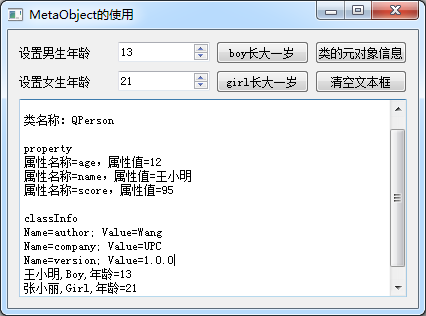

### 3.1.5　元对象特性测试实例

#### 1．QPerson类的定义

实例samp3_1演示Qt元对象系统的一些功能。samp3_1是主窗口基于QWidget的应用程序，在项目创建后，创建一个类QPerson。qperson.h文件中的类定义如下所示：

```css
class QPerson : public QObject
{  Q_OBJECT
   Q_CLASSINFO("author","Wang")
   Q_CLASSINFO("company","UPC")
   Q_CLASSINFO("version","1.0.0")
   Q_PROPERTY(int age READ age WRITE setAge NOTIFY ageChanged)
   Q_PROPERTY(QString name MEMBER m_name)
   Q_PROPERTY(int score MEMBER m_score)
private:
   int  m_age=10;
   QString  m_name;
   int      m_score=79;
public:
   explicit  QPerson(QString fName, QObject *parent = nullptr);
   int     age();
   void    setAge(int value);
   void    incAge(); 
signals:
   void    ageChanged(int value);
public slots:
};
```

QPerson是QObject的子类，在类定义部分使用了宏Q_OBJECT，这样QPerson就获得了元对象系统支持，能使用信号与槽、属性等功能。

QPerson使用Q_CLASSINFO宏定义了3个附加信息，使用Q_PROPERTY宏定义了3个属性，还定义了一个信号。下面是QPerson类的实现代码：

```css
QPerson::QPerson(QString fName,QObject *parent) : QObject(parent)
{ //构造函数
   m_name=fName;
}
int QPerson::age()   //返回age
{  return  m_age;
}
void QPerson::setAge(int value) //设置age
{   m_age=value;
   emit ageChanged(m_age); //发射信号
}
void QPerson::incAge()
{   m_age++;
   emit ageChanged(m_age);//发射信号
}
```

setAge(int)函数用于设置年龄，代码里设置年龄后发射信号ageChanged()。

incAge()是一个单独的接口函数，与属性无关，但是也发射信号ageChanged()。

#### 2．元对象特性的使用

实例samp3_1运行时界面如图3-1所示。


<center class="my_markdown"><b class="my_markdown">图3-1　实例samp3_1运行时界面</b></center>

主窗口是基于QWidget的可视化设计的类QmyWidget，其定义如下：

```css
class QmyWidget : public QWidget
{
   Q_OBJECT
private:
   QPerson *boy;
   QPerson *girl;
public:
   explicit QmyWidget(QWidget *parent = 0);
   ~QmyWidget();
private:
   Ui::QmyWidget *ui;
private slots:
//自定义槽函数
   void   on_ageChanged(int  value);
   void   on_spin_valueChanged(int arg1);
//界面按钮的槽函数
   void on_btnClear_clicked();
   void on_btnBoyInc_clicked();
   void on_btnGirlInc_clicked();
   void on_btnClassInfo_clicked();
}
```

QmyWidget类里定义了两个QPerson类型的指针变量，定义了两个自定义槽函数。构造函数的代码如下：

```css
QmyWidget::QmyWidget(QWidget *parent) : QWidget(parent), ui(new Ui::QmyWidget)
{//构造函数
   ui->setupUi(this);
   boy=new QPerson("王小明");
   boy->setProperty("score",95);
   boy->setProperty("age",10);
   boy->setProperty("sex","Boy");//动态属性
   connect(boy,&QPerson::ageChanged,this,&QmyWidget::on_ageChanged);
   girl=new QPerson("张小丽");
   girl->setProperty("score",81);
   girl->setProperty("age",20);
   girl->setProperty("sex","Girl");//动态属性
   connect(girl,&QPerson::ageChanged,this,&QmyWidget::on_ageChanged);
   ui->spinBoy->setProperty("isBoy",true); //动态属性
   ui->spinGirl->setProperty("isBoy",false);
   connect(ui->spinGirl,SIGNAL(valueChanged(int)),
          this,SLOT(on_spin_valueChanged(int)));
   connect(ui->spinBoy,SIGNAL(valueChanged(int)),
          this,SLOT(on_spin_valueChanged(int)));
}
```

创建QPerson类型对象boy后，使用setProperty()函数设置了score、age属性的值，这两个属性是QPerson类里定义的。还设置了一个属性sex的值。

```css
boy->setProperty("sex","Boy");
```

sex属性在QPerson类里没有定义，所以这个属性是个动态属性。

创建对象boy和girl后，它们的ageChanged()信号都与槽函数on_ageChanged()关联，设置信号与槽关联时使用了函数指针的形式，因为QPerson只有一个ageChanged()信号，具有缺省函数参数，这样设置关联是可以的。

为界面上的组件spinBoy和spinGirl也设置了一个逻辑型动态属性isBoy，分别赋值为true和false，并且这两个spinBox的信号valueChanged(int)都与槽函数on_spin_valueChanged(int)相关联。但是，这里使用connect()函数设置关联时必须使用SIGNAL和SLOT宏的形式，而不能使用函数指针的形式，因为QSpinBox有两个valueChanged()信号，只是参数不同。

自定义槽函数on_ageChanged()用于响应QPerson的ageChanged()信号，其实现代码如下：

```css
void QmyWidget::on_ageChanged( int value)
{//响应QPerson的ageChanged()信号
   Q_UNUSED(value);
   QPerson *aPerson = qobject_cast<QPerson *>(sender()); //类型投射
   QString hisName=aPerson->property("name").toString(); //姓名
   QString hisSex=aPerson->property("sex").toString(); //动态属性
   int hisAge=aPerson->age();//通过接口函数获取年龄
//   int hisAge=aPerson->property("age").toInt();//通过属性获得年龄
   ui->textEdit->appendPlainText(hisName+","+hisSex
                         +QString::asprintf(",年龄=%d",hisAge));
}
```

这里使用了QObject:: sender()函数获取信号发射者。因为信号发射者是QPerson类型对象boy或girl，所以可以用qobject_cast()将发射者投射为具体的类型。

```css
QPerson *aPerson = qobject_cast<QPerson *>(sender());
```

这样得到信号发射者QPerson类型的对象指针aPerson，它指向boy或girl。

使用aPerson指针，通过property()函数获取name属性的值，也可以获取动态属性sex的值。因为在QPerson中，name属性只用MEMBER关键字定义了一个私有变量表示这个属性，所以只能用property()读取此属性的值，也只能用setProperty()设置此属性的值。

读取年龄时，直接用了接口函数，即：

```css
int hisAge=aPerson->age();
```

当然也可以采用property()函数获取年龄，即：

```css
int hisAge=aPerson->property("age").toInt();
```

因为定义age属性时用READ和WRITE指定了公共的接口函数，既可以通过property()和setProperty()进行属性读写，也可以直接使用接口函数进行读写。当然，直接使用接口函数速度更快。

界面上两个分别用于设置boy和girl年龄的spinBox的valueChanged(int)信号与槽函数on_spin_valueChanged(int)关联，槽函数代码如下：

```css
void QmyWidget::on_spin_valueChanged(int arg1)
{//响应界面上spinBox的valueChanged(int)信号
   Q_UNUSED(arg1);
   QSpinBox *spinBox = qobject_cast<QSpinBox *>(sender());
   if (spinBox->property("isBoy").toBool())
      boy->setAge(spinBox->value());
   else
      girl->setAge(spinBox->value());
}
```

这里也使用了信号发射者的类型投射，投射为QSpinBox类型指针spinBox，然后根据spinBox的动态属性isBoy的值，确定调用boy或girl的setAge()函数。

这种编写代码的方式一般用于为多个同类型组件的同一信号编写一个槽函数，在槽函数里区分信号来源分别做处理，避免为每个组件分别编写槽函数形成的代码冗余。

界面上“类的元对象信息”按钮的响应代码如下：

```css
void QmyWidget::on_btnClassInfo_clicked()
{//"类的元对象信息"按钮
   const QMetaObject *meta=boy->metaObject();
   ui->textEdit->clear();
   ui->textEdit->appendPlainText("==元对象信息==\n");
   ui->textEdit->appendPlainText(
            QString("类名称：%1\n").arg(meta->className()));
   ui->textEdit->appendPlainText("property");
   for (int i=meta->propertyOffset();i<meta->propertyCount();i++)
   {
      QMetaProperty prop=meta->property(i);
      const char* propName=prop.name();
      QString   propValue=boy->property(propName).toString();
      ui->textEdit->appendPlainText(
        QString("属性名称=%1，属性值=%2").arg(propName).arg(propValue));
   }
   ui->textEdit->appendPlainText("");
   ui->textEdit->appendPlainText("classInfo");
   for (int i=meta->classInfoOffset();i<meta->classInfoCount();++i)
   {
      QMetaClassInfo classInfo=meta->classInfo(i);
      ui->textEdit->appendPlainText(QString("Name=%1; Value=%2")
                  .arg(classInfo.name()).arg(classInfo.value()));
   }
}
```

代码里通过boy->metaObject()获得对象boy的元对象。元对象类QMetaObject封装了访问类的元对象的各种接口函数，例如，QMetaObject:: className()返回类的名称。

QMetaObject用于属性操作的函数有以下几种。

+ propertyOffset()：返回类的第一个属性的序号，第一个属性的序号不一定是0。
+ propertyCount()：返回类的属性个数。
+ QMetaProperty property(int index)：返回序号为index的属性对象，返回值是QMetaProperty类型，它封装了对属性的更多特征查询功能，以及属性值的读写功能。

QMetaClassInfo类封装了类的classInfo的访问接口函数，只有name()和value()两个接口函数。

