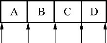

### 3.4.1　Java类型迭代器

#### 1．Java类型迭代器总表

对于每个容器类，有两个Java类型迭代器：一个用于只读操作，一个用于读写操作，各个Java类型的容器类见表3-3。

<center class="my_markdown"><b class="my_markdown">表3-3　Java类型的迭代器类</b></center>

| 容器类 | 只读迭代器 | 读写迭代器 |
| :-----  | :-----  | :-----  | :-----  | :-----  |
| QList<T>, QQueue<T> | QListIterator<T> | QMutableListIterator<T> |
| QLinkedList<T> | QLinkedListIterator<T> | QMutableLinkedListIterator<T> |
| QVector<T>, QStack<T> | QVectorIterator<T> | QMutableVectorIterator<T> |
| QSet<T> | QSetIterator<T> | QMutableSetIterator<T> |
| QMap<Key, T>, QMultiMap<Key, T> | QMapIterator<Key, T> | QMutableMapIterator<Key, T> |
| QHash<Key, T>, QMultiHash<Key, T> | QHashIterator<Key, T> | QMutableHashIterator<Key, T> |

QMap和QHash等关联容器类的迭代器用法相同，QList和QLinkedList、QSet等容器类的用法相同，所以下面只以QMap和QList为例介绍迭代器的用法。

#### 2．顺序容器类的迭代器的使用

Java类型迭代器的指针不是指向一个数据项，而是在数据项之间，迭代器指针位置示意图如图3-2所示。


<center class="my_markdown"><b class="my_markdown">图3-2　Java类型迭代器位置示意图</b></center>

下面是遍历访问一个QList<QString>容器的所有数据项的典型代码。

```css
QList<QString> list;
list << "A" << "B" << "C" << "D";
QListIterator<QString> i(list);
while (i.hasNext())
   qDebug() << i.next();
```

QList< QString>容器对象list作为参数传递给QListIterator< QString >迭代器i的构造函数，i用于对list作只读遍历。起始时刻，迭代器指针在容器第一个数据项的前面（图3-2中数据项“A”的前面），调用hasNext()判断在迭代器指针后面是否还有数据项，如果有，就调用next()跳过一个数据项，并且next()函数返回跳过去的那个数据项。

也可以反向遍历，示例代码如下：

```css
QListIterator<QString> i(list);
i.toBack();
while (i.hasPrevious())
   qDebug() << i.previous();
```

QListIterator用于移动指针和读取数据的函数见表3-4。

<center class="my_markdown"><b class="my_markdown">表3-4　QListIterator常用函数</b></center>

| 函数名 | 功能 |
| :-----  | :-----  | :-----  | :-----  |
| void　toFront() | 迭代器移动到列表的最前面（第一个数据项之前） |
| void　toBack() | 迭代器移动到列表的最后面（最后一个数据项之后） |
| bool　hasNext() | 如果迭代器不是位于列表最后位置，返回true |
| const T & next() | 返回下一个数据项，并且迭代器后移一个位置 |
| const T & peekNext() | 返回下一个数据项，但是不移动迭代器位置 |
| bool　hasPrevious() | 如果迭代器不是位于列表的最前面，返回true |
| const T & previous() | 返回前一个数据项，并且迭代器前移一个位置 |
| const T & peekPrevious() | 返回前一个数据项，但是不移动迭代器指针 |

QListIterator是只读访问容器内数据项的迭代器，若要在遍历过程中对容器的数据进行修改，需要使用QMutableListIterator。例如下面的示例代码为删除容器中数据为奇数的项。

```css
QList<int> list;
list <<1 <<2<<3<<4<<5;
QMutableListIterator<int> i(list);
while (i.hasNext()) {
   if (i.next() % 2 != 0)
      i.remove();
}
```

remove()函数移除next()函数刚刚跳过的一个数据项，不会使迭代器失效。

setValue()函数可以修改刚刚跳过去的数据项的值。

#### 3．关联容器类的迭代器的使用

对于关联容器类QMap<Key T>，使用QMapIterator和QMutableMapIterator迭代器类，它们具有表3-4所示的所有函数，主要是增加了key()和value()函数用于获取刚刚跳过的数据项的键和值。

例如，下面的代码将删除键（城市名称）里以“City”结尾的数据项。

```css
QMap<QString, QString> map;
map.insert("Paris", "France");
map.insert("New York", "USA");
map.insert("Mexico City", "USA");
map.insert("Moscow", "Russia");
...
QMutableMapIterator<QString, QString> i(map);
while (i.hasNext()) {
   if (i.next().key().endsWith("City"))
      i.remove();
}
```

如果是在多值容器里遍历，可以用findNext()或findPrevious()查找下一个或上一个值，如下面的代码将删除上一示例代码中map里值为“USA”的所有数据项。

```css
QMutableMapIterator<QString, QString> i(map);
while (i.findNext("USA"))
   i.remove();
```

