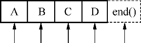

### 3.4.2　STL类型迭代器

#### 1．STL类型迭代器总表

STL迭代器与Qt和STL的原生算法兼容，并且进行了速度优化。具体类型见表3-5。

对于每一个容器类，都有两个STL类型迭代器：一个用于只读访问，一个用于读写访问。无需修改数据时一定使用只读迭代器，因为它们速度更快。

<center class="my_markdown"><b class="my_markdown">表3-5　STL类型的迭代器类</b></center>

| 容器类 | 只读迭代器 | 读写迭代器 |
| :-----  | :-----  | :-----  | :-----  | :-----  |
| QList<T>, QQueue<T> | QList<T>::const_iterator | QList<T>::iterator |
| QLinkedList<T> | QLinkedList<T>::const_iterator | QLinkedList<T>::iterator |
| QVector<T>, QStack<T> | QVector<T>::const_iterator | QVector<T>::iterator |
| QSet<T> | QSet<T>::const_iterator | QSet<T>::iterator |
| QMap<Key, T> | QMultiMap<Key, T> | QMap<Key, T>::const_iterator | QMap<Key, T>::iterator |
| QHash<Key, T> | QMultiHash<Key, T> | QHash<Key, T>::const_iterator | QHash<Key, T>::iterator |

> **注意**
> 在定义只读迭代器和读写迭代器时的区别，它们使用了不同的关键字，const_iterator定义只读迭代器，iterator定义读写迭代器。此外，还可以使用const_reverse_iterator和reverse_iterator定义相应的反向迭代器。

STL类型的迭代器是数组的指针，所以“++”运算符使迭代器指向下一个数据项，“*”运算符返回数据项内容。与Java类型的迭代器不同，STL迭代器直接指向数据项，STL迭代器指向位置示意图如图3-3所示。


<center class="my_markdown"><b class="my_markdown">图3-3　STL类型迭代器位置示意图</b></center>

begin()函数使迭代器指向容器的第一个数据项，end()函数使迭代器指向一个虚拟的表示结尾的数据项，end()表示的数据项是无效的，一般用作循环结束条件。

下面仍然以QList和QMap为例说明STL迭代器的用法，其他容器类迭代器的用法类似。

#### 2．顺序容器类的迭代器的用法

下面的示例代码将QList<QString> list里的数据项逐项输出。

```css
QList<QString> list;
list << "A" << "B" << "C" << "D";
QList<QString>::const_iterator i;
for (i = list.constBegin(); i != list.constEnd(); ++i)
   qDebug() << *i;
```

constBegin()和constEnd()是用于只读迭代器的，表示起始和结束位置。

若使用反向读写迭代器，并将上面示例代码中list的数据项都改为小写，代码如下：

```css
QList<QString>::reverse_iterator i;
for (i = list.rbegin(); i != list.rend(); ++i)
   *i = i->toLower();
}
```

#### 3．关联容器类的迭代器的用法

对于关联容器类QMap和QHash，迭代器的“*”操作符返回数据项的值。如果想返回键，使用key()函数。对应的，用value()函数返回一个项的值。

例如，下面的代码将QMap<int, int> map中所有项的键和值输出。

```css
QMap<int, int> map;
...
QMap<int, int>::const_iterator i;
for (i = map.constBegin(); i != map.constEnd(); ++i)
   qDebug() << i.key() << ':' << i.value();
```

Qt API包含很多返回值为QList或QStringList的函数，要遍历这些返回的容器，必须先复制。由于Qt使用了隐式共享，这样的复制并无多大开销。例如下面的代码是正确的。

```css
const QList<int> sizes = splitter->sizes();
QList<int>::const_iterator i;
for (i = sizes.begin(); i != sizes.end(); ++i)
   ...
```

> **提示**
> 隐式共享（Implicit Sharing）是对象的管理方法。一个对象被隐式共享，只是传递该对象的一个指针给使用者，而不实际复制对象数据，只有在使用者修改数据时，才实质复制共享对象给使用者。如在上面的代码中，splitter->sizes()返回的是一个QList<int>列表对象sizes，但是实际上代码并不将splitter->sizes()表示的列表内容完全复制给变量sizes，只是传递给它一个指针。只有当sizes发生数据修改时，才会将共享对象的数据复制给sizes，这样避免了不必要的复制，减少了资源占用。

而下面的代码是错误的。

```css
QList<int>::const_iterator i;
for (i = splitter->sizes().begin(); i != splitter->sizes().end(); ++i)
   ...
```

对于STL类型的迭代器，隐式共享还涉及另外一个问题，即当有一个迭代器在操作一个容器变量时，不要去复制这个容器变量。

