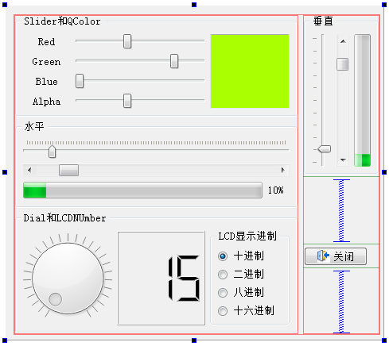

### 4.3.1　实例功能

除了LineEdit和SpinBox之外，还有其他一些用于数值输入和显示的组件。实例samp4_4演示如何使用这些组件，图4-4是实例samp4_4的设计界面。

<b class="my_markdown">图4-4　实例Samp4_4设计界面</b>

在这个实例中，用到如下一些组件。

+ QSlider：滑动条，通过滑动来设置数值，可用于数值输入。实例中使用4个滑动条输入红、绿、蓝三色和Alpha值，然后合成颜色，作为一个QTextEdit组件的底色。
+ QScrollBar：卷滚条，与QSlider功能类似，还可以用于卷滚区域。
+ QProgressBar：进度条，一般用于显示任务进度，可用于数值的百分比显示。实例程序中滑动一个Slider，获取其值并更新ScrollBar和ProgressBar。
+ QDial：表盘式数值输入组件，通过转动表针获得输入值。
+ QLCDNumber：模仿LCD数字的显示组件，可以显示整数或浮点数，显示整数时可以不同进制显示。实例程序中转动表盘，获得的值显示在LCD组件中。单击“LCD显示进制”的RadioButton时，设置LCD的显示进制。

