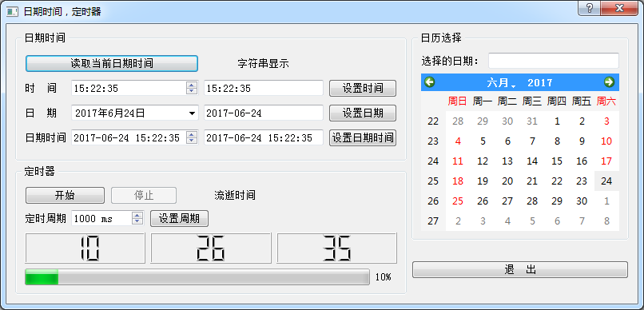

### 4.4.1　时间日期相关的类

时间日期是经常遇到的数据类型，Qt中时间日期类型的类如下。

+ QTime: 时间数据类型，仅表示时间，如 15:23:13。
+ QDate: 日期数据类型，仅表示日期，如2017-4-5。
+ QDateTime：日期时间数据类型，表示日期和时间，如2017-03-23 08:12:43。

Qt中有专门用于日期、时间编辑和显示的界面组件，介绍如下。

+ QTimeEdit: 编辑和显示时间的组件。
+ QDateEdit：编辑和显示日期的组件。
+ QDateTimeEdit：编辑和显示日期时间的组件。
+ QCalendarWidget：一个用日历形式选择日期的组件。

定时器是用来处理周期性事件的一种对象，类似于硬件定时器。例如设置一个定时器的定时周期为1000毫秒，那么每1000毫秒就会发射定时器的timeout()信号，在信号关联的槽函数里就可以做相应的处理。Qt中的定时器类是QTimer，它直接从QObject类继承而来，不是界面组件类。

实例程序samp4_5演示这些时间日期相关类的使用，其运行时界面如图4-5所示。

<b class="my_markdown">图4-5　实例samp4_5运行时界面</b>

