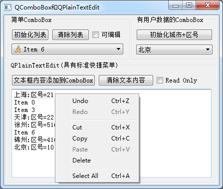

### 4.5.1　实例功能概述

QComboBox是下拉列表框组件类，它提供一个下拉列表供用户选择，也可以直接当作一个QLineEdit用作输入。QComboBox除了显示可见下拉列表外，每个项（item，或称列表项）还可以关联一个QVariant类型的变量，用于存储一些不可见数据。

QPlainTextEdit是一个多行文本编辑器，用于显示和编辑多行简单文本。实例samp4_6演示QComboBox和QPlainTextEdit的使用，其运行时界面如图4-6所示。

<b class="my_markdown">图4-6　实例samp4_6运行界面</b>

