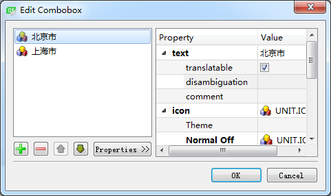

### 4.5.2　QComboBox的使用

#### 1．设计时属性设置

QComboBox主要的功能是提供一个下拉列表供选择输入。在界面上放置一个QComboBox组件后，双击此组件，可以出现如图4-7所示的对话框，对QComboBox组件的下拉列表的项进行编辑。在图4-7所示的对话框中，可以进行编辑，如添加、删除、上移、下移操作，还可以设置项的图标。


<center class="my_markdown"><b class="my_markdown">图4-7　QComboBox组件设计时的列表项编辑器</b></center>

#### 2．用代码添加简单项

窗口上的“初始化列表”按钮初始化下拉列表框的列表内容，其代码如下：

```css
void Widget::on_btnIniItems_clicked()
{ //"初始化列表"按钮
   QIcon   icon;
   icon.addFile(":/images/icons/aim.ico");
   ui->comboBox->clear();
   for (int i=0;i<20;i++)
      ui->comboBox->addItem(icon,QString::asprintf("Item %d",i)); //带图标
//    ui->comboBox->addItem(QString::asprintf("Item %d",i)); //不带图标
}
```

添加一个项时可以指定一个图标，图标来源于资源文件。

addItem()用于添加一个列表项，如果只是添加字符串列表项，而且数据来源于一个QStringList变量，可以使用addItems()函数，示例代码如下：

```css
ui->comboBox->clear();
QStringList strList;
strList<<"北京"<<"上海"<<"天津"<<"河北省"<<"山东省"<<"山西省";
ui->comboBox->addItems(strList);
```

#### 3．添加具有用户数据的项

QComboBox::addItem()函数的两种参数的原型定义如下：

```css
void addItem (const QString &text, const QVariant &userData = QVariant())
void addItem (const QIcon &icon, const QString &text, const QVariant &userData = QVariant())
```

不管是哪一个addItem()函数，后面都有一个可选的QVariant类型的参数userData，可以利用这个变量存储用户定义数据。

界面上另一个ComboBox组件使用了用户数据，“初始化城市+区号”按钮的槽函数代码如下：

```css
void Widget::on_btnIni2_clicked()
{//初始化具有自定义数据的ComboBox
   QMap<QString, int> City_Zone;
   City_Zone.insert("北京",10);
   City_Zone.insert("上海",21);
   City_Zone.insert("天津",22);
   City_Zone.insert("大连",411);
   City_Zone.insert("锦州",416);
   City_Zone.insert("徐州",516);
   City_Zone.insert("福州",591);
   City_Zone.insert("青岛",532);
   ui->comboBox2->clear();
   foreach(const QString &str,City_Zone.keys())
      ui->comboBox2->addItem(str,City_Zone.value(str));
}
```

这里定义了一个关联容器类QMap<QString, int> City_Zone，用于存储<城市，区号>映射表。为City_Zone填充数据后，给comboBox2添加项时，使用了foreach关键字遍历City_Zone.keys()。添加项的语句如下：

```css
ui->comboBox2->addItem(str,City_Zone.value(str));
```

城市名称作为项显示的字符串，电话区号作为项关联的用户数据，但是在列表框里只能看到城市名称。

> **注意**
> 将City_Zone的内容添加到列表框之后，列表框里显示的列表项的顺序与源程序中设置City_Zone的顺序不一致，因为QMap<Key, T>容器类会自动按照Key排序。

#### 4．QComboBox列表项的访问

QComboBox存储的项是一个列表，但是QComboBox不提供整个列表用于访问，可以通过索引访问某个项。访问项的一些函数主要有以下几种。

+ int currentIndex()，返回当前项的序号，第一个项的序号为0。
+ QString currentText()，返回当前项的文字。
+ QVariant currentData(int role = Qt::UserRole)，返回当前项的关联数据，数据的缺省角色为role = Qt::UserRole，角色的意义在5.1节详细介绍。
+ QString itemText(int index)，返回指定索引号的项的文字。
+ QVariant itemData(int index, int role = Qt::UserRole)，返回指定索引号的项的关联数据。
+ int count()，返回项的个数。

在一个QComboBox组件上选择项发生变化时，会发射如下两个信号：

```css
void currentIndexChanged(int index)
void currentIndexChanged(const QString &text)
```

这两个信号只是传递的参数不同，一个传递的是当前项的索引号，一个传递的当前项的文字。

为使用方便，选择为currentIndexChanged(const QString &text)信号编写槽函数。窗体上只存储字符串列表的comboBox的槽函数代码如下：

```css
void Widget::on_comboBox_currentIndexChanged(const QString &arg1)
{
   ui->plainTextEdit->appendPlainText(arg1);
}
```

关联有城市区号的comboBox2的槽函数代码如下：

```css
void Widget::on_comboBox2_currentIndexChanged(const QString &arg1)
{ 
   QString zone=ui->comboBox2->currentData().toString();  //项关联的数据
   ui->plainTextEdit->appendPlainText(arg1+":区号="+zone);
}
```

