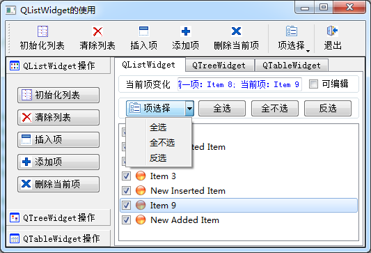

### 4.6.1　实例功能简介

Qt中用于项（Item）处理的组件有两类，一类是Item Views，包括QListView、QTreeView、QTableView、QColumnView等；另一类是Item Widgets，包括QListWidget、QTreeWidget和QTableWidget。

Item Views基于模型/视图（Model/View）结构，视图（View）与模型数据（Model Data）关联实现数据的显示和编辑，模型/视图结构的使用在第5章详细介绍。

Item Widgets是直接将数据存储在每一个项里，例如，QListWidget的每一行是一个项，QTreeWidget的每个节点是一个项，QTableWidget的每一个单元格是一个项。一个项存储了文字、文字的格式、自定义数据等。

Item Widgets是GUI设计中常用的组件，本节通过实例samp4_7先介绍QListWidget以及其他一些组件的用法，实例运行时界面如图4-8所示。

<b class="my_markdown">图4-8　实例Samp4_7运行时界面</b>

本实例不仅介绍QListWidget的使用，还包括如下一些功能的实现。

+ 使用QTabWidget设计多页界面，工作区右侧就是一个具有3个页面的TabWidget组件。
+ 使用QToolBox设计多组工具箱，工作区左侧是一个有3个组的ToolBox组件。
+ 使用分隔条（QSplitter）设计可以左右分割的界面，工作区的ToolBox和TabWidget之间有一个splitter，运行时可以分割调整两个组件的大小。
+ 创建Actions，用Actions设计主工具栏，用Action关联QToolButton按钮。
+ 使用QToolButton按钮，设置与Action关联，设计具有下拉菜单功能的ToolButton按钮，在主工具栏上添加具有下拉菜单的ToolButton按钮。
+ 使用QListWidget，演示如何创建和添加项，为项设置图标和复选框，如何遍历列表进行选择。
+ QListWidget的主要信号currentItemChanged()的功能，编写响应槽函数。
+ 为QListWidget组件利用已设计的Actions创建自定义快捷菜单。

