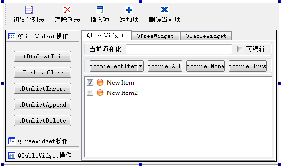
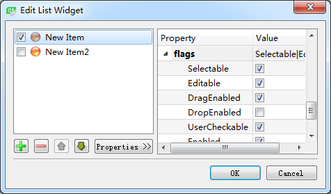
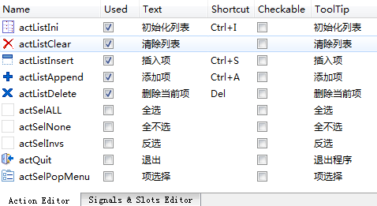

### 4.6.2　界面设计

#### 1．混合式界面设计

本实例的主窗口从QMainWindow继承而来，采用混合式界面设计。在UI设计器里完成的窗体界面如图4-9所示，与图4-8所示运行界面有一些区别。运行时在工具栏上增加了一个具有下拉菜单的工具栏按钮，为各个ToolButton按钮设置了关联的Action。


<center class="my_markdown"><b class="my_markdown">图4-9　在UI设计器里完成的窗体界面</b></center>

图4-9中界面上的按钮都使用QToolButton组件，在设计时只为其命名，图中按钮上显示的文字就是其objectName。QToolButton有一个setDefaultAction()函数，可以使其与一个Action关联，按钮的文字、图标、ToolTip都将自动设置为与关联的Action一致，单击一个QToolButton按钮就是执行Action的槽函数，与工具栏上的按钮一样。实际上，主工具栏上的按钮就是根据Action自动创建的QToolButton按钮。

QToolButton还有一个setMenu()函数，可以为其设置一个下拉式菜单，配合QToolButton的一些属性设置，可以有不同的下拉菜单效果。在图4-8中，工具栏上的“项选择”直接显示下拉菜单，而在列表框上方的“项选择”按钮，只有单击右侧的向下箭头才弹出下拉菜单，直接单击按钮会执行按钮关联的Action的代码。

混合式界面设计中用代码实现的部分，就是为界面上的各ToolButton按钮设置关联的Action，在工具栏上动态添加一个ToolButton，并设置其下拉菜单功能。

#### 2．QToolBox组件的设置

在UI设计器里设计界面时，在窗口的工作区放置一个QToolBox组件。

在ToolBox组件上调出右键快捷菜单，可以使用“Insert Page”“Delete Page”等菜单项实现分组的添加或删除。单击某个分组的标题，就可以选择为ToolBox组件的当前分组，在Property Editor中主要的属性设置如下。

+ currentIndex，当前分组编号，第1个分组的编号是0，通过改变这个值，可以选择不同的分组页面。
+ currentItemText，当前分组的标题。
+ currentItemName，当前分组的对象名称。
+ currentItemIcon，为当前分组设置一个图标，显示在文字标题的左侧。

在一个ToolBox内可以放置任何界面组件，如QGroupBox、QLineEdit、QPushButton等。在第一个分组里放置几个QToolButton按钮，并设置为Grid布局。注意不要使用水平布局，因为使用水平布局时，组内的ToolButton按键都是自动向左靠齐的，而使用Grid布局时，自动居中。

#### 3．QTabWidget组件的设置

QTabWidget是一个多页的容器类组件。在窗口上放置一个QTabWidget组件，通过其快捷菜单的“Insert Page”“Delete Page”等菜单项实现页面的添加或删除。在Property Editor中主要的属性设置如下。

+ tabPosition：页标签的位置，东、西、南、北四个方位中选择一个。
+ currentIndex：当前页的编号。
+ currentTabText：当前页的标题。
+ currentTabName：当前页的对象名称。
+ currentTabIcon：可以为当前页设置一个图标，显示在文字标题的左侧。

#### 4．使用QSplitter设计分割界面

具有分割效果的典型界面是Windows的资源管理器，QSplitter用于设计具有分割效果的界面，可以左右或上下分割。

本实例主窗口两个主要的组件是toolBox和tabWidget，希望这两个组件设计为左右分割的效果。同时选择这两个组件，单击主窗口工具栏上的“Lay Out Horizontally in Splitter”按钮，就可以为这两个组件创建一个水平分割的布局组件splitter。在主窗口构造函数里使用下面一行语句就可以使splitter填充满整个工作区。

```css
setCentralWidget(ui->splitter);
```

在使用分割条调整大小时，如果不希望ToolBox的宽度变得太小而影响按钮的显示，可以设置toolBox的minimumSize.Width属性，设置一个最小宽度。

#### 5．QListWidget的设置

在TabWidget组件的第一个页面上放置一个QListWidget组件，以及其他几个按钮和编辑框，组成如图4-9所示的界面。QListWidget是存储多个项的列表组件，每个项是一个QListWidgetItem类型的对象。

双击ListWidget组件，可以打开其列表项编辑器，如图4-10所示。在这个编辑器里可以增加、删除、上移、下移列表项，可以设置每个项的属性，包括文字内容、字体、文字对齐方式、背景色、前景色等。

比较重要的是其flags属性（如图4-10所示），用于设置项的一些标记，这些标记是枚举类型Qt::ItemFlag的具体值，包括以下几种。


<center class="my_markdown"><b class="my_markdown">图4-10　QListWidget组件的列表项编辑器</b></center>

+ Selectable：项是否可被选择，对应枚举值Qt::ItemIsSelectable。
+ Editable：项是否可被编辑，对应枚举值Qt:: ItemIsEditable。
+ DragEnabled：项是否可以被拖动，对应枚举值Qt:: ItemIsDragEnabled。
+ DropEnabled：项是否可以接收拖放的项，对应枚举值Qt:: ItemIsDropEnabled。
+ UserCheckable：项是否可以被复选，若为true，项前面出现一个CheckBox，对应枚举值Qt:: ItemIsUserCheckable。
+ Enabled：项是否被使能，对应枚举值Qt:: ItemIsEnabled。
+ Tristate：是否允许Check的第三种状态，若为false，则只有checked和unChecked两种状态，对应枚举值Qt::ItemIsAutoTristate。

在代码中设置项的flags属性时，使用函数setFlags()，例如：

```css
aItem->setFlags(Qt::ItemIsSelectable |Qt::ItemIsUserCheckable |Qt::ItemIsEnabled);
```

QListWidget的列表项一般是在程序里动态创建，后面会演示如何用程序完成添加、删除列表项等操作。

#### 6．创建Action

在2.4节已经介绍了创建Action，学习用Action设计主菜单和主工具栏的方法。本实例也采用Action设计工具栏，并且将Action用于QToolButton按钮。创建的Action列表如图4-11所示。利用这些Action创建主工具栏，设计时完成的主工具栏如图4-9所示。


<center class="my_markdown"><b class="my_markdown">图4-11　本实例创建的Action</b></center>

actSelPopMenu用于“项选择”的ToolButton按钮，也就是窗口上具有下拉菜单的两个按钮。将actSelPopMenu的功能设置为与actSelInvs完全相同，在“Signals &Slots Editor”里设置这两个Action关联（如图4-12所示），这样，执行actSelPopMenu就是执行actSelInvs。


<center class="my_markdown"><b class="my_markdown">图4-12　在Signals和Slots编辑器中设置的关联</b></center>

