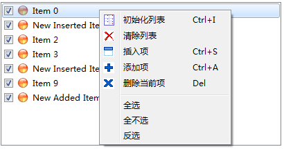

### 4.6.5　创建右键快捷菜单

每个从QWidget继承的类都有信号customContextMenuRequested()，这个信号在鼠标右击时发射，为此信号编写槽函数，可以创建和运行右键快捷菜单。

本实例为listWidget组件的customContextMenuRequested()信号创建槽函数，实现快捷菜单的创建与显示，代码如下：

```css
void MainWindow::on_listWidget_customContextMenuRequested(const QPoint &pos)
{
   Q_UNUSED(pos);
   QMenu* menuList=new QMenu(this); //创建菜单
  //添加Actions创建菜单项
   menuList->addAction(ui->actListIni);
   menuList->addAction(ui->actListClear);
   menuList->addAction(ui->actListInsert);
   menuList->addAction(ui->actListAppend);
   menuList->addAction(ui->actListDelete);
   menuList->addSeparator();
   menuList->addAction(ui->actSelALL);
   menuList->addAction(ui->actSelNone);
   menuList->addAction(ui->actSelInvs);
   menuList->exec(QCursor::pos()); //在鼠标光标位置显示右键快捷菜单
   delete menuList; 
}
```

在这段代码里，首先创建一个QMenu类型的对象menuList，然后利用QMenu的addAction()方法添加已经设计的Actions作为菜单项。

创建完菜单后，使用QMenu::exec()函数显示快捷菜单。

```css
menuList->exec(QCursor::pos());
```

这样会在鼠标当前位置显示弹出式菜单，静态函数QCursor::pos()获得鼠标光标当前位置。快捷菜单的运行效果如图4-13所示。


<center class="my_markdown"><b class="my_markdown">图4-13　listWidget组件的右键快捷菜单的运行效果</b></center>

