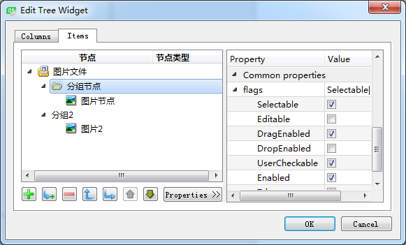
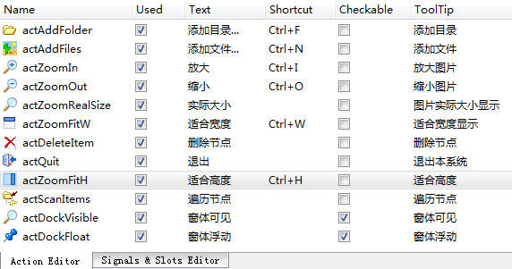

### 4.7.2　界面设计

#### 1．界面布局设计

实例Samp4_8的主窗口从QMainWindow继承而来，界面采用可视化设计，程序功能主要用Action实现，主菜单和主工具栏也都由其实现。

工作区左侧是一个QDockWidget组件，在DockWidget上放置一个QTreeWidget组件，用水平布局使treeWidget填充满停靠区。

工作区右侧是一个QScrollArea组件，QScrollArea组件里放置一个QLabel组件，利用QLabel的pixmap属性显示图片。scrollArea内部的组件采用水平布局，当图片较小时，Label显示的图片可以自动居于scrollArea的中间；当Label显示的图片超过scrollArea可显示区域的大小后，scrollArea会自动显示水平或垂直方向的卷滚条，用于显示更大的区域。

在主窗口构造函数里将ScrollArea组件设置为主窗口工作区的中心组件后，DockWidget与ScrollArea之间自动出现分割条，可以分割两个组件的大小。

#### 2．QDockWidget组件属性设置

在UI设计器里对DockWidget组件的主要属性进行设置，主要属性如下。

+ allowedAreas属性，设置允许停靠区域。

由函数setAllowedAreas(Qt::DockWidgetAreas areas)设置允许停靠区，参数areas是枚举类型Qt::DockWidgetArea的值的组合，可以设置在窗口的左、右、顶、底停靠，或所有区域都可停靠，或不允许停靠。

本实例设置为允许左侧和右侧停靠。

+ features属性，设置停靠区组件的特性。

由setFeatures(DockWidgetFeatures features)函数设置停靠区组件的特性，参数features是枚举类型QDockWidget::DockWidgetFeature的值的组合，枚举值如下。

```css
- QDockWidget::DockWidgetClosable：停靠区可关闭。
- QDockWidget::DockWidgetMovable：停靠区可移动。
- QDockWidget::DockWidgetFloatable：停靠区可浮动。
- QDockWidget::DockWidgetVerticalTitleBar：在停靠区左侧显示垂直标题栏。
- QDockWidget::AllDockWidgetFeatures：使用以上所有特征。
- QDockWidget::NoDockWidgetFeatures：不能停靠、移动和关闭。

```

本实例设置为可关闭、可停靠、可浮动。

#### 3．QTreeWidget组件的设置

在UI设计器里，双击界面上的QTreeWidget组件，可以打开图4-15所示的设计器，设计器有两页，可分别对Columns和Items进行设计。


<center class="my_markdown"><b class="my_markdown">图4-15　QTreeWidget组件的设计器（Items页面）</b></center>

Columns页用于设计目录树的列，目录树可以有多个列。在设计器里可以添加、删除、移动列，设置列的文字、字体、前景色、背景色、文字对齐方式、图标等。本实例设置了两个列，标题分别为“节点”和“节点类型”。

Items页面用于设计目录树的节点，可对每个节点设置属性，如文字、字体、图标等，特别是flags属性，可以设置节点是否可选、是否可编辑、是否有CheckBox等，还可以设置节点的CheckState。在图4-15下方有一组按钮可以新增节点、新增下级节点、删除节点、改变节点级别、平级移动节点等。

使用设计器设计目录树的列和节点，适用于创建固定结构的目录树，但是目录树一般是根据内容动态创建的，需要运用代码实现节点的创建。

#### 4．Action设计

本例的功能代码大多采用Action实现，在Action Editor里设计Action，然后利用Action设计主菜单和主工具栏。设计完成的Action如图4-16所示。


<center class="my_markdown"><b class="my_markdown">图4-16　设计的Action</b></center>

