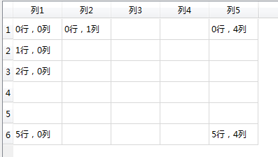
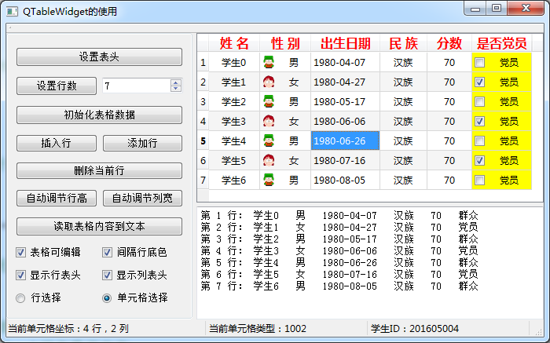

### 4.8.1　QTableWidget概述

QTableWidget是Qt中的表格组件类。在窗体上放置一个QTableWidget组件后，可以在Property Editor里对其进行属性设置，双击这个组件，可以打开一个编辑器，对其Colum、Row和Item进行编辑。一个QTableWidget组件的界面基本结构如图4-17所示，这个表格设置为6行5列。

表格的第1行称为行表头，用于设置每一列的标题，第1列称为列表头，可以设置其标题，但一般使用缺省的标题，即为行号。行表头和列表头一般是不可编辑的。

除了行表头和列表头之外的表格区域是内容区，内容区是规则的网格状，如同一个二维数组，每个网格单元称为一个单元格。每个单元格有一个行号、列号，图4-17表示了行号、列号的变化规律。

<b class="my_markdown">图4-17　一个QTableWidget表格的基本结构和工作区的行、列索引号</b>

在QTableWidget表格中，每一个单元格是一个QTableWidgetItem对象，可以设置文字内容、字体、前景色、背景色、图标，也可以设置编辑和显示标记。每个单元格还可以存储一个QVariant数据，用于设置用户自定义数据。

实例samp4_9以QTableWidget为主要组件，演示QTableWidget一些主要操作的实现。实例运行时的界面如图4-18所示，该实例将演示以下功能的实现方法。

+ 设置表格的列数和行数，设置表头的文字、格式等。
+ 初始化表格数据，设置一批实例数据填充到表格里。

<b class="my_markdown">图4-18　实例Samp4_9的运行时界面</b>

+ 插入行、添加行、删除当前行的操作。
+ 遍历表格所有单元格，读取表格内容到一个QPlainTextEdit里，表格的一行数据作为一行文本。
+ 表格上选择的当前单元格变化时，在状态栏显示单元格存储的信息。

