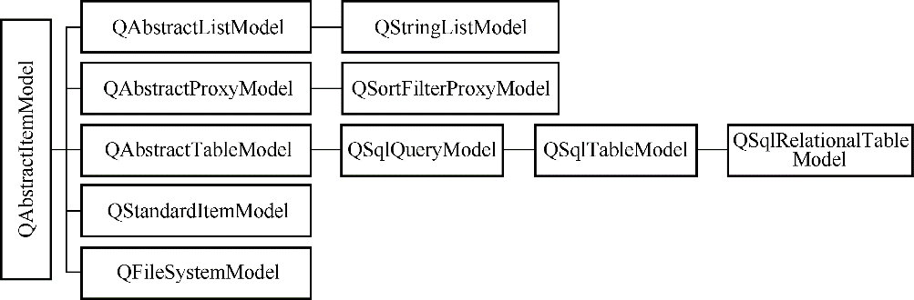

### 5.1.2　数据模型

所有的基于项数据（item data）的数据模型（Model）都是基于QAbstractItemModel类的，这个类定义了视图组件和代理存取数据的接口。数据无需存储在数据模型里，数据可以是其他类、文件、数据库或任何数据源。Qt中与数据模型相关的几个主要的类的层次结构如图5-2所示。

<b class="my_markdown">图5-2　Qt中模型类的层次结构</b>

图5-2中的抽象类是不能直接使用的，需要由子类继承来实现一些纯虚函数。Qt提供了一些模型类用于项数据处理，常见的几个见表5-1。

<b class="my_markdown">表5-1　Qt提供的数据模型类</b>

| Model类 | 用途 |
| :-----  | :-----  | :-----  | :-----  |
| QStringListModel | 用于处理字符串列表数据的数据模型类 |
| QStandardItemModel | 标准的基于项数据的数据模型类，每个项数据可以是任何数据类型 |
| QFileSystemModel | 计算机上文件系统的数据模型类 |
| QSortFilterProxyModel | 与其他数据模型结合，提供排序和过滤功能的数据模型类 |
| QSqlQueryModel | 用于数据库SQL查询结果的数据模型类 |
| QSqlTableModel | 用于数据库的一个数据表的数据模型类 |
| QSqlRelationalTableModel | 用于关系型数据表的数据模型类 |

数据库相关的3个模型类将在第11章介绍数据库编程时专门说明。如果这些现有的模型类无法满足需求，用户可以从QAbstractItemModel、QAbstractListModel或QAbstractTableModel继承，生成自己定制的数据模型类。

