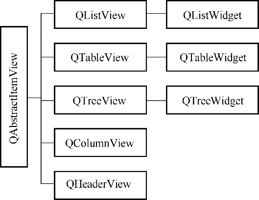

### 5.1.3　视图组件

视图组件（View）就是显示数据模型的数据的界面组件，Qt提供的视图组件如下。

+ QListView：用于显示单列的列表数据，适用于一维数据的操作。
+ QTreeView：用于显示树状结构数据，适用于树状结构数据的操作。
+ QTableView：用于显示表格状数据，适用于二维表格型数据的操作。
+ QColumnView：用多个QListView显示树状层次结构，树状结构的一层用一个QListView显示。
+ QHeaderView：提供行表头或列表头的视图组件，如QTableView的行表头和列表头。

视图组件在显示数据时，只需调用视图类的 setModel()函数，为视图组件设置一个数据模型就可以实现视图组件与数据模型之间的关联，在视图组件上的修改将自动保存到关联的数据模型里，一个数据模型可以同时在多个视图组件里显示数据。

在第4章介绍了QListWidget、QTreeWidget和QtableWidget 3个可用于数据编辑的组件。这3个类称为便利类（convenience classes），它们分别是3个视图类的子类，其层次关系如图5-3所示。

<b class="my_markdown">图5-3　视图相关类的层次结构图</b>

用于Model/View结构的几个视图类直接从QAbstract ItemView继承而来，而便利类则从相应的视图类继承而来。

视图组件类的数据采用单独的数据模型，视图组件不存储数据。便利类则为组件的每个节点或单元格创建一个项（item），用项存储数据、格式设置等。所以，便利类没有数据模型，它实际上是用项的方式集成了数据模型的功能，这样就将界面与数据绑定了。所以，便利类缺乏对大型数据源进行灵活处理的能力，适用于小型数据的显示和编辑。

