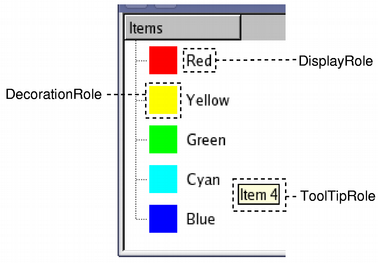

### 5.1.5　Model/View结构的一些概念

#### 1．数据模型的基本结构

在Model/View结构中，数据模型为视图组件和代理提供存取数据的标准接口。在Qt中，所有的数据模型类都从QAbstractItemModel继承而来，不管底层的数据结构是如何组织数据的，QAbstractItemModel的子类都以表格的层次结构表示数据，视图组件通过这种规则来存取模型中的数据，但是表现给用户的形式不一样。

图5-4是数据模型的3种常见表现形式。不管数据模型的表现形式是怎么样的，数据模型中存储数据的基本单元都是项（item），每个项有一个行号、一个列号，还有一个父项（parent item）。在列表和表格模式下，所有的项都有一个相同的顶层项（root item）；在树状结构中，行号、列号、父项稍微复杂一点，但是由这3个参数完全可以定义一个项的位置，从而存取项的数据。


<center class="my_markdown"><b class="my_markdown">图5-4　数据模型的几种表现形式（来自Qt帮助文件）</b></center>

#### 2．模型索引

为了保证数据的表示与数据存取方式隔离，数据模型中引入了模型索引（model index）的概念。通过数据模型存取的每个数据都有一个模型索引，视图组件和代理都通过模型索引来获取数据。

QModelIndex表示模型索引的类。模型索引提供数据存取的一个临时指针，用于通过数据模型提取或修改数据。因为模型内部组织数据的结构随时可能改变，所以模型索引是临时的。如果需要使用持久性的模型索引，则要使用QPersistentModelIndex类。

#### 3．行号和列号

数据模型的基本形式是用行和列定义的表格数据，但这并不意味着底层的数据是用二维数组存储的，使用行和列只是为了组件之间交互方便的一种规定。通过模型索引的行号和列号就可以存取数据。

要获得一个模型索引，必须提供3个参数：行号、列号、父项的模型索引。例如，对于如图5-4中的表格数据模型中的3个数据项A、B、C，获取其模型索引的代码是：

```css
QModelIndex indexA = model->index(0, 0, QModelIndex());
QModelIndex indexB = model->index(1, 1, QModelIndex());
QModelIndex indexC = model->index(2, 1, QModelIndex());
```

在创建模型索引的函数中需要传递行号、列号和父项的模型索引。对于列表和表格模式的数据模型，顶层节点总是用QModelIndex()表示。

#### 4．父项

当数据模型是列表或表格时，使用行号、列号存储数据比较直观，所有数据项的父项（parent item）就是顶层项；当数据模型是树状结构时，情况比较复杂（树状结构中，项一般习惯于称为节点），一个节点可以有父节点，也可以是其他节点的父节点，在构造数据项的模型索引时，必须指定正确的行号、列号和父节点。

对于图5-4中的树状数据模型，节点A和节点C的父节点是顶层节点，获取模型索引的代码是：

```css
QModelIndex indexA = model->index(0, 0, QModelIndex());
QModelIndex indexC = model->index(2, 1, QModelIndex());
```

但是，节点B的父节点是节点A，节点B的模型索引由下面的代码生成：

```css
QModelIndex indexB = model->index(1, 0, indexA);
```

#### 5．项的角色

在为数据模型的一个项设置数据时，可以赋予其不同项的角色（item role）的数据。例如，数据模型类QStandardItemModel的项数据类是QStandardItem，其设置数据的函数是：

```css
void QStandardItem::setData(const QVariant &value,int role= Qt::UserRole + 1)
```

其中，value是需要设置的数据，role是设置数据的角色。一个项可以有不同角色的数据，用于不同的场合。

role是Qt::ItemDataRole枚举类型，有多种取值，如Qt::DisplayRole 角色是在视图组件中显示的字符串，Qt::ToolTipRole是鼠标提示消息，Qt::UserRole可以自定义数据。项的标准角色是Qt::DisplayRole。

在获取一个项的数据时也需要指定角色，以获取不同角色的数据。

```css
QVariant QStandardItem::data(int role = Qt::UserRole + 1) const
```

为一个项的不同角色定义数据，可以告知视图组件和代理组件如何显示数据。例如，在图5-5中，项的DisplayRole数据是显示的字符串，DecorationRole是用于装饰显示的属性，ToolTipRole定义了鼠标提示信息。不同的视图组件对各种角色数据的解释和显示可能不一样，也可能忽略某些角色的数据。


<center class="my_markdown"><b class="my_markdown">图5-5　不同角色数据的表现形式（来自Qt帮助文件）</b></center>

第4章已经介绍了便利类QListWidget、QTree Widget和QTableWidget的使用，本章将介绍Model/ View结构的基本用法，包括Qt预定义的Qstring ListModel、QFileSystemModel、QStandardItemModel以及视图组件QListView、QTableView、QTreeView的使用，还介绍如何设计和使用自定义代理。涉及数据库的Model/View的使用将在数据库一章单独介绍。

