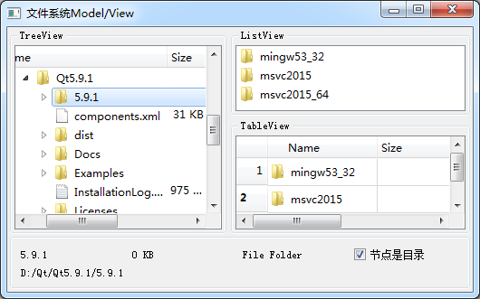

### 5.2.1　QFileSystemModel类的基本功能

QFileSystemModel提供了一个可用于访问本机文件系统的数据模型。QFileSystemModel和视图组件QTreeView结合使用，可以用目录树的形式显示本机上的文件系统，如同Widnows的资源管理器一样。使用QFileSystemModel提供的接口函数，可以创建目录、删除目录、重命名目录，可以获得文件名称、目录名称、文件大小等参数，还可以获得文件的详细信息。

要通过QFileSystemModel获得本机的文件系统，需要用setRootPath()函数为QFileSystemModel设置一个根目录，例如：

```css
QFileSystemModel *model = new QFileSystemModel;
model->setRootPath(QDir::currentPath());
```

静态函数QDir::currentPath()获取应用程序的当前路径。

用于获取磁盘文件目录的数据模型类还有一个QDirModel，QDirModel的功能与QFileSystemModel类似，也可以获取目录和文件，但是QFileSystemModel采用单独的线程获取目录文件结构，而QDirModel不使用单独的线程。使用单独的线程就不会阻碍主线程，所以推荐使用QFileSystemModel。

使用QFileSystemModel作为数据模型，QTreeView、QListView和QTableView为主要组件设计的实例samp5_1运行界面如图5-6所示。在TreeView中以目录树的形式显示本机的文件系统，单击一个目录时，右边的ListView和TableView显示该目录下的目录和文件。在TreeView上单击一个目录或文件节点时，下方的几个标签里显示当前节点的信息。


<center class="my_markdown"><b class="my_markdown">图5-6　实例samp5_1的运行时界面</b></center>

