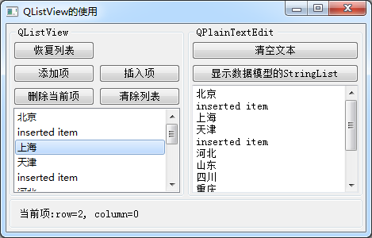

### 5.3.1　QStringListModel功能概述

QStringListModel用于处理字符串列表的数据模型，它可以作为QListView的数据模型，在界面上显示和编辑字符串列表。

QStringListModel的setStringList()函数可以初始化数据模型的字符串列表的内容，stringList()函数返回数据模型内的字符串列表，在关联的ListView组件里编辑修改数据后，数据都会及时更新到数据模型内的字符串列表里。

QStringListModel提供编辑和修改字符串列表数据的函数，如insertRows()、removeRows()、setData()等，这些操作直接影响数据模型内部的字符串列表，并且修改后的数据会自动在关联的ListView组件里刷新显示。

实例samp5_2采用QStringListModel作为数据模型，QListView组件作为视图组件，演示了QStringListModel和QListView构成Model/View结构编辑字符串列表的功能，程序运行时界面如图5-7所示。

<b class="my_markdown">图5-7　实例samp5_2的运行时界面</b>

窗口左侧是对QStringListModel的一些操作，右侧的QPlaintextEdit组件显示QString ListModel:: stringList()的内容，以查看其是否与界面上ListView组件显示的内容一致。

