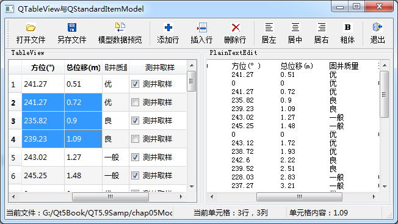

### 5.4.1　功能概述

QStandardItemModel是标准的以项数据（item data）为基础的标准数据模型类，通常与QTableView组合成Model/View结构，实现通用的二维数据的管理功能。

本节介绍QStandardItemModel的使用，主要用到以下3个类。

+ QStandardItemModel：基于项数据的标准数据模型，可以处理二维数据。维护一个二维的项数据数组，每个项是一个QStandardItem类的变量，用于存储项的数据、字体格式、对齐方式等。
+ QTableView：二维数据表视图组件，有多个行和多个列，每个基本显示单元是一个单元格，通过setModel()函数设置一个QStandardItemModel类的数据模型之后，一个单元格显示QStandardItemModel数据模型中的一个项。
+ QItemSelectionModel：一个用于跟踪视图组件的单元格选择状态的类，当在QTableView选择某个单元格，或多个单元格时，通过QItemSelectionModel可以获得选中的单元格的模型索引，为单元格的选择操作提供方便。

这几个类之间的关系是：QTableView是界面视图组件，其关联的数据模型是QStandardItem Model，关联的项选择模型是QItemSelectionModel，QStandardItemModel的数据管理的基本单元是QStandardItem。

实例samp5_3演示QStandardItemModel的使用，其运行时界面如图5-8所示。

<b class="my_markdown">图5-8　实例samp5_3的运行时界面</b>

该实例具有如下功能。

+ 打开一个纯文本文件，该文件是规则的二维数据文件，通过字符串处理获取表头和各行各列的数据，导入到一个QStandardItemModel数据模型。
+ 编辑修改数据模型的数据，可以插入行、添加行、删除行，还可以在QTableView视图组件中直接修改单元格的数据内容。
+ 可以设置数据模型中某个项的不同角色的数据，包括文字对齐方式、字体是否粗体等。
+ 通过QItemSelectionModel获取视图组件上的当前单元格，以及选择单元格的范围，对选择的单元格进行操作。
+ 将数据模型的数据内容显示到QPlainTextEdit组件里，显示数据模型的内容，检验视图组件上做的修改是否与数据模型同步。
+ 将修改后的模型数据另存为一个文本文件。

