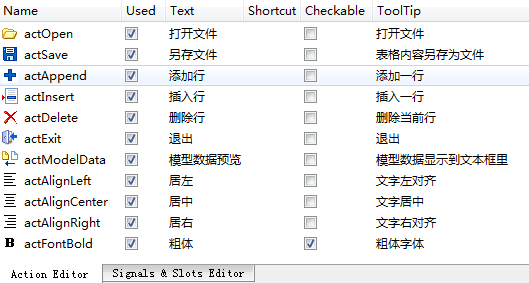

### 5.4.2　界面设计与主窗口类定义

本实例的主窗口从QMainWindow继承而来，中间的TableView和PlainTextEdit组件采用水平分割条布局。在Action编辑器中创建如图5-9所示的一些Action，并由Action创建主工具栏上的按钮，下方的状态栏设置了几个QLabel组件，显示当前文件名称、当前单元格行号、列号，以及相应内容。


<center class="my_markdown"><b class="my_markdown">图5-9　实例中创建的Action</b></center>

主窗口类MainWindow里新增的定义如下（省略了UI设计器生成的界面组件的槽函数的声明）：

```css
#define    FixedColumnCount   6      //文件固定6列
class MainWindow : public QMainWindow
{
   Q_OBJECT
private:
   QLabel  *LabCurFile;              //当前文件
   QLabel  *LabCellPos;              //当前单元格行列号
   QLabel  *LabCellText;             //当前单元格内容
   QStandardItemModel  *theModel;    //数据模型
   QItemSelectionModel *theSelection;//选择模型
   void   iniModelFromStringList(QStringList&);//从StringList初始化数据模型
public:
   explicit MainWindow(QWidget *parent = 0);
   ~MainWindow();
private slots:
//当前选择单元格发生变化
   void on_currentChanged(const QModelIndex &current, const QModelIndex &previous);
private:
   Ui::MainWindow *ui;
};
```

这里定义了数据模型变量theModel，项数据选择模型变量theSelection。

定义的私有函数iniModelFromStringList()用于在打开文件时，从一个QStringList变量的内容创建数据模型。

自定义槽函数on_currentChanged()用于在TableView上选择单元格发生变化时，更新状态栏的信息显示，这个槽函数将会与项选择模型theSelection的currentChanged()信号关联。

