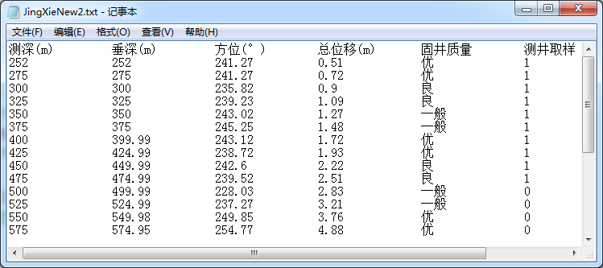

### 5.4.3　QStandardItemModel的使用

#### 1．系统初始化

在MainWindow的构造函数中进行界面初始化，数据模型和选择模型的创建，以及与视图组件的关联，信号与槽的关联等设置，代码如下：

```css
MainWindow::MainWindow(QWidget *parent) : QMainWindow(parent), ui(new Ui::MainWindow)
{
   ui->setupUi(this);
   setCentralWidget(ui->splitter); 
   theModel = new QStandardItemModel(2,FixedColumnCount,this); //数据模型
   theSelection = new QItemSelectionModel(theModel);//选择模型
   connect(theSelection,SIGNAL(currentChanged(QModelIndex,QModelIndex)),
         this,SLOT(on_currentChanged(QModelIndex,QModelIndex)));
   ui->tableView->setModel(theModel); //设置数据模型
   ui->tableView->setSelectionModel(theSelection);//设置选择模型
   ui->tableView->setSelectionMode(QAbstractItemView::ExtendedSelection);
   ui->tableView->setSelectionBehavior(QAbstractItemView::SelectItems);
//创建状态栏组件，代码略
}
```

在构造函数里首先创建数据模型theModel，创建数据选择模型时需要传递一个数据模型变量作为其参数。这样，数据选择模型theSelection就与数据模型theModel关联，用于表示theModel的项数据选择操作。

创建数据模型和选择模型后，为TableView组件设置数据模型和选择模型：

```css
ui->tableView->setModel(theModel); //设置数据模型
ui->tableView->setSelectionModel(theSelection);//设置选择模型
```

构造函数里还将自定义的槽函数on_currentChanged()与theSelection的currentChanged()信号关联，用于界面上tableView选择单元格发生变化时，显示单元格的行号、列号、内容等信息，槽函数代码如下：

```css
void MainWindow::on_currentChanged(const QModelIndex &current, const QModelIndex &previous)
{ //选择单元格变化时的响应
   if (current.isValid()) 
   {
      LabCellPos->setText(QString::asprintf("当前单元格：%d行，%d列",
                          current.row(),current.column()));
      QStandardItem*   aItem=theModel->itemFromIndex(current); 
      this->LabCellText->setText("单元格内容："+aItem->text()); 
      QFont   font=aItem->font(); 
      ui->actFontBold->setChecked(font.bold());  
   }
}
```

#### 2．从文本文件导入数据

QStandardItemModel是标准的基于项数据的数据模型，以类似于二维数组的形式管理内部数据，适合于处理表格型数据，其显示一般采用QTableView。

QStandardItemModel的数据可以是程序生成的内存中的数据，也可以来源于文件。例如，在实际数据处理中，有些数据经常是以纯文本格式保存的，它们有固定的列数，每一列是一项数据，实际构成一个二维数据表。图5-10是本实例程序要打开的一个纯文本文件的内容，文件的第1行是数据列的文字标题，相当于数据表的表头，然后以行存储数据，以TAB键间隔每列数据。

当单击工具栏上的“打开文件”按钮时，需要选择一个这样的文件导入到数据模型，并在tableView上进行显示和编辑。图5-10的数据有6列，第1列是整数，第2至4列是浮点数，第5列是文字，第6列是逻辑型变量，“1”表示true。


<center class="my_markdown"><b class="my_markdown">图5-10　纯文本格式的数据文件</b></center>

下面是“打开文件”按钮的槽函数代码：

```css
void MainWindow::on_actOpen_triggered()
{ //打开文件
   QString  curPath=QCoreApplication::applicationDirPath();
   QString  aFileName=QFileDialog::getOpenFileName(this,"打开一个文件",
              curPath,"井数据文件(*.txt);;所有文件(*.*)");
   if (aFileName.isEmpty())
      return; 
   QStringList fFileContent; 
   QFile aFile(aFileName);
   if (aFile.open(QIODevice::ReadOnly | QIODevice::Text)) //打开文件
   {
      QTextStream aStream(&aFile); //用文本流读取文件
      ui->plainTextEdit->clear();
      while (!aStream.atEnd())
      {
         QString  str=aStream.readLine();
         ui->plainTextEdit->appendPlainText(str); 
         fFileContent.append(str);
      }
      aFile.close();
      this->LabCurFile->setText("当前文件："+aFileName);//状态栏显示
      iniModelFromStringList(fFileContent);//初始化数据模型
   }
}

```

这段代码让用户选择所需要打开的数据文本文件，然后用只读和文本格式打开文件，逐行读取其内容，将每行字符串显示到界面上的plainTextEdit里，并且添加到一个临时的QStringList类型的变量fFileContent里。

然后调用自定义函数iniModelFromStringList()，用fFileContent的内容初始化数据模型。下面是iniModelFromStringList()函数的代码：

```css
void MainWindow::iniModelFromStringList(QStringList& aFileContent)
{ //从一个StringList 获取数据，初始化数据模型
   int rowCnt=aFileContent.count(); //文本行数，第1行是标题
   theModel->setRowCount(rowCnt-1);
//设置表头，一个或多个空格、TAB等分隔符隔开的字符串，分解为一个StringList
   QString  header=aFileContent.at(0);//第1行是表头
   QStringList  headerList= 
         header.split(QRegExp("\\s+"),QString::SkipEmptyParts);
   theModel->setHorizontalHeaderLabels(headerList); //设置表头文字
//设置表格数据
   QStandardItem   *aItem;
   QStringList   tmpList;
   int j;
   for (int i=1;i<rowCnt;i++)
   {
      QString  aLineText=aFileContent.at(i);  
      tmpList=aLineText.split(QRegExp("\\s+"),QString::SkipEmptyParts);
      for (j=0;j<FixedColumnCount-1;j++) 
      { //不包含最后一列
         aItem=new QStandardItem(tmpList.at(j));
         theModel->setItem(i-1,j,aItem); //为模型的某个行列位置设置Item
      }
      aItem=new QStandardItem(headerList.at(j));//最后一列
      aItem->setCheckable(true); //设置为Checkable
      if (tmpList.at(j)=="0")
         aItem->setCheckState(Qt::Unchecked);  
      else
         aItem->setCheckState(Qt::Checked);
      theModel->setItem(i-1,j,aItem); 
   }
}
```

传递来的参数aFileContent是文本文件所有行构成的StringList，文件的每一行是aFileContent的一行字符串，第1行是表头文字，数据从第2行开始。

程序首先获取字符串列表的行数，然后设置数据模型的行数，因为数据模型的列数在初始化时已经设置了。

然后获取字符串列表的第1行，即表头文字，用QString::split()函数分割成一个QStringList，设置为数据模型的表头标题。

QString::split()函数根据某个特定的符号将字符串进行分割。例如，header是数据列的标题，每个标题之间通过一个或多个TAB键分隔，其内容是：

```css
测深(m)    垂深(m)     方位(°)     总位移(m)     固井质量    测井取样
```

那么通过上面的split()函数操作，得到一个字符串列表headerList，其内容是：

```css
测深(m)
垂深(m)
方位(°)
总位移(m)
固井质量
测井取样
```

也就是分解为一个6行的StringList。然后使用此字符串列表作为数据模型，设置表头标题的函数setHorizontalHeaderLabels()的参数，就可以为数据模型设置表头了。

同样，在逐行获取字符串后，也采用split()函数进行分解，为每个数据创建一个QStandardItem类型的项数据aItem，并赋给数据模型作为某行某列的项数据。

QStandardItemModel以二维表格的形式保存项数据，每个项数据对应着QTableView的一个单元格。项数据不仅可以存储显示的文字，还可以存储其他角色的数据。

数据文件的最后一列是一个逻辑型数据，在tableView上显示时为其提供一个CheckBox组件，此功能通过调用QStandardItem的setCheckable()函数实现。

#### 3．数据修改

当TableView设置为可编辑时，双击一个单元格可以修改其内容，对于使用CheckBox的列，改变CheckBox的勾选状态，就可以修改单元格关联项的选择状态。

在实例主窗口工具栏上有“添加行”“插入行”“删除行”按钮，它们实现相应的编辑操作，这些操作都是直接针对数据模型的，数据模型被修改后，会直接在TableView上显示出来。

+ 添加行

“添加行”操作是在数据表的最后添加一行，其实现代码如下：

```css
void MainWindow::on_actAppend_triggered()
{ //在表格最后添加行
   QList<QStandardItem*>  aItemList; //列表类
   QStandardItem   *aItem;
   for(int i=0;iheaderData(theModel->columnCount()-1, Qt::Horizontal, Qt::DisplayRole).toString();
   aItem=new QStandardItem(str); //创建 "测井取样" Item
   aItem->setCheckable(true);
   aItemList<insertRow(theModel->rowCount(),aItemList); //插入一行
   QModelIndex curIndex=theModel->index(theModel->rowCount()-1,0);
   theSelection->clearSelection();
   theSelection->setCurrentIndex(curIndex,QItemSelectionModel::Select); 
}
```

使用QStandardItemModel::insertRow()函数插入一行，其函数原型是：

```css
void insertRow(int row, const QList<QStandardItem *> &items)
```

其中，row是一个行号，表示在此行号之前插入一行，若row等于或大于总行数，则在最后添加一行。QList<QStandardItem *> &items 是一个QStandardItem类型的列表类，需要为插入的一行的每个项数据创建一个QStandardItem类型的项，然后传递给insertRow()函数。

在这段程序中，为前5列创建QStandardItem对象时，都使用文字“0”，最后一列使用表头的标题，并设置为Checkable。创建完每个项数据对象后，使用insertRow()函数在最后添加一行。

+ 插入行

“插入行”按钮的功能是在当前行的前面插入一行，实现代码与“添加行”类似。

+ 删除行

“删除行”按钮的功能是删除当前行，首先从选择模型中获取当前单元格的模型索引，然后从模型索引中获取行号，调用removeRow(int row)删除指定的行。

```css
void MainWindow::on_actDelete_triggered()
{ //删除行
   QModelIndex curIndex=theSelection->currentIndex();//获取模型索引
   if (curIndex.row()==theModel->rowCount()-1)//最后一行
      theModel->removeRow(curIndex.row()); //删除最后一行
   else
   {
     theModel->removeRow(curIndex.row());//删除一行，并重新设置当前选择行
     theSelection->setCurrentIndex(curIndex,QItemSelectionModel::Select);
   }
}
```

#### 4．单元格格式设置

工具栏上有3个设置单元格文字对齐方式的按钮，还有一个设置字体粗体的按钮。当在TableView中选择多个单元格时，可以同时设置多个单元格的格式。例如，“居左”按钮的代码如下：

```css
void MainWindow::on_actAlignLeft_triggered()
{//设置文字居左对齐
   if (!theSelection->hasSelection())
      return;
//获取选择的单元格的模型索引列表，可以是多选
   QModelIndexList selectedIndex=theSelection->selectedIndexes();
   for (int i=0;i<selectedIndex.count();i++)
   {
      QModelIndex  aIndex=selectedIndex.at(i); //获取一个模型索引
      QStandardItem*  aItem=theModel->itemFromIndex(aIndex);
      aItem->setTextAlignment(Qt::AlignLeft);//设置文字对齐方式
   }
}
```

QItemSelectionModel::selectedIndexes()函数返回选择单元格的模型索引列表，然后通过此列表获取每个选择的单元格的模型索引，再通过模型索引获取其项数据，然后调用QStandardItem::set TextAlignment()设置一个项的对齐方式即可。

“居中”和“居右”按钮的代码与此类似。

“粗体”按钮设置单元格的字体是否为粗体，在选择单元格时，actFontBold的check状态根据当前单元格的字体是否为粗体自动更新。actFontBold的triggered(bool)的槽函数代码如下，与设置对齐方式的代码操作方式类似：

```css
void MainWindow::on_actFontBold_triggered(bool checked)
{//设置字体粗体
   if (!theSelection->hasSelection())
      return;
   QModelIndexList selectedIndex=theSelection->selectedIndexes();
   for (int i=0;i< selectedIndex.count();i++)
   {
      QModelIndex aIndex= selectedIndex.at(i); //获取一个模型索引
      QStandardItem*   aItem=theModel->itemFromIndex(aIndex);//获取项数据
      QFont  font=aItem->font();
      font.setBold(checked); //设置字体是否粗体
      aItem->setFont(font); 
   }
}
```

#### 5．数据另存为文件

在视图组件上对数据的修改都会自动更新到数据模型里，单击工具栏上的“模型数据预览”按钮，可以将数据模型的数据内容显示到PlainTextEdit里。

数据模型里的数据是在内存中的，工具栏上的“另存文件”按钮可以将数据模型的数据另存为一个数据文本文件，同时也显示在PlainTextEdit里，其实现代码如下：

```css
void MainWindow::on_actSave_triggered()
{ //保存为文件
   QString curPath=QCoreApplication::applicationDirPath();
   QString aFileName=QFileDialog::getSaveFileName(this,"选择一个文件", curPath,"井斜数据文件(*.txt);;所有文件(*.*)");
   if (aFileName.isEmpty())
      return;
   QFile aFile(aFileName);
   if (!(aFile.open(QIODevice::ReadWrite | QIODevice::Text | QIODevice::Truncate)))
      return; //以读写、覆盖原有内容方式打开文件
   QTextStream aStream(&aFile); 
   QStandardItem   *aItem;
   int i,j;
   QString str;
   ui->plainTextEdit->clear();
//获取表头文字
   for (i=0;i<theModel->columnCount();i++)
   {   aItem=theModel->horizontalHeaderItem(i); //获取表头的项数据
      str=str+aItem->text()+"\t\t";  //以TAB隔开
   }
   aStream<plainTextEdit->appendPlainText(str);
//获取数据区文字
   for ( i=0;i<theModel->rowCount();i++)
   {   str="";
      for( j=0;j<theModel->columnCount()-1;j++)
      {   aItem=theModel->item(i,j);
         str=str+aItem->text()+QString::asprintf("\t\t");
      }
      aItem=theModel->item(i,j); //最后一列是逻辑型
      if (aItem->checkState()==Qt::Checked)
         str=str+"1";
      else
         str=str+"0";
       ui->plainTextEdit->appendPlainText(str);
       aStream<
```

