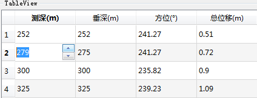

### 5.5.1　自定义代理的功能

在前一节的实例samp5_3中，导入数据文件进行编辑时，QTableView组件为每个单元格提供的是缺省的代理编辑组件，就是一个QLineEdit组件。在编辑框里可以输入任何数据，所以比较通用。但是有些情况下，希望根据数据的类型限定使用不同的编辑组件，例如在samp5_3的实例的数据中，第1列“测深”是整数，使用QSpinBox作为编辑组件更合适；“垂深”“方位”“总位移”是浮点数，使用QDoubleSpinBox更合适；而“固井质量”使用一个QComboBox，从一组列表文字中选择更合适。

要实现这些功能，就需要为TableView的某列或某个单元格设置自定义代理组件。本节在实例samp5_3的基础上，为TableView增加自定义代理组件功能。设定自定义代理组件之后的TableView运行时，其编辑状态的效果如图5-11所示。

<b class="my_markdown">图5-11　设置自定义代理组件后的TableView编辑时的效果</b>

