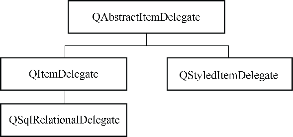

### 5.5.2　自定义代理类的基本设计要求

Qt中有关代理的几个类的层次结构如图5-12所示。

<b class="my_markdown">图5-12　实现代理功能的类的层次结构</b>

QAbstractItemDelegate是所有代理类的抽象基类，QStyledItemDelegate是视图组件使用的缺省的代理类，QItemDelegate也是类似功能的类。QStyledItemDelegate与QItemDelegate的差别在于：QStyledItemDelegate可以使用当前的样式表设置来绘制组件，因此建议使用QStyledItem Delegate作为自定义代理组件的基类。

不管从QStyledItemDelegate还是QItemDelegate继承设计自定义代理组件，都必须实现如下的4个函数：

+ createEditor()函数创建用于编辑模型数据的widget组件，如一个QSpinBox组件，或一个QComboBox组件；
+ setEditorData()函数从数据模型获取数据，供widget组件进行编辑；
+ setModelData()将widget上的数据更新到数据模型；
+ updateEditorGeometry()用于给widget组件设置一个合适的大小。

