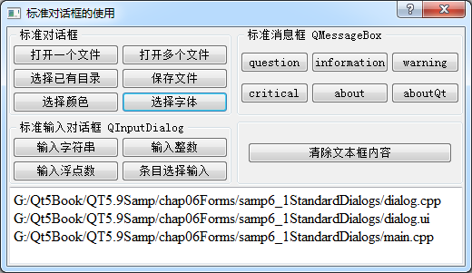

### 6.1.1　概述

Qt为应用程序设计提供了一些常用的标准对话框，如打开文件对话框、选择颜色对话框、信息提示和确认选择对话框、标准输入对话框等，用户无需再自己设计这些常用的对话框，这样可以减少程序设计工作量。在前面几章的实例中，或多或少地用到了其中的一些对话框。

Qt预定义的各标准对话框的类，及其主要静态函数的功能见表6-1（由于输入参数一般较多，省略了函数的输入参数，只列出了函数的返回值类型）。

<b class="my_markdown">表6-1　Qt预定义标准对话框</b>

| 对话框 | 常用静态函数名称 | 函数功能 |
| :-----  | :-----  | :-----  | :-----  | :-----  |
| QFileDialog | 文件对话框 | QString　getOpenFileName() | 选择打开一个文件 |
| QStringList　getOpenFileNames() | 选择打开多个文件 |
| QString　getSaveFileName() | 选择保存一个文件 |
| QString　getExistingDirectory() | 选择一个已有的目录 |
| QUrl　getOpenFileUrl() | 选择打开一个文件，可选择远程网络文件 |
| QcolorDialog | 颜色对话框 | QColor　getColor() | 选择颜色 |
| QFontDialog | 字体对话框 | QFont　getFont() | 选择字体 |
| QInputDialog | 输入对话框 | QString　getText() | 输入单行文字 |
| int　getInt() | 输入整数 |
| double　getDouble() | 输入浮点数 |
| QString　getItem() | 从一个下拉列表框中选择输入 |
| QString　getMultiLineText() | 输入多行字符串 |
| QMessageBox | 消息框 | StandardButton　information() | 信息提示对话框 |
| StandardButton　question() | 询问并获取是否确认的对话框 |
| StandardButton　warning() | 警告信息提示对话框 |
| StandardButton　critical() | 错误信息提示对话框 |
| void　about() | 设置自定义信息的关于对话框 |
| void　aboutQt() | 关于Qt的对话框 |

实例samp6_1演示使用这些对话框，程序运行界面如图6-1所示。下方的文本框显示打开文件的文件名或一些提示信息，某些对话框的输入结果可应用于文本框的属性设置，如字体和颜色。

<b class="my_markdown">图6-1　实例samp6_1运行界面</b>

