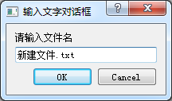
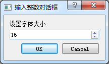
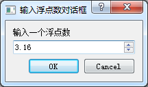
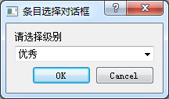

### 6.1.5　QInputDialog标准输入对话框

QInputDialog有单行字符串输入、整数输入、浮点数输入、列表框选择输入和多行文本等多种输入方式，图6-2是其中4种界面效果。





<center class="my_markdown"><b class="my_markdown">图6-2　QinputDialog 4种输入对话框</b></center>

#### 1．输入文字

QInputDialog::getText()函数显示一个对话框用于输入字符串，传递的参数包括对话框标题、提示标签文字、缺省输入、编辑框响应模式等。

其中编辑框响应模式是枚举类型QLineEdit::EchoMode，它控制编辑框上文字的显示方式，正常情况下选择QLineEdit::Normal；如果是输入密码，选择QLineEdit::Password。代码如下：

```css
void Dialog::on_btnInputString_clicked()
{ //输入字符串
   QString dlgTitle="输入文字对话框";
   QString txtLabel="请输入文件名";
   QString defaultInput="新建文件.txt";
   QLineEdit::EchoMode echoMode=QLineEdit::Normal; 
//   QLineEdit::EchoMode echoMode=QLineEdit::Password;//密码输入
   bool ok=false;
   QString text = QInputDialog::getText(this, dlgTitle,txtLabel,
             echoMode,defaultInput, &ok);
   if (ok && !text.isEmpty())
      ui->plainTextEdit->appendPlainText(text);
}
```

#### 2．输入整数

使用QInputDialog::getInt()函数输入一个整数，下面的代码为文本选择字体大小。

```css
void Dialog::on_btnInputInt_clicked()
{//输入整数
   QString dlgTitle="输入整数对话框";
   QString txtLabel="设置字体大小";
   int defaultValue=ui->plainTextEdit->font().pointSize();
   int minValue=6, maxValue=50,stepValue=1;
   bool ok=false;
   int inputValue = QInputDialog::getInt(this, dlgTitle,txtLabel,
                      defaultValue, minValue,maxValue,stepValue,&ok);
   if (ok) 
   { 
      QFont   font=ui->plainTextEdit->font();
      font.setPointSize(inputValue);
      ui->plainTextEdit->setFont(font);
   }
}
```

输入整数对话框使用一个SpinBox组件输入整数，getInt()需要传递的参数包括数值大小范围、步长、初始值，确认选择输入后，将输入的整数值作为文本框字体的大小。

#### 3．输入浮点数

使用QInputDialog:: getDouble ()函数输入一个浮点数，输入对话框使用一个QDoubleSpinBox作为输入组件，getDouble()的输入参数需要输入范围、初始值、小数点位数等。代码如下：

```css
void Dialog::on_btnInputFloat_clicked()
{ //输入浮点数
   QString dlgTitle="输入浮点数对话框";
   QString txtLabel="输入一个浮点数";
   float defaultValue=3.13;
   float minValue=0, maxValue=10000; 
   int decimals=2;//小数点位数
   bool ok=false;
   float inputValue = QInputDialog::getDouble(this, dlgTitle,txtLabel,
                       defaultValue, minValue,maxValue,decimals,&ok);
   if (ok) 
   {
      QString str=QString::asprintf("输入了一个浮点数:%.2f",inputValue);
      ui->plainTextEdit->appendPlainText(str);
   }
}
```

#### 4．下拉列表选择输入

使用QInputDialog::getItem()可以从一个ComboBox组件的下拉列表中选择输入。代码如下：

```css
void Dialog::on_btnInputItem_clicked()
{ //条目选择输入
   QStringList items; 
   items <<"优秀"<<"良好"<<"合格"<<"不合格";
   QString dlgTitle="条目选择对话框";
   QString txtLabel="请选择级别";
   int    curIndex=0; //初始选择项
   bool   editable=true; //ComboBox是否可编辑
   bool   ok=false;
   QString text = QInputDialog::getItem(this, dlgTitle, txtLabel,
                 items, curIndex, editable, &ok);
   if (ok && !text.isEmpty())
      ui->plainTextEdit->appendPlainText(text);
}
```

getItem()函数需要一个QStringList变量为其ComboBox组件做条目初始化，curIndex指明初始选择项，editable表示对话框里的ComboBox是否可编辑，若不能编辑，则只能在下拉列表中选择。

