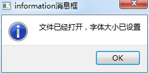
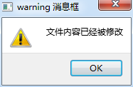
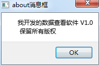
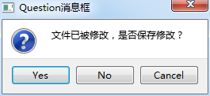

### 6.1.6　QMessageBox消息对话框

#### 1．简单信息提示

消息对话框QMessageBox用于显示提示、警告、错误等信息，或进行确认选择，由几个静态函数实现这些功能（详见表6-1）。其中warning()、information()、critical()和about()这几个函数的输入参数和使用方法相同，只是信息提示的图标有区别。例如，warning()的函数原型是：

```css
StandardButton QMessageBox::warning(QWidget *parent, const QString &title, const 
QString &text, StandardButtons buttons = Ok, StandardButton defaultButton = NoButton)
```

其中，parent是对话框的父窗口，指定父窗口之后，打开对话框时，对话框将自动显示在父窗口的上方中间位置；title是对话框标题字符串；text是对话框需要显示的信息字符串；buttons是对话框提供的按钮，缺省只有一个OK按钮；defaultButton是缺省选择的按钮，缺省表示没有选择。

warning()函数的返回结果是StandardButton类型。对话框上显示的按钮和缺省选中按钮也是StandardButton类型。

StandardButton是各种按钮的定义，如OK、Yes、No、Cancel等，其枚举取值是QMessageBox::Ok、QMessageBox::Cancel、QMessageBox::Close等，详见Qt帮助文档中的StandardButton类型的说明。

对于warning()、information()、critical()和about()这几种对话框，它们一般只有一个OK按钮，且无须关心对话框的返回值。所以，使用缺省的按钮设置即可。例如，下面是程序中调用QMessageBox信息显示的代码，显示的几个对话框如图6-3所示。





<center class="my_markdown"><b class="my_markdown">图6-3　QMessageBox的几种消息提示对话框</b></center>

```css
void Dialog::on_btnMsgInformation_clicked()
{//information
   QString dlgTitle="information消息框";
   QString strInfo="文件已经打开，字体大小已设置";
   QMessageBox::information(this, dlgTitle, strInfo,
                        QMessageBox::Ok,QMessageBox::NoButton);
}
void Dialog::on_btnMsgWarning_clicked()
{// warning
   QString dlgTitle="warning 消息框";
   QString strInfo="文件内容已经被修改";
   QMessageBox::warning(this, dlgTitle, strInfo);
}
void Dialog::on_btnMsgCritical_clicked()
{// critical
   QString dlgTitle="critical消息框";
   QString strInfo="有不明程序访问网络";
   QMessageBox::critical(this, dlgTitle, strInfo);
}
void Dialog::on_btnMsgAbout_clicked()
{// about
   QString dlgTitle="about消息框";
   QString strInfo="我开发的数据查看软件 V1.0 \n 保留所有版权";
   QMessageBox::about(this, dlgTitle, strInfo);
}
```

#### 2．确认选择对话框

QMessageBox::question()函数用于打开一个选择对话框，提示信息，并提供Yes、No、OK、Cancel等按钮，用户单击某个按钮返回选择，如常见的文件保存确认对话框如图6-4所示。


<center class="my_markdown"><b class="my_markdown">图6-4　QMessageBox:: question()生成的对话框</b></center>

静态函数QMessageBox::question()的原型如下：

```css
StandardButton QMessageBox::question(QWidget *parent, const QString &title, const QString &text, StandardButtons buttons = StandardButtons( Yes | No ), StandardButton defaultButton = NoButton)
```

question()对话框的关键是在其中可以选择显示多个按钮，例如同时显示Yes、No、OK或Cancel。其返回结果也是一个StandardButton 类型变量，表示哪个按钮被单击了。下面是产生如图6-4所示对话框的代码，并根据对话框选择结果进行了判断和显示。

```css
void Dialog::on_btnMsgQuestion_clicked()
{
   QString dlgTitle="Question消息框";
   QString strInfo="文件已被修改，是否保存修改？";
   QMessageBox::StandardButton  defaultBtn=QMessageBox::NoButton; 
   QMessageBox::StandardButton  result;//返回选择的按钮
   result=QMessageBox::question(this, dlgTitle, strInfo,
                  QMessageBox::Yes|QMessageBox::No |QMessageBox::Cancel,
                  defaultBtn);
   if (result==QMessageBox::Yes)
      ui->plainTextEdit->appendPlainText("Question消息框: Yes 被选择");
   else if(result==QMessageBox::No)
      ui->plainTextEdit->appendPlainText("Question消息框: No 被选择");
   else if(result==QMessageBox::Cancel)
      ui->plainTextEdit->appendPlainText("Question消息框: Cancel 被选择");
   else
      ui->plainTextEdit->appendPlainText("Question消息框: 无选择");
}
```

