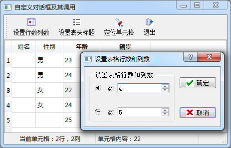
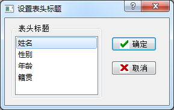
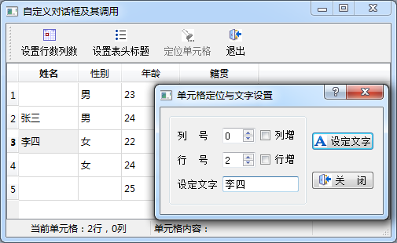

### 6.2.1　对话框的不同调用方式

在一个应用程序设计中，为了实现一些特定的功能，必须设计自定义对话框。自定义对话框的设计一般从QDialog继承，并且可以采用UI设计器可视化地设计对话框。对话框的调用一般包括创建对话框、传递数据给对话框、显示对话框获取输入、判断对话框单击按钮的返回类型、获取对话框输入数据等过程。

本节将通过实例samp6_2来详细介绍这些原理。图6-5是实例samp6_2的主窗口，及其设置表格行列数的对话框。

主窗口采用QTableView和QStandardItemModel、QItemSelectionModel构成一个通用的数据表格编辑器，设计了3个对话框，分别具有不同的功能，并且展示对话框不同调用方式的特点。

+ 设置表格行列数对话框QWDialogSize

该对话框每次动态创建，以模态方式显示（必须关闭此对话框才可以返回主窗口操作），对话框关闭后获取返回值，用于设置主窗口的表格行数和列数，并且删除对话框对象，释放内存。

这种对话框创建和调用方式适用于比较简单，不需要从主窗口传递大量数据做初始化的对话框，调用后删除对话框对象可以节约内存。

+ 设置表头标题对话框QWDialogHeaders

图6-6是设置表格表头标题的对话框，该对话框在父窗口（本例中就是主窗口）存续期间只创建一次，创建时传递表格表头字符串列表给对话框，在对话框里编辑表头标题后，主窗口获取编辑之后的表头标题。对话框以模态方式显示，关闭后只是隐藏，并不删除对象，下次再调用时只是打开已创建的对话框对象。

<b class="my_markdown">图6-5　实例samp6_2主窗口及其设置表格行列数的对话框</b>

<b class="my_markdown">图6-6　设置表格表头标题对话框</b>

这种创建和调用方式适用于比较复杂的对话框，需要从父窗口传递大量数据做对话框初始化。下次调用时不需要重复初始化，能提高对话框调用速度，但是会一直占用内存，直到父窗口删除时，对话框才从内存中删除。

+ 单元格定位与文字设置对话框QWDialogLocate

图6-7是单元格定位和文字设置对话框，该对话框以非模态方式调用，显示对话框时还可以对主窗口进行操作，对话框只是浮动在窗口上方。在对话框里可以定位主窗口表格的某个单元格并设置其文字内容，在主窗口上的表格中单击鼠标时，单元格的行号、列号也会更新在对话框中。对话框关闭后将自动删除，释放内存。

这种对话框适用于主窗口与对话框需要交互操作的情况，例如用于查找和替换操作的对话框。

<b class="my_markdown">图6-7　浮动于主窗口上方的对话框，可交互操作</b>

