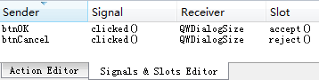

### 6.2.2　对话框QWDialogSize的创建和使用

#### 1．创建对话框QWDialogSize

实例主窗口从QMainWindow继承，主窗口用一个QTableView组件作为界面中心组件，设计几个Action用于创建主工具栏按钮。主窗口采用QStandardItemModel作为数据模型，QItemSelectionModel作为选择模型，界面和主窗口Model/View结构的设计可参考5.4节的实例，本节不再详述。

在项目主窗口建立后，要创建如图6-5所示的设置表格行列数的对话框，单击Qt Creator的菜单项“File”→“New File or Project”，选择Qt类别下的“Qt Designer Form Class”，创建可视化设计的对话框类。在随后出现的向导里，选择窗口模板为Dialog without Buttons，并设置自定义对话框的类名。

设置创建的对话框类名称为QWDialogSize，系统自动生成qwdialogsize.h、qwdialogsize.cpp和qwdialogsize.ui 3个文件。

QWDialogSize对话框的界面设计在UI设计器里进行，放置界面组件并设置好布局。

#### 2．对话框的调用和返回值

设计QWDialogSize对话框的界面时，在上面放置了两个QPushButton按钮，并分别命名为btnOK和btnCancel，分别是“确定”和“取消”按钮，用于获取对话框运行时用户的选择。那么，如何获得用户操作的返回值呢？

在信号与槽编辑器里，将btnOK的clicked()信号与对话框的accept()槽关联，将btnCancel的clicked()信号与对话框的reject()槽关联即可，如图6-8所示。


<center class="my_markdown"><b class="my_markdown">图6-8　对话框设计时“确定”和“取消”按钮的信号与槽关联</b></center>

单击“确定”按钮会执行accept()槽（或在代码里调用accept()槽函数也是一样的），这会关闭对话框（默认情况下，对话框只是被隐藏，并不被删除），并返回QDialog::Accepted 作为exec()函数的返回值。

单击“取消”按钮会执行reject()槽函数，也会关闭对话框，并返回QDialog::Rejected作为exec()函数的返回值。

完成后的QWDialogSize的类完整定义如下：

```css
class QWDialogSize : public QDialog
{   Q_OBJECT
public:
   explicit QWDialogSize(QWidget *parent = 0);
   ~QWDialogSize();
   int    rowCount();//返回对话框输入的行数
   int    columnCount();//返回对话框输入的列数
   void   setRowColumn(int row, int column); //初始对话框上两个SpinBox的值
private:
   Ui::QWDialogSize *ui;
};
```

在QWDialogSize的类定义中定义3个public函数，用于与对话框调用者的数据交互。因为窗体上的组件都是私有成员，外界不能直接访问界面组件，只能通过接口函数访问。

下面是类的接口函数实现代码。在析构函数中弹出一个消息提示对话框，以便观察对话框是何时被删除的。

```css
QWDialogSize::~QWDialogSize()
{
   QMessageBox::information(this,"提示","设置表格行列数对话框被删除");
   delete ui;
}
int QWDialogSize::rowCount()
{ //用于主窗口调用获得行数的输入值
   return  ui->spinBoxRow->value();
}
int QWDialogSize::columnCount()
{//用于主窗口调用获得列数的输入值
   return  ui->spinBoxColumn->value();
}
void QWDialogSize::setRowColumn(int row, int column)
{ //初始化数据显示
   ui->spinBoxRow->setValue(row);
   ui->spinBoxColumn->setValue(column);
}
```

下面是主窗口中的“设置行数列数”工具栏按钮的响应代码，用于创建、显示对话框，并读取对话框上设置的行数、列数。

```css
void MainWindow::on_actTab_SetSize_triggered()
{ //模态对话框，动态创建，用过后删除
   QWDialogSize   *dlgTableSize=new QWDialogSize(this); 
   Qt::WindowFlags   flags=dlgTableSize->windowFlags();
   dlgTableSize->setWindowFlags(flags | Qt::MSWindowsFixedSizeDialogHint); 
   dlgTableSize->setRowColumn(theModel->rowCount(),
                          theModel->columnCount()); 
   int ret=dlgTableSize->exec();// 以模态方式显示对话框，
   if (ret==QDialog::Accepted)  
   { //OK按钮被按下，获取对话框上的输入，设置行数和列数
      int cols=dlgTableSize->columnCount();
      theModel->setColumnCount(cols);
      int rows=dlgTableSize->rowCount();
      theModel->setRowCount(rows);
   }
   delete dlgTableSize; 
}
```

从代码中可以看到，每次单击此工具栏按钮时，对话框都被重新创建。创建后用QDialog的setWindowFlags()函数将对话框设置为固定大小，然后调用对话框的自定义函数setRowColumn()，将主窗口数据模型theModel的现有的行数和列数显示到对话框上的两个SpinBox组件里。

调用对话框的exec()函数，以模态显示的方式显示对话框。模态显示方式下，用户只能在对话框上操作，不能操作主窗口，主程序也在此处等待exec()函数的返回结果。

当用户单击“确定”按钮关闭对话框后，exec()返回结果为QDialog::Accepted，主程序获得此返回结果后，通过对话框的自定义函数columnCount()和rowCount()获得对话框上新输入的列数和行数，然后设置为数据模型的列数和行数。

最后使用delete删除创建的对话框对象，释放内存。所以，关闭对话框时，会出现QWDialogSize析构函数里的消息提示对话框。

> **注意**
> 在对话框上单击按钮或关闭对话框时，对话框只是隐藏（缺省的），而并没有从内存中删除。如果对话框一关闭就自动删除，则在后面调用对话框的自定义函数获得输入的行数和列数时会出现严重错误。

